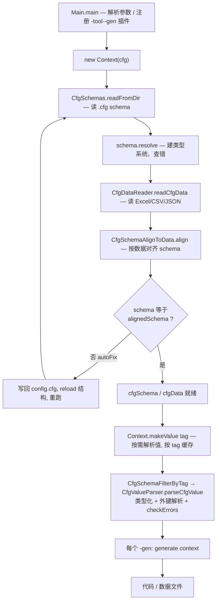

# 架构总览

cfggen 是一个**配置定义驱动**的多语言代码生成器：从 `.cfg` schema 定义 + 数据源（Excel/CSV/JSON）出发，生成各目标语言（Java/C#/Go/Lua/TypeScript/GDScript…）的读表代码与数据文件。

一句话概括数据流：

> **Schema（类型系统）→ Data（原始数据）→ Value（类型化值）→ Generate（代码 / 数据输出）**

四层各管一件事、单向依赖；`Context` 是把它们串起来、并缓存中间产物的协调者。

## 端到端流水线

入口在 `Main`（见 `gen/Main.java`）：`main` → `registerAllProviders()`（注册全部 `-tool` / `-gen` 插件）→ `runWithCatch` → `run`。`run` 解析命令行，构造 `Context`，再依次对每个 `-gen` 调 `generate(context)`。

`Context` 在构造时就把 schema 和 data 读完并对齐；`makeValue` 在第一个生成器需要值时按需解析并缓存。

## 模块地图（关注点 → 主所在）

不是逐类清单，只标每块"谁主管"。要查具体类，用 Glob。

| 关注点 | 主所在包 | 入口符号 |
|---|---|---|
| 命令行 / 插件注册 | `gen` | `Main`、`Tools`、`Generators` |
| 上下文 / 协调 / 缓存 | `ctx` | `Context`、`DirectoryStructure` |
| Schema 模型与解析 | `schema` | `CfgSchemas`、`CfgSchema`、`CfgSchemaResolver` |
| Schema ↔ 数据对齐 | `schema` | `CfgSchemaAlignToData`、`CfgSchemaFilterByTag` |
| CFG 文法（.cfg 读写） | `schema.cfg` | `Cfg.g4`、`CfgReader`、`CfgWriter` |
| 数据读取 | `data` | `CfgDataReader`、`ReadByFastExcel`、`ReadCsv` |
| 值模型 / 外键 | `value` | `CfgValue`、`CfgValueParser`、`RefValidator` |
| 代码生成 | `gen` 基类 + `genjava`/`gencs`/`genlua`/`genbytes` + `gents`/`gengd`/`gengo` + /`genjson`/`genbyai` | `Generator`、各 `*CodeGenerator` |
| 二进制格式 | `genbytes` | `BytesGenerator`、各 `*Serializer`、`ConfigOutput`/`ConfigInput` |
| 国际化 | `i18n` + `geni18n` | `LangTextFinder`、`LangSwitchable`、`I18nBy*Generator` |
| 写回（编辑器 / AI → 文件） | `write` + `editorserver` + `mcpserver` | `VTableStorage`、`EditorServer`、`CfgMcpServer` |
| 校验 / 检索 | `tool` | `ValueVerifyTool`、`ValueInspectTool` |
| 模板 / 缓存输出 / 日志 | `util` | `JteEngine`、`CachedFiles`、`Logger` |

## 设计原理

这一节讲几个**非显然**的决策——它们决定了代码长成现在这样。

### 1. 为什么以 `Context` 为中心

`Context`（见 `ctx/Context.java`）是唯一持有 `cfgSchema`、`cfgData` 和缓存值的地方。所有生成器和服务器都接收 `Context` 从中取数据，而不是各自去读文件。

好处：读 + 对齐 + 缓存的逻辑只写一遍；生成器退化为纯粹的"取值 → 渲染"，极其轻量；服务器（`editorserver` / `mcpserver`）和命令行复用同一套**已对齐**的数据。

### 2. 为什么 Schema / Data / Value / Generate 要分四层

这是整个架构的骨架，详见 [`02`](02-schema-and-cfg.md) / [`03`](03-data-reading.md) / [`04`](04-value-model.md)。核心是**职责单一 + 单向依赖**：

- **Schema** 是类型系统，能脱离任何数据存在（先有结构定义）；
- **Data** 是原始单元格，只关心文件格式（Excel / CSV / JSON），不做类型解释；
- **Value** 是类型化、外键已解析的运行时模型；
- **Generate** 是消费方。

分层让三种变化各自独立：换数据源只动 `data`；换目标语言只加一个 `gen*`；换校验策略只动 `value` / `tool`。

### 3. 为什么 Schema 要"对齐到 Data"，甚至改写 config.cfg

数据是**事实来源**——策划在 Excel 里加了列，schema 必须跟上。`Context` 构造时（`readSchemaAndData`）会比较 `schema` 与按数据对齐后的 `alignedSchema`：若不一致且开启 `autoFix`，会把对齐后的 schema **写回 `config.cfg`、reload 目录结构、再重跑一遍**；仍不一致才报错抛出。

这是个**数据驱动 schema** 的决策：不让 schema 和数据手工同步，而由代码自动把 schema 对齐到数据现状。代价是 `config.cfg` 会被程序改写——你需要意识到这点（这也是为什么编辑器保存记录后，schema 有时会被悄悄更新）。

### 4. 为什么 `makeValue` 要缓存，且 `allowErr` 有方向

一次运行常挂多个 `-gen`（例如同时 `-gen java,bytes`），而把全部数据解析成 `CfgValue` 很贵——所以 `makeValue` 按 `tag` 缓存结果复用。

`allowErr` 参数控制"值带错时是否抛异常"。缓存的命中规则刻意**堵死宽松 → 严格方向**：

- 严格（`allowErr=false`）缓存的值保证无错，能服务任何请求；
- 宽松（`allowErr=true`）缓存的值可能带错，只能服务宽松请求；遇到严格请求必须重算重新校验。

否则 `EditorServer` 的 `makeValue(tag, true)`（容忍带错值以便展示给编辑器）会被后续生成器 `makeValue(tag)` 复用，跳过校验、把脏值写进产物。`makeValue` 与 `updateDataAndValue` 都 `synchronized`，因为编辑器 handler 线程与 reload 线程会并发读写这块缓存。

### 5. 为什么用插件注册表

`Tools.addProvider(name, ctor)` / `Generators.addProvider(name, ctor)`（见 `Main.registerAllProviders`）把名字映射到构造器。加一个新语言或新工具，只需：继承基类 + 在这里登记一行 + 放模板。详见 [`05`](05-codegen-and-extension.md)。

> 注：`verify` / `search` / `i18n` / `i18nbyid` 虽然概念上是"工具 / 流程"，却注册在 `Generators` 下（因为它们也消费 `Context` 产出），这是历史归类，别被名字误导。

## 接下来

- 想深入某一层 → 上面模块地图对应的篇目。
- 想理解**某种数据格式怎么变成代码** → [`03`](03-data-reading.md) → [`04`](04-value-model.md) → [`05`](05-codegen-and-extension.md)。
- 想理解**编辑器 / AI 怎么写回**配置 → [`07`](07-write-back-and-servers.md)。
