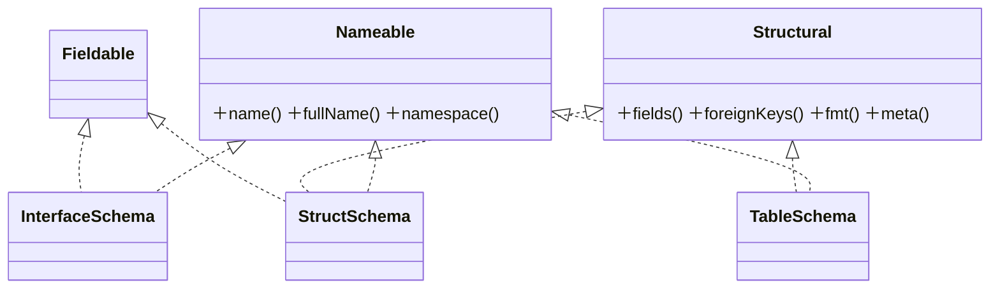

# Schema 与 CFG 文法

schema 层是 cfggen 的**类型系统**：定义有哪些 struct / interface / table / enum、它们的字段、外键、tag。它**独立于数据存在**——先有结构定义，数据再往里填。

本篇讲四件事：内存模型、`resolve` 过程、外键（`->` vs `=>`）、`.cfg` 文法解析；外加两个会**改写** schema 的关键操作——**对齐到数据**和**按 tag 过滤**。

> CFG **语法本身**（怎么写 `.cfg`）是用户向话题，看用户站点 [`core/schema`](../../docs/src/content/docs/core/schema.mdx)。本篇只讲**代码如何建模与解析它**。

## 内存模型

schema 包用三个接口正交地描述元素，具体类只需实现相应接口：



| 类 | 是什么 |
|---|---|
| `Nameable` | 有名字的东西（接口）。名字带命名空间，如 `ns.Foo`；impl 的全名是 `Interface.impl` |
| `Structural` | 有字段 + 外键的东西（接口）。代码对 struct 和 table 统一处理就靠它 |
| `Fieldable` | 可作为字段类型的命名类型（接口）= `StructSchema` / `InterfaceSchema` |
| `StructSchema` | 复合结构（见 `schema/StructSchema.java`） |
| `InterfaceSchema` | 多态接口，带一组 impl + 可选 enumRef / defaultImpl |
| `TableSchema` | 数据表，带主键、entry、唯一键 |
| `FieldSchema` / `ForeignKeySchema` / `KeySchema` | 字段 / 外键 / 键 |
| `EntryType` | 表形态：`ENo`（普通）/ `EEntry`（单行，按某 str 字段）/ `EEnum`（枚举表） |
| `FieldType` | `Primitive`(bool/int/long/float/str/text) / `StructRef` / `FList` / `FMap` |
| `FieldFormat` | 字段到列的映射：`AUTO`/`PACK`(整结构压一列) / `Sep`(分隔符) / `Fix`(定长) |
| `Metadata` | "口袋"：tag / comment / fmt / enumRef / nullable / fromEnumType… 凡不适合做强类型字段的都塞这 |

两个**非显然**点：

1. **enum 不是独立模型类**。文法里有 `enum_decl`，但 `CfgReader.readEnum`（见 `schema/cfg/CfgReader.java`）把它**脱糖成一个 `TableSchema`**：带 `MetaEnumValues`、`EntryType.EEnum`，字段是 `name`(/`id`/`comment`)。所以后续所有"表"的处理天然覆盖 enum。
2. **`Metadata` 是万能口袋**。配置里大量属性（tag、注释、fmt、enumRef、defaultImpl、nullable…）都进 metadata，而不是给模型加一堆布尔字段。代价是类型不严格；好处是模型类稳定、扩展属性不用改模型。

## 两阶段：init → resolved

`CfgSchema`（见 `schema/CfgSchema.java`）有个 `isResolved` 标志：**resolve 前可变，之后冻结**，`requireResolved()` 守卫。

为什么这么设计：`resolve` 会算出大量**派生结构**——名字索引（`itemMap`/`fieldableMap`/`tableMap`）、外键目标解析、以及 `Span`/`HasRef`/`HasBlock`/`HasMap`/`HasText` 的预计算。如果 resolve 后还允许改 schema，这些派生数据就会悄悄失效。所以代码用"构建期可变 → resolve → 冻结"把这件事钉死。

## resolve 做了什么

`CfgSchemaResolver`（见 `schema/CfgSchemaResolver.java`）把"文本解析得到的 items"升级成"语义自洽的类型系统"，分步：

| 步骤 | 做什么 |
|---|---|
| step0 | impl 反向挂到 interface；表名必须小写（enum 表豁免） |
| step0 冲突检查 | 全局 / 局部命名空间冲突；**建索引** `setMap`（itemMap/fieldableMap/tableMap） |
| step1 | 解析字段类型里的 `StructRef`：按 **interface impl → 本命名空间 → 全局** 顺序找目标并 `setObj`；容器内的 enum 自动转 `STRING` |
| step2 | 解析每个 nameable：interface（enumRef / defaultImpl / impl 非空）、table（entry 字段存在且为 str、主键/唯一键解析与类型校验、enum 表主键须为 enum 字段或 int） |
| step3 | 解析外键：找 ref 表、解析 local key、记录列下标、按 RefKey 类型校验（详见下节） |
| step4 | fmt 约束（interface impl 必须 auto；sep struct 字段必须全 primitive） |
| step5 | 未被任何表引用的 struct/interface → **警告**（不是错） |
| 预计算 | 无错时算 `Span`/`HasRef`/`HasBlock`/`HasMap`/`HasText`，**缓存到 schema 供生成器复用** |
| 收尾 | 全程无错才 `setResolved()` |

设计要点：**解析（格式）与语义（引用）分离**——`CfgReader` 只管把文本变成 items，所有"指向谁、类型匹不匹配"都留给 resolve。这让两件事各自可测、可复用（align 后会再 resolve 一遍）。

## 外键：`->` vs `=>`

这是 schema 层最值得理解的设计。CFG 文法里引用写成（见 `Cfg.g4`）：

```
ref : (REF | LISTREF) ns_ident key? ;   // REF='->'  LISTREF='=>'
```

`CfgReader.readRef` 据此产出三种 `RefKey`，`CfgSchemaResolver.resolveForeignKey` 校验它们：

| 写法 | RefKey | 含义 | 校验 |
|---|---|---|---|
| `-> Tbl` | `RefPrimary(nullable)` | 单值引用 `Tbl` 的**主键** | local 与主键类型逐个匹配 |
| `-> Tbl [uk]` | `RefUniq(key, nullable)` | 单值引用 `Tbl` 的**唯一键** `uk` | `[uk]` 必须是唯一键；类型匹配 |
| `=> Tbl [f]` | `RefList(key)` | **多值**引用：local 是个 list，每个元素匹配 `Tbl.f` | local 与 remote 必须**单 key**；list 元素类型匹配 |

语法示意：

```
struct Award {
    itemId: int  -> item [id];          // 单值：引用 item 表 id 唯一键；可标 nullable
    count:  int;
}
struct Mission {
    awardIds: list<int> => award [id];  // 多值：list 里每个 int 匹配一个 award 的 id
}
```

一句话区分：**`->` 是"指一个"，`=>` 是"指一串"**。

还有一个**自动外键**：字段类型直接写成一个 enum 表引用时，resolve 会把它**改写成 `STRING` + 自动生成一个 `RefPrimary` 外键**（带 `fromEnumType` 元数据）。所以"引用 enum"在代码里等同于"引用一个字符串，但带引用完整性校验"——干净统一。

## .cfg 文法（ANTLR）

`.cfg` 用 ANTLR 定义（`schema/cfg/Cfg.g4`），语法骨架：

```
schema      : (struct | interface | table | enum)*  suffix_comment*  EOF ;
struct      : STRUCT ns_ident metadata { (field | foreign)* } ;
interface   : INTERFACE ns_ident metadata { struct+ } ;
table       : TABLE ns_ident key metadata { (field | foreign | key)* } ;
field       : identifier : type_ ref? metadata ;          // 行内外键 ref 可选
foreign     : -> identifier : key ref metadata ;           // 独立外键声明
type_       : list<T> | map<K,V> | base ;                  // base ∈ bool/int/long/float/str/text 或 ns_ident
ref         : (-> | =>) ns_ident key? ;
metadata    : ( key(=value)? | -key )* ;                   // tag / -tag / 键值
```

解析链：`CfgLexer` → `CommonTokenStream` → `CfgParser` → 遍历语法树 → 建 `CfgSchema`（见 `CfgReader`）。`ThrowingErrorListener` 把语法错**抛成异常**而非静默恢复。

两个工程取舍：

- **为什么自定义 DSL**：配置需要带外键、tag、命名空间、注释的类型定义，Excel / JSON 表达不了这种结构。值得专门一门小语言。
- **注释往返**：`COMMENT` 词法规则**不 `skip`**，前导 / 后缀 / 行内（`{` 和 `;` 同行）注释全保留进模型（`CommentData`）。所以 `CfgReader` 读进来再 `CfgWriter` 写出去，**注释不丢**——这对策划很重要（注释就是文档）。
- **多文件并行**：`CfgSchemas.readFromDir` 用工作窃取线程池并发解析各 `.cfg` 文件（文件间无依赖），`invokeAll` 保证合并顺序与提交顺序一致（见 `schema/CfgSchemas.java`）。

> 另有 `XmlReader` 提供 XML → schema 的替代输入路径；序列化出口只有 `CfgWriter`（`CfgSchema.stringify` 也委托给它）。

## schema 对齐到数据

这是 [`01`](01-architecture-overview.md) 提到的"auto-fix 写回 config.cfg"的**具体机制**，实现在 `CfgSchemaAlignToData`（见 `data/CfgSchemaAlignToData.java`，注意它在 `data` 包）。

核心原则：**数据是事实**。`align` 按数据表头逐列走，与 schema 字段比对：

| 情况 | 处理 |
|---|---|
| 数据列 ↔ schema 字段都有 | 保留 **schema 的类型**（类型以 schema 为准），用数据更新注释 |
| 数据有、schema 无 | **新增字段**，类型从表头 `suggestedType` 推断，默认 `STRING` |
| schema 有、数据无 | **删除字段**（记日志） |
| 多列字段 | 按 `Span`（结构/list/map 占几列）对齐 |
| 数据里有整张表、schema 无 | **新增表**，纯从表头推断 |
| schema 有表、无数据文件 | **删除表**（记日志） |

此外主键 / entry / 外键 / 唯一键若依赖的字段被删了，会相应降级或丢弃。还有一段**遗留兼容**：表头 `a1,a2,a3` 当作 `aList`、`a1,b1,a2,b2` 当作 `a2bMap`（`findAndRemove`），为兼容旧配表习惯。

为什么这么设计：策划改 Excel（加列、加表）是常态。与其让人手工同步 schema，不如让代码按数据现状自动对齐——这正是 `Context` 构造时发现 `schema != alignedSchema` 就**写回 `config.cfg` 重跑**的由来。

## 按 tag 过滤

`CfgSchemaFilterByTag`（见 `schema/CfgSchemaFilterByTag.java`）在生成时按 tag 取 schema 子集，产出 `partial` schema。规则（来自其文档注释）：

- tag 只标在 field 上即可，**不用标外键**——外键能不能保留由"是否还可行"决定。
- 对一个 structural 有三种情况：(1) 没字段标 tag/-tag → 全保留；(2) 有字段标了 tag → 只取标了 tag 的；(3) 没字段标 tag 但有字段标 -tag → 取没标 -tag 的。
- `-foo` 前缀 = 排除带 foo 的项。

表过滤分两阶段：先过滤字段 / entry / 唯一键，再处理外键——**外键仅当其 key 字段和 ref 表都存活才保留**，否则发 `weakWarn`（"被忽略"），不报错。输出是 partial，需再 `resolve`（`Context.makeValue` 会做）。

为什么需要：一套表，按 tag 给不同端（服务端 / 客户端 / 编辑器）生成不同子集，共享同一份 schema 定义。

## 关键类速查

| 关注点 | 主类 |
|---|---|
| schema 容器 / 两阶段 / 索引 | `CfgSchema` |
| 读多文件 / 并行 / 合并 / 写回 | `CfgSchemas` |
| resolve 全流程 + 预计算 | `CfgSchemaResolver` |
| 对齐到数据 | `CfgSchemaAlignToData`（在 `data` 包） |
| tag 过滤 | `CfgSchemaFilterByTag` |
| 文法 | `cfg/Cfg.g4`、`cfg/CfgReader`、`cfg/CfgWriter`、`cfg/XmlReader` |
| 错误载体 | `CfgSchemaErrs`（详见 [`08`](08-errors-and-validation.md)） |

## 接下来

schema 定义完结构后，数据怎么读进来 → [`03-data-reading`](03-data-reading.md)。
