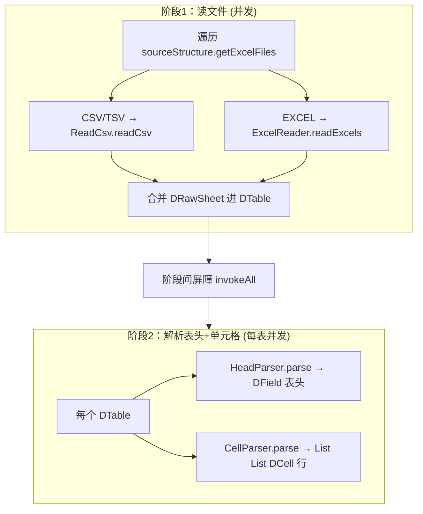

# 数据读取（data 层）

data 层把磁盘上的 Excel / CSV 文件变成内存里的**原始单元格模型** `CfgData`。它**只搬运 + 规整，不做类型解释**——不知道哪个字段是 int、哪个是外键。类型化是 [`value` 层](04-value-model.md)的事。

> JSON 表不走这条单元格管线，而是在值解析阶段由 `VTableJsonParser` 直接读入（见 [`04`](04-value-model.md)）。本篇聚焦 Excel / CSV。

## 模型 `CfgData`

见 `data/CfgData.java`。核心是几张 record：

| 类型 | 含义 |
|---|---|
| `CfgData` | `Map<String, DTable>` + 统计 `CfgDataStat` |
| `DTable` | 一张逻辑表：`fields`(表头，HeadParser 产) + `rows`(单元格，CellParser 产) + `rawSheets` + 可选 `nullableAddTag` |
| `DField` | 表头一列：`name` / `comment` / `suggestedType` |
| `DCell` | 一个单元格：已 trim 的 `value` + `rowId` + `col` + `mode` 位标志 |
| `DRawSheet` | 一个原始 sheet/csv：路径 / sheet名 / `index` / `rows` / `fieldIndices` |
| `DRawRow` | 行接口（`cell(c)` / `count()`），抽象掉 excel 行与 csv 行的差异 |

两个约定（来自 `DTable` 文档注释）：

- **一张逻辑表可拆成多文件 / 多 sheet**：csv 可拆 `task.csv`(=`task_0.csv`)、`task_1.csv`、`task_2.csv`；excel 可拆 sheet `task`、`task_1`、`task_2`。`index` 决定合并后的顺序。
- **`nullableAddTag`**：通常是 `-client` / `-server`，给整张表打附加 tag，用于抽取特定端数据。

`DCell` 的 `toString()` 会把 `col` 转成 Excel 列字母（`toAZ`，0→A、25→Z、26→AA…），输出形如 `sheet=task[row],row=3,col=B,data=...`——**报错信息能直接指回 Excel 的 A1 位置**。

## 读取管线（`CfgDataReader`）

见 `data/CfgDataReader.java`。`readCfgData` 分**两阶段并发**：

- **阶段 1**：遍历数据文件，csv 走 `ReadCsv`、excel 走 `ExcelReader`，并发读出 `DRawSheet`，按表名合并进 `DTable`。文件名 / sheet 名不符合命名规范（`DataUtil.getTableNameIndex` 解析不出表名）的**直接忽略**并计入统计。
- **阶段 2**：对每张表并发跑 `HeadParser`（建表头）+ `CellParser`（建单元格行）。是否列模式（`isColumnMode`）从 schema 查。

两阶段都用同一个工作窃取线程池 + `invokeAll`（保合并顺序）。

## Excel 读取：FastExcel vs POI

- 默认 `ReadByFastExcel`（见 `data/ReadByFastExcel.java`），用 `org.dhatim.fastexcel.reader`。
- 备选 `ReadByPoi`（Apache POI）。`ExcelReadDiffTool`（`-tool fastexcelcheck`）专门比对两者读取结果，做一致性兜底。

FastExcel 实现里两个**非显然**点：

1. **`fixRows` 补空行**：FastExcel 的 `sheet.read()` 会**跳过空行**，但这会让行号与 Excel 实际行号错位。`fixRows` 按真实 `getRowNum` 补 `EMPTY_ROW` 占位，保证行号对齐——否则后续报错定位会乱。这是典型的"适配第三方库怪癖"。
2. **cell 类型统计仅 verbose 时做**：非 verbose 跳过整表 `getType` 遍历，省一次全表扫描。

## 表头解析（`HeadParser`）

见 `data/HeadParser.java`。

- `HeadRow`（`-headrow` 选，默认 2 行）定义哪几行是 `nameRow` / `commentRow` / `suggestedTypeRow`，以及 `rowCount`。
- **行模式 vs 列模式**：`getLogicRow` 在行模式读一条**横行**，在列模式读一条**竖列**（相当于转置）——同一套逻辑兼容两种排版。
- 多 sheet 组成的表：表头必须一致，否则 `SplitDataHeaderNotEqual` 报错（但仍按第一个表头继续，数据可能错位）。
- 列名解析 `name.split("[.,@]", 2)[0]` 去后缀；首列以 `#` 开头视为注释列。

## 编码 / BOM / 分隔符

- CSV 默认 **GBK** 编码，支持带 BOM 的 UTF-8 自动识别（`ReadCsv` 配合 `util/UnicodeReader`）。
- CSV 用 `,`、TSV（`.txt`）用 `\t`。
- `-encoding` 覆盖默认编码。

## 设计原理

1. **为何 data 只搬运不解释**：把"文件格式"和"类型语义"彻底解耦。加一种新数据源（比如 YAML）只需加个 reader 产出 `CfgData`，value 层的类型逻辑零改动。这正是四层分离的好处（见 [`01`](01-architecture-overview.md)）。
2. **为何默认 FastExcel**：性能——POI 重得多。但**保留 POI 实现**作兜底和比对（`fastexcelcheck`），不把鸡蛋放一个篮子。
3. **为何并发 + 工作窃取**：表之间完全独立，读是 IO、解析是 CPU，混合负载；工作窃取池自动平衡。`CfgDataReader` 注释里留有 `FixedThreadPool` / `VirtualThreadPerTaskExecutor` 的尝试痕迹——说明这池子是调过的，不是随手选的。
4. **为何 `DCell` 要带 `rowId` / `col` / `mode`**：错误信息必须能指回 Excel 的 `sheet[A1]`；而列模式下行列互换，`mode` 里记着 `COLUMN_MODE` 才能在 `toString` 时正确还原显示的行列。

## 关键类速查

| 关注点 | 主类 |
|---|---|
| 读取编排 / 两阶段并发 | `CfgDataReader` |
| 数据模型 | `CfgData`、`DTable`、`DCell`、`DRawSheet` |
| Excel 读取 | `ReadByFastExcel`（默认）、`ReadByPoi`、接口 `ExcelReader` |
| CSV 读取 | `ReadCsv` |
| 表头解析 | `HeadParser` |
| 单元格解析 | `CellParser` |
| FastExcel↔POI 比对 | `ExcelReadDiffTool`（在 `tool` 包） |

## 接下来

原始单元格怎么变成类型化、外键已解析的值 → [`04-value-model`](04-value-model.md)。
