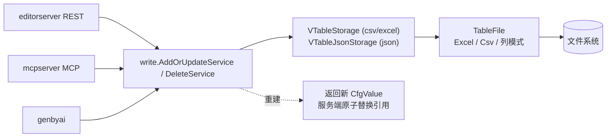

# 写回与服务（write / editorserver / mcpserver）

前面几篇都是"读进来 + 生成出去"。本篇讲**反方向**：编辑器和 AI 把配置**写回**到 Excel/CSV/JSON 文件。三个入口（`editorserver` REST、`mcpserver` MCP、`genbyai`）统一走 `write` 包落盘。

## 写回管道

三个入口都委托给 `write.AddOrUpdateService` / `write.DeleteService`：解析 JSON → 建 `VStruct` → 落盘 → **重建 `CfgValue` 返回**。落盘的具体动作在 `VTableStorage`（csv/excel）或 `VTableJsonStorage`（json 表）。

## `VTableStorage`：原地编辑

见 `write/VTableStorage.java`。类注释一句话点明设计：**"不做任何内存数据结构的修改，只读"**——它只动文件，不动内存。

- **更新**：按主键找到旧记录在文件里的位置（靠记录的 `Source` / `DRowId` 回溯），`emptyRows` 清空那几行，再把新记录块插回原位。
- **新增**：取一个 sheet，`startRow=-1` 追加到末尾。
- **删除**：定位后清空行。

记录在内存里先经 `RecordBlockMapper.mapToBlock` 转成 `RecordBlock`（单元格表示），再按 `fieldIndices` 变换到文件列。`TableFile` 接口（见 `write/TableFile.java`）抽象掉格式差异：`emptyRows` / `insertRecordBlock`（空行不够时自动插新行） / `saveAndClose`，实现有 `ExcelTableFile` / `CsvTableFile` / `ColumnModeExcelTableFile` / `ColumnModeCsvTableFile`。

## `editorserver`：给 cfgeditor 的 REST API

见 `editorserver/EditorServer.java`。基于 `com.sun.net.httpserver`，虚拟线程池执行（`newVirtualThreadPerTaskExecutor`）。主要路由：

| 方法 | 路由 | 作用 |
|---|---|---|
| GET | `/schemas` | schema 概览 |
| GET | `/search?q=&max=` | 全局搜索（`SearchService`） |
| GET | `/record?table=&id=&depth=&...` | 取记录（含取引用 / 取未被引用模式） |
| GET | `/recordRefIds?table=&id=&in=&out=` | 引用图（入/出深度，靠 `TableSchemaRefGraph`） |
| POST | `/recordAddOrUpdate?table=` + JSON body | 增 / 改记录 |
| DELETE | `/recordDelete?table=&id=` | 删记录 |
| POST | `/checkJson?table=` + JSON | 校验 JSON 合法性（不落盘） |
| GET | `/prompt?table=` | 生成 AI prompt |
| GET/POST | `/notes` / `/noteUpdate` | 笔记（存 `_note.csv`） |

响应统一 JSON（fastjson2），带 CORS 头（`Access-Control-Allow-Origin: *`）——因为 cfgeditor 是浏览器端（Tauri/React）跨域调用。

写操作（`recordAddOrUpdate` / `recordDelete`）`synchronized(this)`，成功后把服务端持有的 `cfgValue` **原子替换**为 service 返回的新值。

## `mcpserver`：给 AI 的 MCP 服务

见 `mcpserver/CfgMcpServer.java`。用 codeboyzhou 的声明式 MCP SDK（`@McpServerApplication`），流式 HTTP 端口默认 3457。工具（`@McpTool`）：

| 工具 | 作用 |
|---|---|
| `SchemaTool` | 查表结构 |
| `ReadRecordTool` | 读记录 |
| `WriteRecordTool` | `addOrUpdateRecord` / `deleteRecord`（见 `mcpserver/WriteRecordTool.java`） |
| `SearchTool` | 搜索 |

写工具 `synchronized(lock)` 串行化，成功后 `CfgMcpServer.updateCfgValue` 换值。

## 设计原理

1. **写回统一走 `write` 包**：editor / mcp / byai 三个入口都委托给 `AddOrUpdateService` / `DeleteService`。写逻辑实现一次，多入口复用，行为一致。
2. **服务端值用 `allowErr=true`**：`initFromCtx` 调 `makeValue(tag, true)`——数据可能有引用错误，但仍要能展示/编辑。**带 tag 时是 partial 视图 → 不可写**（返回 `serverNotEditable`），因为写回部分视图不安全。这呼应 [`01`](01-architecture-overview.md) 里 allowErr 方向的设计。
3. **写文件不改内存**：`VTableStorage` 只动文件；写完由 service 重建 `CfgValue` 返回，服务端原子替换引用。**内存值与文件不会停在半同步状态**——要么全没改、要么全改完。
4. **原地编辑**：更新时定位记录在文件里的原始行列再覆写，**保留文件布局**（别的行、注释都不动）。这对策划很重要——他们的 Excel 注释/格式不被破坏。
5. **写串行化**：editor `synchronized(this)`、mcp `synchronized(lock)`。写是状态变更，串行避免竞态。
6. **文件监听 + postrun**：`watch>0` 时监听数据目录，防抖等待后 reload context，并可选跑 `postrun` bat（比如重新生成代码）——支撑"编辑器改完自动重生"的工作流。

## 关键类速查

| 关注点 | 主类 |
|---|---|
| 写编排（JSON→VStruct→落盘→重建值） | `write/AddOrUpdateService`、`write/DeleteService` |
| csv/excel 落盘 | `write/VTableStorage` |
| json 落盘 | `write/VTableJsonStorage` |
| 记录块映射 | `write/RecordBlockMapper`、`write/RecordBlock` |
| 文件抽象 | `write/TableFile` + `ExcelTableFile` / `CsvTableFile` / 列模式 |
| REST 服务 | `editorserver/EditorServer` + 各 `*Service` |
| MCP 服务 | `mcpserver/CfgMcpServer` + 4 个 `*Tool` |
| 文件监听 | `ctx/WatchAndPostRun` |

## 接下来

写回和校验都依赖一套**收集式错误机制** → [`08-errors-and-validation`](08-errors-and-validation.md)。
