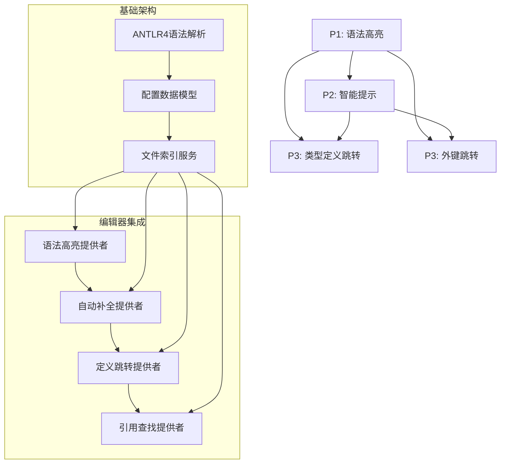

# Tasks: CFG文件编辑器支持

**Feature**: CFG文件编辑器支持
**Date**: 2025-11-06
**Spec**: [spec.md](./spec.md)
**Plan**: [plan.md](./plan.md)

**Note**: This template is filled in by the `/speckit.tasks` command. See `.specify/templates/commands/tasks.md` for the execution workflow.

## 用户故事优先级

基于spec.md中的用户故事优先级：
- **P1**: 语法高亮 - 最高优先级，基础功能
- **P2**: 智能提示 - 中等优先级，提升编辑体验
- **P3**: 类型定义跳转 - 较低优先级，高级功能
- **P3**: 外键跳转 - 较低优先级，高级功能

## 依赖图



## 并行执行示例

```bash
# 阶段1: 基础架构 (可并行)
# 任务: 1.1, 1.2, 1.3, 1.4, 1.5

# 阶段2: 语法高亮 (依赖阶段1)
# 任务: 2.1, 2.2, 2.3, 2.4

# 阶段3: 智能提示 (依赖阶段1和2)
# 任务: 3.1, 3.2, 3.3, 3.4

# 阶段4: 高级功能 (依赖阶段1-3)
# 任务: 4.1, 4.2, 4.3, 4.4, 4.5
```

## 任务清单

### 阶段1: 基础架构 (P1依赖)

#### 1.1 项目初始化和配置
- [ ] **创建VSCode插件项目结构**
  - 创建package.json配置插件元数据
  - 配置TypeScript编译设置
  - 设置开发依赖和构建脚本
  - 验证VSCode API版本兼容性
  - **文件**: `package.json`, `tsconfig.json`
  - **依赖**: 无
  - **验收标准**: 项目能正常编译和运行

#### 1.2 ANTLR4语法集成
- [ ] **集成ANTLR4 TypeScript运行时**
  - 安装ANTLR4 TypeScript依赖
  - **复制语法文件**: `grammar/Cfg.g4` 必须完全从 `../app/src/main/java/configgen/schema/cfg/Cfg.g4` 复制，保证语法完全一致
  - 配置ANTLR4语法文件编译
  - 生成词法分析器和语法分析器
  - 创建语法访问者基类
  - **文件**: `grammar/Cfg.g4`, `src/parser/cfgLexer.ts`, `src/parser/cfgParser.ts`
  - **依赖**: 1.1
  - **验收标准**: 能成功解析.cfg文件语法，语法定义与源文件完全一致

#### 1.3 配置数据模型
- [ ] **实现核心数据模型类**
  - 创建ConfigFile类表示配置文件
  - 实现StructDefinition结构体模型
  - 实现InterfaceDefinition接口模型
  - 实现TableDefinition表模型
  - 实现FieldDefinition字段模型
  - **文件**: `src/model/configModel.ts`, `src/model/structModel.ts`, `src/model/interfaceModel.ts`, `src/model/tableModel.ts`
  - **依赖**: 1.2
  - **验收标准**: 数据模型能正确表示.cfg文件结构

#### 1.4 文件索引服务
- [ ] **实现全局文件索引服务**
  - 创建TypeRegistry类型注册表
  - 实现文件监听和增量更新
  - 创建ProjectIndex项目索引
  - 实现跨文件引用解析
  - **文件**: `src/services/indexService.ts`, `src/model/typeRegistry.ts`
  - **依赖**: 1.3
  - **验收标准**: 能正确索引和更新项目文件

#### 1.5 基础工具类
- [ ] **实现通用工具类**
  - 创建Logger日志工具
  - 实现Performance性能监控
  - 创建NamespaceUtils命名空间工具
  - 实现缓存服务
  - **文件**: `src/utils/logger.ts`, `src/utils/performance.ts`, `src/utils/namespaceUtils.ts`, `src/services/cacheService.ts`
  - **依赖**: 1.1
  - **验收标准**: 工具类功能正常，性能监控准确

### 阶段2: 语法高亮 (P1)

#### 2.1 语法高亮提供者
- [ ] **实现DocumentSemanticTokensProvider**
  - 配置语义标记类型定义
  - 实现provideDocumentSemanticTokens方法
  - 支持增量更新语义标记
  - 处理语法解析错误
  - **文件**: `src/providers/syntaxHighlighter.ts`
  - **依赖**: 1.2, 1.3
  - **验收标准**: .cfg文件正确显示语法高亮

#### 2.2 语义标记类型
- [ ] **定义语义标记类型和颜色**
  - 配置struct/interface/table标记
  - 定义字段、关键字、注释标记
  - 设置外键引用标记颜色
  - 配置元数据属性标记
  - **文件**: `package.json` (contributes.semanticTokenColors)
  - **依赖**: 2.1
  - **验收标准**: 不同类型元素正确着色

#### 2.3 语法高亮测试
- [ ] **创建语法高亮测试用例**
  - 测试基本语法结构高亮
  - 测试嵌套结构高亮
  - 测试外键引用高亮
  - 验证性能目标(<50ms)
  - **文件**: `test/unit/providers/syntaxHighlighter.test.ts`
  - **依赖**: 2.1, 2.2
  - **验收标准**: 所有测试通过，性能达标

#### 2.4 语法高亮集成
- [ ] **集成到VSCode扩展**
  - 在package.json注册语言特性
  - 配置激活事件和贡献点
  - 实现插件激活逻辑
  - 验证插件启动性能
  - **文件**: `src/extension.ts`, `package.json`
  - **依赖**: 2.1, 2.2
  - **验收标准**: 插件正常激活，语法高亮工作

### 阶段3: 智能提示 (P2)

#### 3.1 自动补全提供者
- [ ] **实现CompletionItemProvider**
  - 提供结构体/接口/表名称补全
  - 实现字段名称和类型补全
  - 支持外键表名称补全
  - 提供关键字和元数据属性补全
  - **文件**: `src/providers/completionProvider.ts`
  - **依赖**: 1.4, 2.4
  - **验收标准**: 输入时显示准确的自动补全建议

#### 3.2 上下文感知补全
- [ ] **实现基于上下文的补全逻辑**
  - 根据光标位置确定补全类型
  - 实现命名空间解析
  - 支持接口多态补全
  - 处理复杂类型系统
  - **文件**: `src/providers/completionProvider.ts`
  - **依赖**: 3.1
  - **验收标准**: 补全建议准确反映当前上下文

#### 3.3 悬停提示提供者
- [ ] **实现HoverProvider**
  - 显示结构体/接口/表文档
  - 提供字段描述和类型信息
  - 显示外键目标信息
  - 支持接口多态信息
  - **文件**: `src/providers/hoverProvider.ts`
  - **依赖**: 1.4, 2.4
  - **验收标准**: 悬停时显示有用的文档信息

#### 3.4 智能提示测试
- [ ] **创建智能提示测试用例**
  - 测试自动补全准确性
  - 验证悬停提示内容
  - 测试性能目标(<100ms)
  - 验证错误处理
  - **文件**: `test/unit/providers/completionProvider.test.ts`, `test/unit/providers/hoverProvider.test.ts`
  - **依赖**: 3.1, 3.2, 3.3
  - **验收标准**: 所有测试通过，性能达标

### 阶段4: 高级功能 (P3)

#### 4.1 定义跳转提供者
- [ ] **实现DefinitionProvider**
  - 支持结构体/接口/表定义跳转
  - 实现外键引用跳转(->, =>)
  - 支持接口实现类跳转
  - 实现枚举表引用跳转
  - **文件**: `src/providers/definitionProvider.ts`
  - **依赖**: 1.4, 3.4
  - **验收标准**: Ctrl+点击正确跳转到定义

#### 4.2 引用查找提供者
- [ ] **实现ReferenceProvider**
  - 查找类型定义的所有引用
  - 支持外键引用的反向查找
  - 实现接口实现类的引用查找
  - 提供引用计数和位置信息
  - **文件**: `src/providers/referenceProvider.ts`
  - **依赖**: 4.1
  - **验收标准**: 能正确查找所有引用位置

#### 4.3 验证服务
- [ ] **实现配置验证服务**
  - 语法验证(ANTLR4语法)
  - 语义验证(类型存在性、外键有效性)
  - 接口验证(enumRef表匹配)
  - 提供诊断信息和快速修复
  - **文件**: `src/services/validationService.ts`
  - **依赖**: 1.4, 2.4
  - **验收标准**: 能正确检测和报告配置错误

#### 4.4 高级功能测试
- [ ] **创建高级功能测试用例**
  - 测试定义跳转准确性
  - 验证引用查找完整性
  - 测试配置验证规则
  - 验证跨文件功能
  - **文件**: `test/unit/providers/definitionProvider.test.ts`, `test/unit/providers/referenceProvider.test.ts`, `test/unit/services/validationService.test.ts`
  - **依赖**: 4.1, 4.2, 4.3
  - **验收标准**: 所有测试通过，功能完整

#### 4.5 快速导航提供者
- [ ] **实现快速导航和搜索功能**
  - 创建符号提供者支持快速跳转
  - 实现配置元素搜索功能
  - 支持大纲视图显示配置结构
  - 提供文件内导航快捷方式
  - **文件**: `src/providers/navigationProvider.ts`
  - **依赖**: 1.4, 2.4
  - **验收标准**: 用户能够快速导航和搜索配置元素

### 阶段5: 集成和优化

#### 5.1 集成测试
- [ ] **创建端到端集成测试**
  - 测试完整编辑体验
  - 验证跨文件引用解析
  - 测试大型配置文件性能
  - 验证内存使用情况
  - **文件**: `test/integration/extension.test.ts`
  - **依赖**: 所有阶段
  - **验收标准**: 集成测试通过，用户体验流畅

#### 5.2 性能优化
- [ ] **实施性能优化措施**
  - 优化语法解析性能
  - 改进索引更新策略
  - 实施内存使用优化
  - 验证性能目标达成
  - **文件**: 所有相关文件
  - **依赖**: 所有阶段
  - **验收标准**: 性能指标达标，内存<50MB

#### 5.3 文档和发布
- [ ] **完善文档和发布准备**
  - 更新README使用说明
  - 创建用户指南和API文档
  - 准备发布包和安装说明
  - 验证插件市场兼容性
  - **文件**: `README.md`, `docs/`
  - **依赖**: 所有阶段
  - **验收标准**: 文档完整，插件可发布

## 并行执行策略

### 可并行执行的阶段
- **阶段1内部**: 任务1.1, 1.2, 1.5可并行执行
- **阶段2内部**: 任务2.1, 2.2可并行执行
- **阶段3内部**: 任务3.1, 3.3可并行执行
- **阶段4内部**: 任务4.1, 4.3可并行执行

### 关键路径
1. 阶段1 → 阶段2 → 阶段3 → 阶段4 → 阶段5
2. 语法解析(1.2) → 数据模型(1.3) → 索引服务(1.4) → 所有提供者

### 风险缓解
- 优先完成P1功能(语法高亮)确保基础体验
- 并行开发非依赖组件最大化开发效率
- 早期集成测试验证架构设计

## 验收标准总结

- ✅ 语法高亮: .cfg文件正确着色，响应时间<50ms
- ✅ 智能提示: 准确的自动补全和悬停提示，响应时间<100ms
- ✅ 类型跳转: Ctrl+点击正确跳转到定义
- ✅ 外键跳转: 支持->和=>引用跳转
- ✅ 性能: 插件启动<1秒，内存<50MB
- ✅ 稳定性: 无崩溃，正确处理错误情况
- ✅ 兼容性: 支持VSCode 1.60.0+，跨平台运行

---

**生成时间**: 2025-11-06
**生成工具**: `/speckit.tasks`
**状态**: 就绪实施