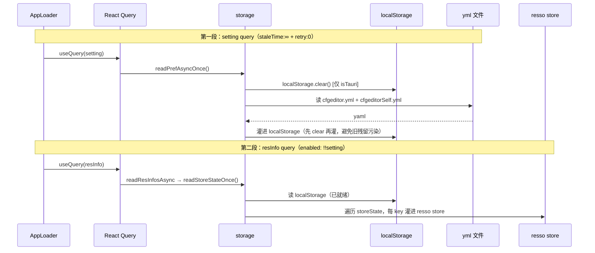

# 02 状态管理：五种方案分工

> cfgeditor 的「状态」不是一种，是**五种方案各管一摊**。本文讲它们的职责边界、为什么不只一种、启动时偏好怎么灌注、怎么持久化。
>
> **不讲**：EditingSession 内部实现（值类 / 结构类 / undo / coalescing → [03 编辑会话](03-editing-session-undo.md)）、React Query 的缓存 / 失效（→ [01 数据流](01-data-flow.md)）。本文只讲「谁存什么、怎么配合」。
>
> 【承前】01 的 React Query 是其中一种（远端态）。　【启后】五种里的 `EditingSession` 承载编辑能力 → [03](03-editing-session-undo.md)。

---

## 一、五种状态方案

| 方案 | 存什么 | 机制 | 何时读 / 写 |
|---|---|---|---|
| **React Query** | 远端服务器数据（schema / notes / record / layout …）| 01 的 `queryClient` | 网络来回 |
| **resso store** | 业务 UI 态（按用途分组的若干 key）| [`store.ts`](../src/store/store.ts) + [`resso.ts`](../src/store/resso.ts) | render 期同步读、事件期写 |
| **storage** | 偏好持久化（跨会话）| localStorage + Tauri yml | 启动灌入、关窗落盘 |
| **EditingSession** | 单条 record 的编辑态（每条一实例）| [`editingSession.ts`](../src/services/editingSession.ts) | 编辑期 |
| 路由派生 | URL 解析出的 `curPage` / `curTableId` / `curId` | `useLocationData`（01）| 每次渲染 |

**为什么不只用一种**：远端数据要缓存 + 失效（RQ）；UI 态要同步读 + 细粒度订阅（resso）；偏好要跨会话（storage）；编辑态要可变 + undo（EditingSession）。各取所长——职责混用容易出 bug，强行统一更糟。

---

## 二、resso：per-key 订阅机制

[`resso.ts`](../src/store/resso.ts) 是 **vendored 的机制库**（文件头注明「VENDORED from resso… 勿在此加业务代码；升级时整文件覆盖」）。它只提供 store 工厂机制，业务态在 store.ts。

### 2.1 机制：Proxy + useSyncExternalStore

`resso` 工厂做两件事：

1. 初始化时给每个 key 建一份**独立**订阅槽（一个 setter 集合 + 该 key 的 snapshot）。
2. 返回一个代理对象：
   - 读某 key → 调 `useSyncExternalStore` 订阅**该 key 的 setter 集**、取**该 key 的 snapshot**。
   - 写某 key → 对比 `oldVal !== newVal`，新值才触发**该 key 的 setter 集**。

```
per-key 订阅槽形状（每个 key 一份，互不相干）：
  setters   : Set<react 重渲回调>   ← useSyncExternalStore 注册
  snapshot  : 该 key 当前的值       ← getSnapshot 直接返回
```

核心：`get` 命中某 key 时只订阅**该 key**，`set` 时只通知**该 key** 的订阅者。

### 2.2 两个关键性质

- **per-key 订阅**：`useMyStore()` 解构几个 key 就只订阅这几个，**不是整 store**。改 `maxImpl` 不会让只读 `dragPanel` 的组件重渲——因为 `dragPanel` 的 `Set<setter>` 没被触发。
- **同值短路**：`setKey` 里 `if (obj[key] !== newVal)`——赋相同值不触发订阅者。

> 这就是为什么 05 里 `query` 走 resso store 而不是塞进 `node.data`：搜索框输入只改 `query`，resso per-key 只重渲订阅 `query` 的高亮组件，不重建 nodes / 不重跑 ELK。

### 2.3 业务 store

业务侧：[`store.ts`](../src/store/store.ts) 把初值对象 `storeState` 传给 `resso` 得到 `store`，再用 `useMyStore()` 返回它供组件解构订阅。

---

## 三、store.ts：业务 UI 态

`StoreState`（[`store.ts`](../src/store/store.ts)）的若干 key，按用途分组：

| 分组 | key | 说明 |
|---|---|---|
| **连接** | `server` / `aiConf` / `themeConfig` | 后端地址 / AI 配置（含 apiKey）/ 主题文件 |
| **图拓扑** | `maxImpl` / `refIn` / `refOutDepth` / `maxNode` / `recordRefIn` / `recordRefInShowLinkMaxNode` / `recordRefOutDepth` / `recordMaxNode` / `refIdsInDepth` / `refIdsOutDepth` / `refIdsMaxNode` / `nodeShow` / `tauriConf` | 各视图展开 / 引用深度；按 queryKey 归属分三组（见 §3.1）|
| **UI 交互** | `dragPanel` / `pageConf` / `query` / `searchMax` / `imageSizeScale` / `isNextIdShow` | 当前侧栏 / 固定页 / 搜索框值 / 缩放 |
| **编辑模式开关**（持久化、URL 派生）| `isEditMode` | URL `/edit` 段派生（[`Record.tsx`](../src/features/record/Record.tsx) 的 effect 调 `setIsEditMode(edit)`），写个人 pref |
| **编辑会话镜像**（不持久化）| `editingCurTable` / `editingCurId` / `editingIsEdited` | 只由 EditingSession `onEditingStateChange` 回调写，供 HeaderBar 显示 unsaved |
| **资源 / 历史**（不持久化）| `history` / `resMap` / `resourceDir` | 运行时计算 / 访问栈 |

### 3.1 setter 纯化转向

老版本改拓扑 setting（`maxImpl` / `refOutDepth` / …）要手动调 `clearLayoutCache`。现在不用——这些字段已纳入 layout `queryKey` 的 `topologyKeys`（04），改值时 queryKey 自然变 → React Query 自动失效重取。

`setMaxImpl` / `setNodeShow` 等 setter 的源码注释明说：不清 layout 缓存——`topologyKeys` 已进 layout queryKey，改值自然失效，store 重新变**纯状态容器**，把缓存失效让位给 queryKey。

拓扑 setting 按 queryKey 归属分三组（改值由对应 queryKey 自然失效）：

| 字段 | 所属 queryKey |
|---|---|
| `maxImpl` / `refIn` / `refOutDepth` / `maxNode` / `recordRefIn` / `recordRefInShowLinkMaxNode` / `recordRefOutDepth` / `recordMaxNode` / `tauriConf`（9 个）| layout 的 `topologyKeys`（04）|
| `nodeShow`（部分）| layout 的 `layoutKeys`——`pickLayoutKeys` 白名单挑 13 个布局字段（04），纯颜色字段（`nodeColor*` / `edgeColor` 等）故意排除 |
| `refIdsInDepth` / `refIdsOutDepth` / `refIdsMaxNode`（3 个）| `recordRefIds` queryKey（Finder 的 RefIdList）|

### 3.2 编辑会话镜像

`editingCurTable` / `editingCurId` / `editingIsEdited` 三个 key 不持久化（`notSaveKeySet`），**只由 EditingSession 通过 `onEditingStateChange` 回调写**（[`Record.tsx`](../src/features/record/Record.tsx) 构造 session 时把 `setEditingState` 注入回调）——HeaderBar 订阅它们显示 unsaved 脏点。store 不直接管编辑态，只镜像显示。

**为什么用 store 镜像而非直订 EditingSession**：HeaderBar 渲染在路由 Outlet **外**，与持 session 的 Record 是**兄弟**；session 实例受 per-record 生灭语义限制（随 record 切换 mount / unmount）不能上提到 CfgEditorApp，故把 `{table, id, isEdited}` 三元组镜像到 resso store 供兄弟读——"兄弟可见、实例不上提"的标准解。Chat / AddJson 寻址当前会话走另一条：模块级 `currentEditingSession` 指针（见六）。

---

## 四、storage：偏好持久化

[`storage.ts`](../src/store/storage.ts) 双存储：**localStorage 同步层（真相源）+ Tauri yml 异步层（跨会话镜像）**。

### 4.1 为什么双存储

resso store 初始化不能等 async（组件 render 期要同步读），所以 **localStorage 作真相源（同步）、Tauri yml 作跨会话镜像（异步）**。`getPrefInt/Bool/Str/Json` 只读 localStorage；`setPref` 写 localStorage + 异步排程 yml。

### 4.2 双 yml + 键集三分类

两份 Tauri `Resource` 目录的 yml：

- `cfgeditor.yml`（共享 / 团队）：键集 `prefKeySet`
- `cfgeditorSelf.yml`（个人 / 敏感）：键集 `prefSelfKeySet` —— 含 `aiConf`（有 apiKey），与团队共享隔离

键集三分类：

```
prefSelfKeySet = { curPage, curTableId, curId, query, isEditMode,
                   imageSizeScale, dragPanel, aiConf }              # aiConf 含 apiKey，写个人文件
notSaveKeySet  = { history, resMap, resourceDir,
                   editingCurTable, editingCurId, editingIsEdited } # 编辑镜像不持久化
prefKeySet     = storeState 全部 key − prefSelfKeySet − notSaveKeySet  → 共享文件
```

> **注**：`prefSelfKeySet` 里的 `curPage` / `curTableId` / `curId` **不在 `StoreState` 类型里**——它们是路由派生的 localStorage key（`navTo` 直接 `setPref` 写，见 §一 路由派生行）。故 `StoreState ∩ prefSelfKeySet` 实际只有 5 个（`query` / `isEditMode` / `imageSizeScale` / `dragPanel` / `aiConf`）。

**依赖方向**：键集由 store 在模块加载时 `registerPrefKeySet` 注册给 storage，**消除 storage→store 反向依赖**——storage 只持有两个 `Set<string>`，不知道 store 的类型。

### 4.3 启动门卫两段式



为什么分两段：先让 localStorage 就绪（第一段），再从它同步灌 store（第二段）——避开「store 初始化读到空 localStorage」的竞态。`alreadyRead` 守卫保证各只跑一次（`readPrefAsyncOnce` 在 [`storage.ts`](../src/store/storage.ts)、`readStoreStateOnce` 在 [`store.ts`](../src/store/store.ts)，两份分驻两文件）。

**setting query 配置**（[`AppLoader.tsx`](../src/app/AppLoader.tsx)）：`staleTime: Infinity`（只跑一次，永不 stale 防重读 yml 覆盖内存态）+ `retry: 0`（yml 读失败不无限重试）。**web 模式**（非 Tauri）`readPrefAsyncOnce` 早 return（`if (!isTauri()) return`，不 clear 不读 yml），只走 localStorage。

`readStoreStateOnce` 按类型分发：复杂对象（`nodeShow` / `aiConf` / `pageConf` / `tauriConf` / `themeConfig`）用 `getPrefJson` + Convert parser；基本类型按 `typeof` 走 `getPrefBool` / `getPrefInt` / `getPrefStr`。

### 4.4 写盘三层防丢

偏好写盘（`setPref` → localStorage + 异步 yml）有三层保护：

```
① debounce（300ms 兜底上限）：合并短时间多次写
   - 例：navTo 一次触发 3 次 setPref（curPage / curTableId / curId）
   - 每个 (fn, keySet) 挂一个 timer，新写重置 timer

② 串行化：同文件并发写会损坏 / 丢字段
   - 每文件一条共享 Promise 链，writeTextFile 依次排队
   - 形状：writeChain = writeChain.then(saveKeySetPrefAsync).catch(log)

③ 关窗强制 flush（绕过 debounce）：
   - main.tsx 的 onCloseRequested → event.preventDefault()
   - await flushAllPrefsAsync() → 个人 + 共享两份都走 ②串行落盘
   - 完成后再 Window.destroy()
```

为什么三层都不可少：debounce 省 IO，但 pending 定时器在关窗 `destroy` 前没 fire 就丢——所以关窗要 `preventDefault` + bypass debounce 强制串行落盘（见 [`main.tsx`](../src/main.tsx) 的 `onCloseRequested`）。串行化防同文件并发写损坏。

---

## 五、React Query（远端态）

见 [01 数据流](01-data-flow.md)。承担所有从后端拉的数据（schema / notes / record / recordRef / layout / prompt / search / resInfo）。既当远端缓存又当派生态管道：`select` 把 `RawSchema → Schema` class、layout 的 `queryFn` 直接跑 ELK——派生计算与原始数据同生命周期，缓存命中即跳过派生。

---

## 六、EditingSession（编辑态，定位边界）

**每条 record 编辑态一个 `EditingSession` 实例**（[`editingSession.ts`](../src/services/editingSession.ts)），用 `useSyncExternalStore` 接入 React，承担值类 / 结构类编辑的就地变异、undo / redo、脏标记、视口语义。模块级 `currentEditingSession` 指针让 Splitter 兄弟（Chat / AddJson）跨路由寻址当前会话。

它和 store 的界限很清：

- EditingSession 管「正在编辑这条 record 的可变态」（实例级、可变、有 undo）。
- store 只**镜像**它的 `(table, id, isEdited)` 给 HeaderBar 显示（见 §3.2），不持有编辑数据本身。

内部实现（值类 / 结构类二分、就地变异、undo 栈、coalescing）见 [03 编辑会话](03-editing-session-undo.md)。

---

## 七、Cheat Sheet

**加一个 UI 状态**：在 `store.ts` 的 `StoreState` 加 key + `storeState` 初值 → 需持久化就加入 `prefSelfKeySet`（个人敏感）或默认进 `prefKeySet`（共享）；运行时的加入 `notSaveKeySet`。

**偏好读写**：读用 `getPrefInt/Bool/Str/Json`（同步，读 localStorage）；写用 `setPref`（写 localStorage + 异步 yml）。别直接操作 localStorage / yml。

**换库**：`setServer` 已 `removeQueries({queryKey: []})` 全清缓存（多数 queryKey 不含 `server`，个别如 `search` 含——全清已覆盖），无需额外处理。

**改拓扑 setting**：直接 `setMaxImpl` 等，**不要**手动清 layout 缓存——`topologyKeys` 已进 layout queryKey，自然失效。

---

## 一句话速记

- **五种状态各管一摊**：RQ（远端）/ resso（UI 态）/ storage（偏好）/ EditingSession（编辑态）/ 路由派生——别混用，也别强行统一。
- **resso per-key 订阅**：解构几个 key 只订阅这几个，改一个 key 不波及读别的 key 的组件。
- **启动门卫两段**：`setting` 灌 localStorage → `resInfo` 灌 resso store；先 clear 再灌。
- **写盘三层**：debounce（省 IO）+ 串行化（防损坏）+ 关窗 flush（bypass 防丢）。
- **store setter 纯化**：拓扑字段进 layout queryKey，改值自然失效，store 不再命令式清缓存。
