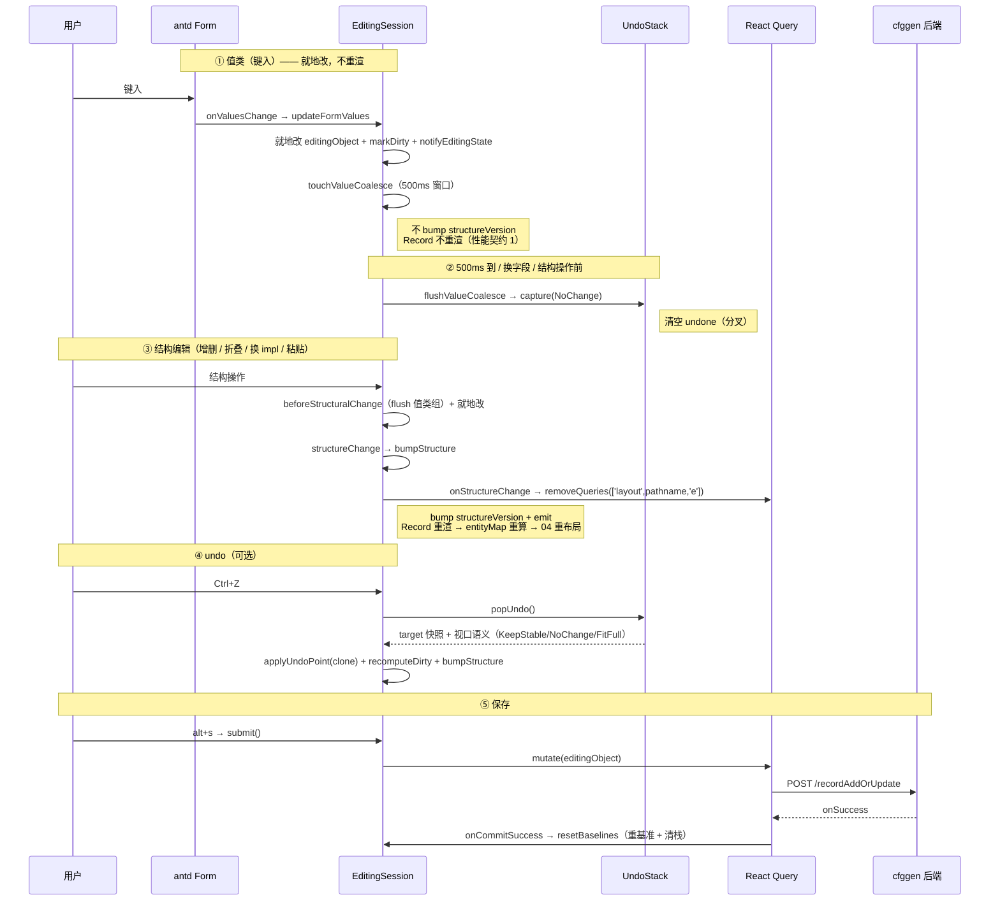

# 03 编辑会话 + Undo/Redo

> `EditingSession` 是单条 record 的「编辑会话」——一个可变 store 实例，每打开一条记录编辑就建一个。它管：编辑态的就地变异、值类 / 结构类二分、undo / redo、脏标记、视口语义。配套 `UndoStack` 是纯数据栈。
>
> **不讲**：layout 怎么消费缓存失效信号（→ [04](04-layout-viewport.md)）、表单怎么写入（→ [06](06-edit-form.md)）。本文只讲编辑会话内部机制。
>
> 【承前】02 点出 `EditingSession` 是五种状态之一、编辑地基。　【启后】结构编辑 `onStructureChange` 清 layout 缓存 → 钩给 04；undo 快照带视口语义 → 喂给 04 的视口算法。

设计要点直接写在文件头注释（editingSession.ts:8-30）——是这套机制最好的总纲，建议先读一遍。

---

## 一、为什么是实例而非全局单例

旧版本是模块级全局单例 `editState`，在 React render 期变异（反模式，已根治）。现改为**每条 record 一个 `EditingSession` 实例**（editingSession.ts:40），所有 mutation 只发生在**事件回调**（UI 触发的编辑方法）或 **effect**（`maybeReset`），绝不在 render 期。

模块级 `currentEditingSession` 指针（:480）让 Splitter 兄弟（Chat / AddJson，非 Record 子树）跨路由寻址当前会话：

```ts
let currentEditingSession: EditingSession | null = null;
export function getCurrentEditingSession() { return currentEditingSession; }
export function setCurrentEditingSession(session) { currentEditingSession = session; }
```

它不是 React state，变异发生在 mount/unmount effect + 事件回调，不在 render——故不走 resso，用模块指针。

---

## 二、值类 vs 结构类二分（红线 1，核心）

所有编辑方法分两类，**这是全项目的性能地基**：

### 2.1 值类（不重渲）

`updateFormValues` / `updateNote`（:162 / :240）：

```ts
updateFormValues(schema, values, fieldChains, changed) {   // 简化签名
    // ...就地改 obj[key] = conv(fieldValue)...
    this.markDirty();
    this.notifyEditingState();      // 刷新 HeaderBar 脏点
    // 不 bump structureVersion、不 emit → Record 不重渲（性能契约 1）
}
```

改字段值 → 就地改 `editingObject` + `markDirty` + `notifyEditingState`，**不 bump `structureVersion`、不 emit** → Record 不重渲、entityMap 不重建。一张记录常含几十个表单输入，每键一次就重建布局会卡。

### 2.2 结构类（重算）

`addArrayItem` / `addArrayItemAtIndex` / `deleteArrayItem` / `swapArrayItem` / `updateFold` / `updateInterfaceValue` / `pasteStruct`（:250+）：

```ts
addArrayItem(defaultItem, arrayFieldChains, position) {
    this.beforeStructuralChange();
    const obj = getFieldObj(this.editingObject, arrayFieldChains);
    obj.push(defaultItem);
    this.structureChange(position);   // bump + emit → Record 重渲 → entityMap 重算
}
```

增删 / 交换 / 折叠 / 换 impl / 粘贴 → `beforeStructuralChange` + 就地改 + `structureChange`（:391，固定 `FitId` + undo `KeepStable` 锚点）→ bump `structureVersion` + emit → Record 重渲 → entityMap 重算。

**例外：`replaceEditingObject`（Chat / AddJson 整体替换）bypass `structureChange`**——它直接 `bumpStructure({fitView: FitFull})` + `capture(FitFull)`（:305-312），因为整体替换需要正向 FitFull + undo FitFull 且无锚点，与 `structureChange` 固定的 `FitId + KeepStable` 语义不同。

### 2.3 方法清单

| 类别 | 方法 | 视口语义 |
|---|---|---|
| 值类 | `updateFormValues` / `updateNote` | 不 bump、不重布局 |
| 结构类 | `addArrayItem` / `addArrayItemAtIndex` / `deleteArrayItem` / `swapArrayItem` | `FitId` + undo `KeepStable` |
| 结构类 | `updateFold`（07 的 `$fold`）| `FitId` + undo `KeepStable` |
| 结构类 | `updateInterfaceValue`（换 impl）| `FitId` + undo `KeepStable` |
| 结构类 | `pasteStruct`（粘贴）| `FitId` + undo `KeepStable` |
| 结构类 | `replaceEditingObject`（Chat / AddJson / funcClear）| `FitFull` + undo `FitFull` |
| 特殊 | Form.List 长度变化（在 `updateFormValues` 内）| capture 但**不 bump**（不重算 entityMap / 不重渲），undo `NoChange`（primitive list 非节点、布局不变）|

---

## 三、就地变异 + 共享引用（红线 2）

`editingObject` 是各 `onUpdateXxx` **就地改的同一对象**（不靠不可变更新）。`RecordEditEntityCreator.createThis` 把它的子对象引用塞进 `entity.edit.editObj`——值类改后闭包直接见最新值，提交时 `submit()` 读到全量最新。

```ts
submit(): void { this.mutate?.(this.editingObject); }   // :334，读全量最新
```

> 这与「不可变状态 + 浅比较」的 React 常规相反，是有意为之：编辑会话是短期、实例级、可撤销的可变态，就地变异 + 共享引用让值类编辑零重渲成为可能。勿改成不可变 reducer。

---

## 四、useSyncExternalStore + structureVersion

组件订阅 `getStructureVersion`（基本类型 `number`，:97）：

```ts
subscribe = (listener) => { this.listeners.add(listener); return () => this.listeners.delete(listener); };
getStructureVersion = (): number => this.structureVersion;
getEditingObject = (): JSONObject => this.editingObject;
```

- 值类编辑：不 bump → 订阅者不重渲
- 结构类编辑：bump → 订阅者（Record）重渲

**关键**：`getSnapshot` 永远返回基本类型。**绝不返回 `editingObject` 引用**——就地变异下顶层引用不变，返回引用会让 React 永远跳过更新（`Object.is` 判相等）。这是「就地变异 + useSyncExternalStore」组合的铁律。

---

## 五、脏标记三态缓存（getIsEdited）

`getIsEdited`（:101）不能每次都深比较（O(n)），用三态缓存：

```ts
getIsEdited(): boolean {
    if (!this.dirty) return false;                                    // ① 精确 clean：采信（任何 mutation 经 markDirty 置 true）
    if (this.mutationSeq === this.mutationSeqCached) return true;     // ② 自上次精确算后无新 mutation：采信 true
    this.dirty = !isDeeplyEqual(this.editingObject, this.originalEditingObject);  // ③ 有新 mutation：重新深比较并缓存
    this.mutationSeqCached = this.mutationSeq;
    return this.dirty;
}
```

配合 `markDirty`（:111，乐观置 `dirty=true` + `mutationSeq++`）：

- ① `dirty=false` 必然精确 clean（任何 mutation 经 markDirty 置 true，false 期间不可能有未计入变更）→ 采信，O(1)
- ② `dirty=true` 且 `mutationSeq === mutationSeqCached`：自上次精确算后无新 mutation → 采信 true
- ③ `dirty=true` 且 seq 不同：有新 mutation → 重新深比较（仅在「mutation 后首次读」发生）

这样既保留缓存收益，又修正纯 dirty 标记会误报的场景（updateNote 加一字符再减一字符 = 实际相等却报 dirty）。

---

## 六、UndoStack：纯数据栈

[`undoStack.ts`](../src/domain/undoStack.ts) 是 undo/redo 的**纯数据栈**，刻意**不依赖 session、不调 React**——只管三段语义，可独立单测。session 负责 capture/apply 时机 + `bumpStructure` 驱动 React。

```ts
export class UndoStack {
    private baseline!: Snapshot;        // 初始 / 最近提交后状态
    private done: Snapshot[] = [];      // 操作后快照；done[末]=最近
    private undone: Snapshot[] = [];    // 已 undo、可 redo
    private readonly maxDepth = 50;     // 栈深硬上限兜底
    // setBaseline / capture / popUndo / popRedo
}
```

三段语义：

- `baseline`：初始 / 最近一次提交后的状态。undo 到栈底恢复成它（显式存住，无 off-by-one）。
- `done`：操作后快照；`done[末]` = 最近。`capture` 入栈、`popUndo` 弹出。
- `undone`：已 undo、可 redo。`popRedo` 弹出。

**分叉**：`capture` 清空 `undone`（undo 后又新编辑，redo 历史作废，与所有编辑器一致）。`maxDepth=50` 硬上限兜底（大 record 内存）。

> 为什么拆纯栈：栈语义（深、分叉、baseline 栈底、视口语义随快照）可独立单测，不挂 React / session。session 只调 `capture/popUndo/popRedo/setBaseline`，时机和副作用（bump 重渲）归 session。

---

## 七、快照带视口语义

Snapshot 不只存数据（undoStack.ts:14）：

```ts
export type Snapshot = {
    data: JSONObject;        // 必须 structuredClone 独立——存 editingObject 引用会被后续就地变异污染
    undoFitView: EFitView;   // undo/redo 到此快照后该用的视口
    anchorId?: string;       // KeepStable 时的锚点节点 id
};
```

session 侧（:413-427）：

```ts
private captureUndoPoint(): JSONObject { return structuredClone(this.editingObject); }
private capture(undoFitView: EFitView, anchorId?: string): void {
    this.undoStack.capture({data: this.captureUndoPoint(), undoFitView, anchorId});
}
private applyUndoPoint(s: JSONObject): void { this.editingObject = structuredClone(s); }  // clone 入参，防栈里 snapshot 被污染
```

四态 `EFitView`（[entityModel.ts](../src/domain/entityModel.ts)）区分 undo/redo 时的视口动作：

| `EFitView` | 何时用 | undo/redo 视口 |
|---|---|---|
| `FitFull` | 整体替换（Chat / AddJson / reset）| 重新认识图，全图适配 |
| `KeepStable` + 锚点 | 结构操作（增删 / swap / fold / impl / paste）| 锚点屏幕坐标不动 |
| `NoChange` | 值类 / Form.List 长度变 | 不动（值类不重布局）|
| `FitId` | 结构操作**正向**（非 undo）| 适配操作焦点（04 讲）|

`undo()` / `redo()`（:358-375）按被撤销操作的快照语义驱动视口：

```ts
undo(): void {
    this.flushValueCoalesce();                                        // 先固化未 capture 的键入
    if (!this.undoStack.canUndo()) return;
    const {target, undoFitView, anchorId} = this.undoStack.popUndo();
    this.applyUndoPoint(target.data);
    this.recomputeDirty();                                            // 可能回到 baseline 变 clean，重算
    this.bumpStructure({fitView: undoFitView, position: anchorId ? {id: anchorId, x: 0, y: 0} : undefined});
}
```

→ 这把 03 和 04 的视口算法直接串起来（04 的 `pickViewportAction` 吃 `editingObjectRes` 的 `fitView` / `fitViewToIdPosition`）。

---

## 八、值类 coalescing（500ms + per-key O(1)）

每键一个字符就 capture 一步 undo 的话，「打一个词」会变十几步 undo，Ctrl+Z 要按十几次——不可用。故同字段连续键入在 **500ms 窗口**内合并成一步（:452）：

```ts
private touchValueCoalesce(fieldKey: string): void {
    if (this.valueCoalesceKey !== fieldKey) {        // 换字段 → 关旧组开新组
        this.flushValueCoalesce();
        this.valueCoalesceKey = fieldKey;
    }
    if (this.valueCoalesceTimer !== undefined) clearTimeout(this.valueCoalesceTimer);
    this.valueCoalesceTimer = setTimeout(() => this.flushValueCoalesce(), 500);  // 500ms 无新键入则关闭组
}
private flushValueCoalesce(): void {
    if (this.valueCoalesceTimer === undefined) return;
    clearTimeout(this.valueCoalesceTimer);
    this.valueCoalesceTimer = undefined;
    this.capture(EFitView.NoChange);                 // 值类组 undo 不动视口
    this.valueCoalesceKey = undefined;
    this.emit();   // capture 不 bump structureVersion；canUndo 已变，emit 通知订阅者
}
```

**fieldKey 来源**：`touchValueCoalesce` 收的 `fieldKey` 实为 `coalesceKey(fieldChains, fieldKey) = [...fieldChains, fieldKey].join('/')`（:446）——含完整嵌套路径，保证不同位置的同名字段不误合并。

**per-key O(1) 不变量**：只做「字段标识比较 + clearTimeout/setTimeout」，**严禁每键 clone/遍历**——否则啃掉性能契约 1（几十表单输入零重渲）。

`beforeStructuralChange`（:472）调 `flushValueCoalesce`：结构操作前先固化未 capture 的键入，避免与结构操作混在一个快照。

---

## 九、submit / onCommitSuccess / resetBaselines（重基准挂 onSuccess）

```ts
submit(): void { this.mutate?.(this.editingObject); }   // :334，只发请求

onCommitSuccess(): void { this.resetBaselines(); }      // :341，mutation onSuccess 才调
```

**为什么重基准挂在 `onSuccess` 而非 `submit`**（:338 注释）：提交是异步网络调用，可能失败。若 `submit()` 发请求时就清栈重基准，一旦失败——undo 历史没了（没法退回重改）、脏标记还误报「已保存」——数据危险。挂 `onSuccess` 才保证「只有真落盘了，才算这次编辑结束」。

`resetBaselines`（:432）：清 coalesce timer → `captureUndoPoint` 深拷 → 同时重置 `originalEditingObject`（脏比较归零）和 `undoStack.setBaseline`（清栈 + 新基准）→ `dirty=false`。

---

## 十、03 → 04 钩子：bumpStructure / onStructureChange

结构变更的通用收尾（:400）：

```ts
private bumpStructure(opts: { fitView: EFitView; position?: EntityPosition }): void {
    this.fitView = opts.fitView;
    this.fitViewToIdPosition = opts.position;
    this.structureVersion++;          // 触发订阅者重渲
    this.onStructureChange?.();        // 同步清 layout 缓存（钩给 04）
    this.notifyEditingState();
    this.emit();
}
```

`onStructureChange` 是 `EditingSessionCallbacks`（:31，**创建方注入**）之一——三回调全列：

| callback | 作用 | 注入点 |
|---|---|---|
| `onStructureChange` | 结构变更时清 layout 缓存（钩给 04）| Record.tsx:89 `removeQueries(['layout',pathname,'e'])` |
| `mutate` | 提交写回后端（`submit()` 调）| Record.tsx 的 addOrUpdateRecord mutation |
| `onEditingStateChange` | `(table, id, isEdited)` → 写 store 镜像（HeaderBar 脏点）| Record.tsx:91 `setEditingState` |

**为什么走回调而非直接 import store**（:36-37 注释）：让 EditingSession 不依赖 store 层（守住 services 不反向依赖 store 的方向）。Record.tsx:89 注入 `onStructureChange` 成：

```ts
onStructureChange: () => queryClient.removeQueries({queryKey: ['layout', pathnameRef.current, 'e']})
```

**同步在事件期执行**（不能挪 effect）——否则重渲那一帧读到还没删的旧 layout 缓存，多渲染一帧旧布局。这是 03 给 04 埋的钩子：结构变更清编辑态 layout 缓存，Record 重渲后用新 entityMap 重跑 ELK（01 §6.4 讲了为什么用 `remove` 不用 `invalidate`）。

---

**另一条 03 → 04 通道：`getEditingObjectRes`（fitView 数据出口）**

`bumpStructure` 写入的 `fitView` / `fitViewToIdPosition` 怎么到 layout 层？经 `getEditingObjectRes`（:124）：

```ts
getEditingObjectRes = (): EditingObjectRes => ({
    fitView: this.fitView,
    fitViewToIdPosition: this.fitViewToIdPosition,
    isEdited: this.getIsEdited(),
});
```

Record.tsx 的 `useMemo` 调 `session.getEditingObjectRes()` 拿 `editingObjectRes`，喂给 `useEntityToGraph`——04 的 `pickViewportAction` 吃它的 `fitView` / `fitViewToIdPosition` 决定视口动作，`isEdited` 决定 layout queryKey 的 `'e'` 段 + staleTime。

> **quirk**（:127-129）：值类编辑不重算 entityMap → `editingObjectRes` 不重建 → `isEdited` 不刷新（layout 仍走 5min 干净缓存）。安全——值类不改拓扑、布局不变。勿当 bug 修（04 §五也提了）。

---

## 十一、一次编辑的全程



---

## 十二、Cheat Sheet

**加一个编辑动作**：判断值类 / 结构类。值类 → 改 `editingObject` + `markDirty` + `notifyEditingState`，不 bump；结构类 → `beforeStructuralChange` + 改 + `structureChange(position)`（自动 bump + capture KeepStable + onStructureChange）。

**值类写入要能 undo**：走 `touchValueCoalesce`（不要自己 capture）——500ms 合并由它管。

**整体替换（Chat / AddJson）**：用 `replaceEditingObject`（自动 `deleteRefsInPlace` + FitFull + capture）。

**新增会话**：Record 构造 `new EditingSession(recordResult, callbacks)` + `setCurrentEditingSession` + mount effect 调 `initUndoBaseline`；提交成功调 `onCommitSuccess`；unmount 调 `dispose`。

---

## 一句话速记

- **值类 / 结构类二分**：值类就地改不 bump（零重渲）；结构类 bump + 重算。全项目性能地基。
- **就地变异 + 共享引用**：`editingObject` 就地改，引用塞进 `entity.edit.editObj`，闭包见最新值；`getSnapshot` 返回基本类型，绝不返回引用。
- **脏标记三态**：`dirty=false` 采信 / `dirty=true`+seq 同 采信 / seq 异 重算。
- **UndoStack 纯数据栈**：baseline / done / undone 三段，不依赖 session/React，可独立单测。
- **快照带视口语义**：结构 → KeepStable+锚点；整体替换 → FitFull；值类 → NoChange。
- **值类 coalescing**：500ms 窗口 + per-key O(1)（只比较标识 + timer，不 clone）。
- **重基准挂 `onSuccess`**：提交是异步网络调用，只有真落盘才算编辑结束。
- **③→④ 钩子**：`bumpStructure` 的 `onStructureChange` 同步 `removeQueries` 清编辑态 layout 缓存。
