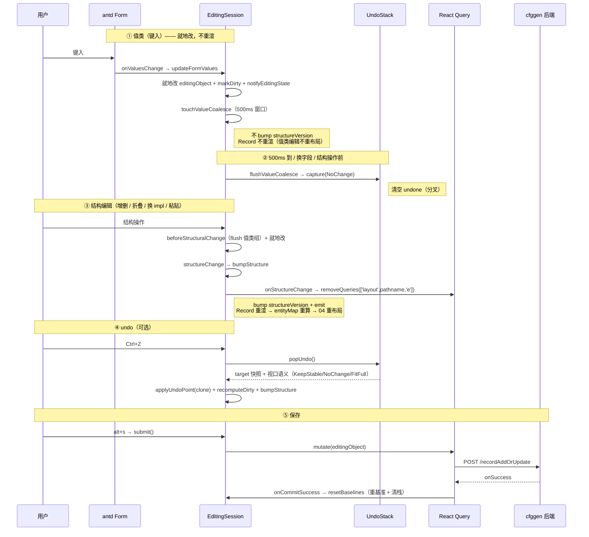

# 03 编辑会话 + Undo/Redo

> `EditingSession` 是单条 record 的「编辑会话」——一个可变 store 实例，每打开一条记录编辑就建一个。它管：编辑态的就地变异、值类 / 结构类二分、undo / redo、脏标记、视口语义。配套 `UndoStack` 是纯数据栈。
>
> **不讲**：layout 怎么消费缓存失效信号（→ [04](04-layout-viewport.md)）、表单怎么写入（→ [06](06-edit-form.md)）。本文只讲编辑会话内部机制。
>
> 【承前】02 点出 `EditingSession` 是五种状态之一、承载编辑能力。　【启后】结构编辑 `onStructureChange` 清 layout 缓存 → 钩给 04；undo 快照带视口语义 → 喂给 04 的视口算法。

设计要点直接写在 [editingSession.ts](../src/services/editingSession.ts) 顶部的文件头注释——是这套机制最好的总纲，建议先读一遍。

---

## 一、为什么是实例而非全局单例

旧版本是模块级全局单例 `editState`，在 React render 期变异（反模式）。现改为**每条 record 一个 `EditingSession` 实例**，所有 mutation 只发生在**事件回调**（UI 触发的编辑方法）或 **effect**（`maybeReset`），绝不在 render 期。

模块级 `currentEditingSession` 指针让 Splitter 兄弟（Chat / AddJson，非 Record 子树）跨路由寻址当前会话——一对模块级 getter/setter，存当前活动 session 的引用：

```
getCurrentEditingSession()      → 当前活动 session（或 null）
setCurrentEditingSession(s)     → 注册 / 注销
```

它不是 React state，变异发生在 mount/unmount effect + 事件回调，不在 render——故不走 resso，用模块指针。

---

## 二、值类 vs 结构类二分（核心）

所有编辑方法分两类，**这是整套编辑性能设计的主轴**：

### 2.1 值类（不重渲）

`updateFormValues` / `updateNote`：

```
值类编辑通用流程：
  就地改 editingObject 对应字段
  → markDirty（乐观置脏 + 递增 mutationSeq）
  → notifyEditingState（刷新 HeaderBar 脏点）
  // 不 bump structureVersion、不 emit → Record 不重渲
```

改字段值 → 就地改 `editingObject` + `markDirty` + `notifyEditingState`，**不 bump `structureVersion`、不 emit** → Record 不重渲、entityMap 不重建。一张记录常含几十个表单输入，逐键一次就重建布局会卡。

### 2.2 结构类（重算）

`addArrayItem` / `addArrayItemAtIndex` / `deleteArrayItem` / `swapArrayItem` / `updateFold` / `updateEmbed` / `deleteEmbed` / `updateInterfaceValue` / `pasteStruct`：

```
结构类编辑通用流程：
  beforeStructuralChange（先固化未 capture 的值类键入）
  → 就地改（push / splice / 赋值 $fold / 写删 $embed_ 键 / 换 impl / 粘贴）
  → structureChange(position)
       // 内部：bump FitId（正向焦点）+ capture KeepStable（undo 锚点）+ onStructureChange
```

增删 / 交换 / 折叠 / 换 impl / 粘贴 → `beforeStructuralChange` + 就地改 + `structureChange`（固定 `FitId` + undo `KeepStable` 锚点）→ bump `structureVersion` + emit → Record 重渲 → entityMap 重算。

**例外：`replaceEditingObject`（Chat / AddJson 整体替换 / funcClear）bypass `structureChange`**——它直接 `bumpStructure({fitView: FitFull})` + `capture(FitFull)`，因为整体替换需要正向 FitFull + undo FitFull 且无锚点，与 `structureChange` 固定的 `FitId + KeepStable` 语义不同。

### 2.3 方法清单

| 类别 | 方法 | 视口语义 |
|---|---|---|
| 值类 | `updateFormValues` / `updateNote` | 不 bump、不重布局 |
| 结构类 | `addArrayItem` / `addArrayItemAtIndex` / `deleteArrayItem` / `swapArrayItem` | `FitId` + undo `KeepStable` |
| 结构类 | `updateFold`（节点级 `$fold`）/ `updateEmbed` / `deleteEmbed`（07 的 `$embed_<fieldName>`）| `FitId` + undo `KeepStable` |
| 结构类 | `updateInterfaceValue`（换 impl）| `FitId` + undo `KeepStable` |
| 结构类 | `pasteStruct`（粘贴）| `FitId` + undo `KeepStable` |
| 结构类 | `replaceEditingObject`（Chat / AddJson / funcClear）| `FitFull` + undo `FitFull` |
| 特殊 | Form.List 长度变化（在 `updateFormValues` 内）| capture 但**不 bump**（不重算 entityMap / 不重渲），undo `NoChange`（primitive list 非节点、布局不变）|

> **funcClear 是什么**：STable 记录编辑表单上「设为默认值」按钮（`FuncSubmitFormItem`，i18n key `setDefaultValue`），把对象整体重置为 schema 算出的默认值；仅 STable（含 `$submit`）记录有此按钮，走 `replaceEditingObject` 路径。

---

## 三、就地变异 + 共享引用

`editingObject` 是各 `onUpdateXxx` **就地改的同一对象**（不靠不可变更新）。`RecordEditEntityCreator.createThis` 把它的子对象引用塞进 `entity.edit.editObj`——值类改后闭包直接见最新值，提交时 `submit()` 读到全量最新（只发请求，不做别的）。

> 这与「不可变状态 + 浅比较」的 React 常规相反，是有意为之：编辑会话是短期、实例级、可撤销的可变态，就地变异 + 共享引用让值类编辑零重渲成为可能。勿改成不可变 reducer。

---

## 四、useSyncExternalStore + structureVersion

组件经 `useSyncExternalStore` 接入 session 的三条读取器：

- `subscribe(listener)` → 注册监听，返回取消订阅函数
- `getStructureVersion()` → 返回 number（`structureVersion`）
- `getEditingObject()` → 直接读 `editingObject`（不建立订阅）

- 值类编辑：不 bump → 订阅者不重渲
- 结构类编辑：bump → 订阅者（Record）重渲

**关键**：`getSnapshot` 永远返回基本类型。**绝不返回 `editingObject` 引用**——就地变异下顶层引用不变，返回引用会让 React 永远跳过更新（`Object.is` 判相等）。这是「就地变异 + useSyncExternalStore」组合下必须守的一点。

---

## 五、canUndo / canRedo 的惰性反馈路径

`EditingSession` 对外有几条渠道，**只有 `subscribe + getStructureVersion` 能驱动 React 重渲**；其余都是直接读或惰性实时读，不建立订阅：

| 渠道 | 类型 | 是否驱动 React |
|---|---|---|
| `subscribe` + `getStructureVersion` | number 快照 | 是（结构编辑 bump 触发重渲）|
| `getEditingObject` / `getEditingObjectRes` | 直接读 | 否（在 useMemo 里读，依赖 structureVersion 才重算）|
| `canUndo` / `canRedo` | 惰性实时读 | 否（每次调用现读栈长度）|

值类编辑（`flushValueCoalesce → capture → emit`）期间 canUndo 会从 false 翻到 true，但 `structureVersion` 没变 → Record 不重渲。这是**刻意的性能取舍**：值类每 500ms 合并一组就让 canUndo 翻转一次，若订阅它，Record 会跟着重渲、视口连带重置（输入 primitive 后偶发 fitFull）。故 canUndo 改走惰性路径：

- 右键菜单的 `disabled` 用箭头函数 `() => !session.canUndo()`——每次菜单打开才判一次；
- `ctrl+z` / `ctrl+y` 热键回调里实时判（栈空或非编辑态直接放行，input 原生 undo 不被误杀）。

> 历史：曾订阅 canUndo → paneMenu 引用变 → 视口连带重置，故改为不订阅。

**连带 quirk**：`getEditingObjectRes` 返回的 `isEdited` 在值类编辑期间也不刷新（同源：值类不重算 entityMap，`getEditingObjectRes` 不重建），layout 仍走 5min 干净缓存——安全，值类不改拓扑。勿当 bug 修（04 §五也提了）。

---

## 六、脏标记三态缓存（getIsEdited）

`getIsEdited` 不能每次都深比较（O(n)），用三态缓存：

```
getIsEdited:
  dirty=false          → 直接采信 false（任何 mutation 都置 dirty=true，故 false 必精确）
  dirty=true, seq 未变 → 采信 true（自上次精确算后无新 mutation）
  dirty=true, seq 变了 → 深比较并缓存（仅"mutation 后首次读"发生）
```

配合 `markDirty`（乐观置 `dirty=true` + `mutationSeq++`）：

- ① `dirty=false` 必然精确 clean（任何 mutation 经 markDirty 置 true，false 期间不可能有未计入变更）→ 采信，O(1)
- ② `dirty=true` 且 `mutationSeq === mutationSeqCached`：自上次精确算后无新 mutation → 采信 true
- ③ `dirty=true` 且 seq 不同：有新 mutation → 重新深比较（仅在「mutation 后首次读」发生）

这样既保留缓存收益，又修正纯 dirty 标记会误报的场景（updateNote 加一字符再减一字符 = 实际相等却报 dirty）。

---

## 七、UndoStack：纯数据栈

[undoStack.ts](../src/domain/undoStack.ts) 是 undo/redo 的**纯数据栈**，刻意**不依赖 session、不调 React**——只管三段语义，可独立单测。session 负责 capture/apply 时机 + `bumpStructure` 驱动 React。

```
UndoStack 三段（+ 兜底）：
  baseline     初始 / 最近一次提交后状态（undo 到栈底恢复成它，显式存住，无 off-by-one）
  done[]       操作后快照；末项 = 最近。capture 入栈、popUndo 弹出
  undone[]     已 undo、可 redo。popRedo 弹出
  maxDepth=50  栈深兜底上限（大 record 内存）
  // 对外方法：setBaseline / capture / popUndo / popRedo
```

三段语义：

- `baseline`：初始 / 最近一次提交后的状态。undo 到栈底恢复成它（显式存住，无 off-by-one）。
- `done`：操作后快照；`done[末]` = 最近。`capture` 入栈、`popUndo` 弹出。
- `undone`：已 undo、可 redo。`popRedo` 弹出。

**分叉**：`capture` 清空 `undone`（undo 后又新编辑，redo 历史作废，与所有编辑器一致）。`maxDepth=50` 是兜底上限（大 record 内存）。

> 为什么拆纯栈：栈语义（深、分叉、baseline 栈底、视口语义随快照）可独立单测，不挂 React / session。session 只调 `capture/popUndo/popRedo/setBaseline`，时机和副作用（bump 重渲）归 session。

---

## 八、快照带视口语义

Snapshot 不只存数据：

```
Snapshot 三字段：
  data         editingObject 的独立深拷（必须独立——存引用会被后续就地变异污染）
  undoFitView  undo/redo 到此快照后该用的视口
  anchorId?    KeepStable 时的锚点节点 id
```

session 侧的 capture / apply 是两个对称的 clone 边界：

```
captureUndoPoint()    → structuredClone(editingObject)        // 入栈前独立化
capture(v, anchor?)   → undoStack.capture({data: captureUndoPoint(), undoFitView: v, anchorId: anchor})
applyUndoPoint(s)     → editingObject = structuredClone(s)    // 出栈后再 clone，防栈里 snapshot 被后续就地变异污染
```

四态 `EFitView`（[entityModel.ts](../src/domain/entityModel.ts)）区分 undo/redo 时的视口动作：

| `EFitView` | 何时用 | undo/redo 视口 |
|---|---|---|
| `FitFull` | 整体替换（Chat / AddJson / reset）| 重新认识图，全图适配 |
| `KeepStable` + 锚点 | 结构操作（增删 / swap / fold / impl / paste）| 锚点屏幕坐标不动 |
| `NoChange` | 值类 / Form.List 长度变 | 不动（值类不重布局）|
| `FitId` | 结构操作**正向**（非 undo）| 适配操作焦点（04 讲）|

`undo()` / `redo()` 按被撤销操作的快照语义驱动视口：

```
undo / redo 通用流程：
  flushValueCoalesce()              // 先固化未 capture 的键入
  popUndo() / popRedo()             → {target, undoFitView, anchorId}
  applyUndoPoint(target.data)       // clone 入 editingObject
  recomputeDirty()                  // 可能回到 baseline 变 clean，重算
  bumpStructure({fitView: undoFitView, position: anchorId ? {id: anchorId} : 无})
```

→ 这把 03 和 04 的视口算法直接串起来（04 的 `pickViewportAction` 吃 `editingObjectRes` 的 `fitView` / `fitViewToIdPosition`）。

---

## 九、值类 coalescing（500ms + per-key O(1)）

每键一个字符就 capture 一步 undo 的话，「打一个词」会变十几步 undo，Ctrl+Z 要按十几次——不可用。故同字段连续键入在 **500ms 窗口**内合并成一步：

```
touchValueCoalesce(fieldKey):
  fieldKey 变了（换字段） → flushValueCoalesce() 关闭旧组，记下新 key
  否则：清旧定时器、重设 500ms 定时器（窗口内无新键入则关闭组）

flushValueCoalesce():
  无活跃组（定时器未起）→ no-op
  否则：清定时器 + capture(NoChange) + emit
        // capture 不 bump structureVersion；canUndo 已变，emit 通知潜在订阅者（Record 现不订阅，热键 / 菜单实时判）
```

**fieldKey 来源**：`touchValueCoalesce` 收的 `fieldKey` 实为 `coalesceKey(fieldChains, fieldKey) = [...fieldChains, fieldKey].join('/')`——含完整嵌套路径，保证不同位置的同名字段不误合并。

**per-key O(1) 不变量**：只做「字段标识比较 + clearTimeout/setTimeout」，**严禁每键 clone/遍历**——否则几十表单输入零重渲的收益就被每键 clone 磨掉。

`beforeStructuralChange` 调 `flushValueCoalesce`：结构操作前先固化未 capture 的键入，避免与结构操作混在一个快照。

---

## 十、submit / onCommitSuccess / resetBaselines（重基准挂 onSuccess）

- `submit()` → 只调 `mutate(editingObject)`，发请求。
- `onCommitSuccess()` → 调 `resetBaselines()`，仅在 mutation `onSuccess` 才被调。

**为什么重基准挂在 `onSuccess` 而非 `submit`**：提交是异步网络调用，可能失败。若 `submit()` 发请求时就清栈重基准，一旦失败——undo 历史没了（没法退回重改）、脏标记还误报「已保存」——数据危险。挂 `onSuccess` 才保证「只有真落盘了，才算这次编辑结束」。

`resetBaselines`：清 coalesce timer → `captureUndoPoint` 深拷 → 同时重置 `originalEditingObject`（脏比较归零）和 `undoStack.setBaseline`（清栈 + 新基准）→ `dirty=false`。

---

## 十一、03 → 04 钩子：bumpStructure / onStructureChange

结构变更的通用收尾：

```
bumpStructure({fitView, position?}):
  fitView / fitViewToIdPosition ← opts
  structureVersion++          // 触发订阅者重渲
  onStructureChange?.()       // 同步清 layout 缓存（钩给 04）
  notifyEditingState()
  emit()
```

`onStructureChange` 是 `EditingSessionCallbacks`（**创建方注入**）之一——三回调全列：

| callback | 作用 | 注入点 |
|---|---|---|
| `onStructureChange` | 结构变更时清 layout 缓存（钩给 04）| [Record.tsx](../src/features/record/Record.tsx) 注入：`queryClient.removeQueries({queryKey: ['layout', pathname, 'e']})` |
| `mutate` | 提交写回后端（`submit()` 调）| [Record.tsx](../src/features/record/Record.tsx) 的 addOrUpdateRecord mutation |
| `onEditingStateChange` | `(table, id, isEdited)` → 写 store 镜像（HeaderBar 脏点）| [Record.tsx](../src/features/record/Record.tsx) 注入：`setEditingState` |

**为什么走回调而非直接 import store**：让 EditingSession 不依赖 store 层（守住 services 不反向依赖 store 的方向）。Record 注入 `onStructureChange` 成：

```
onStructureChange: () => queryClient.removeQueries({queryKey: ['layout', pathname, 'e']})
```

**同步在事件期执行**（不能挪 effect）——否则重渲那一帧读到还没删的旧 layout 缓存，多渲染一帧旧布局。这是 03 给 04 埋的钩子：结构变更清编辑态 layout 缓存，Record 重渲后用新 entityMap 重跑 ELK（为什么用 `remove` 不用 `invalidate`，见 [01 §6.4](01-data-flow.md)）。

---

**另一条 03 → 04 通道：`getEditingObjectRes`（fitView 数据出口）**

`bumpStructure` 写入的 `fitView` / `fitViewToIdPosition` 怎么到 layout 层？经 `getEditingObjectRes`：

```
getEditingObjectRes():
  → {fitView, fitViewToIdPosition, isEdited: getIsEdited()}
```

Record 的 `useMemo` 调 `session.getEditingObjectRes()` 拿 `editingObjectRes`，喂给 `useEntityToGraph`——04 的 `pickViewportAction` 吃它的 `fitView` / `fitViewToIdPosition` 决定视口动作，`isEdited` 决定 layout queryKey 的 `'e'` 段 + staleTime。

> **quirk**：值类编辑不重算 entityMap → `editingObjectRes` 不重建 → `isEdited` 不刷新（layout 仍走 5min 干净缓存）。安全——值类不改拓扑、布局不变。勿当 bug 修（04 §五也提了）。

---

## 十二、一次编辑的全程



---

## 十三、Cheat Sheet

**加一个编辑动作**：判断值类 / 结构类。值类 → 改 `editingObject` + `markDirty` + `notifyEditingState`，不 bump；结构类 → `beforeStructuralChange` + 改 + `structureChange(position)`（自动 bump + capture KeepStable + onStructureChange）。

**值类写入要能 undo**：走 `touchValueCoalesce`（不要自己 capture）——500ms 合并由它管。

**整体替换（Chat / AddJson / funcClear）**：用 `replaceEditingObject`（自动 `deleteRefsInPlace` + FitFull + capture）。

**新增会话**：Record 构造 `new EditingSession(recordResult, callbacks)` + `setCurrentEditingSession` + mount effect 调 `initUndoBaseline`；提交成功调 `onCommitSuccess`；unmount 调 `dispose`。

---

## 一句话速记

- **值类 / 结构类二分**：值类就地改不 bump（零重渲）；结构类 bump + 重算。整套编辑性能设计的主轴。
- **就地变异 + 共享引用**：`editingObject` 就地改，引用塞进 `entity.edit.editObj`，闭包见最新值；`getSnapshot` 返回基本类型，绝不返回引用。
- **脏标记三态**：`dirty=false` 采信 / `dirty=true`+seq 同 采信 / seq 异 重算。
- **UndoStack 纯数据栈**：baseline / done / undone 三段，不依赖 session/React，可独立单测。
- **快照带视口语义**：结构 → KeepStable+锚点；整体替换 → FitFull；值类 → NoChange。
- **值类 coalescing**：500ms 窗口 + per-key O(1)（只比较标识 + timer，不 clone）。
- **重基准挂 `onSuccess`**：提交是异步网络调用，只有真落盘才算编辑结束。
- **canUndo 惰性反馈**：不订阅，走菜单 `disabled` 箭头 + 热键实时判，避免值类编辑连累 Record 重渲。
- **③→④ 钩子**：`bumpStructure` 的 `onStructureChange` 同步 `removeQueries` 清编辑态 layout 缓存。
