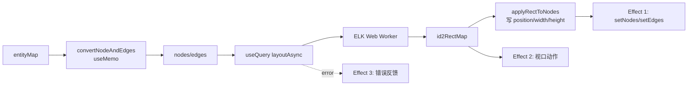

# 04 布局引擎 + 视口

布局引擎把 domain 的 `entityMap` 算成 xyflow 能渲染的 `nodes` / `edges`（带坐标 + 尺寸），并决定视口怎么稳。核心是 `useEntityToGraph` 这根 react-query 异步管线 + ELK Web Worker + 自算的稳定视口。

> **不讲**：FlowNode 怎么渲染（→ [05](05-flow-graph.md)）、entityMap 怎么从 editingObject 构建（→ [06](06-edit-form.md) 的 `recordEditEntityCreator`）。本文只讲「entityMap 进来 → 坐标 + 视口出去」。
>
> 【承前】03 的 `onStructureChange` 清缓存钩子在这里回收；吃 Record.tsx 的 `entityMap`。　【启后】产出 `nodes` / `edges` 坐标给 [05 Flow 图层](05-flow-graph.md)。

---

## 一、总装：useEntityToGraph

[`useEntityToGraph.ts`](../src/flow/useEntityToGraph.ts) 是布局的 react-query 异步管线，把 `entityMap` 变成画布上的 nodes / edges + 视口：



### 1.1 entityMap 构建

`entityMap` 由 Record.tsx 的 `useMemo` 在 `structureVersion` 变化时重算（编辑态走 `RecordEditEntityCreator` 读 `session.getEditingObject()` 共享引用，详见 06），结束后 `fillHandles` 回填 `handleIn` / `handleOut`（domain 层标记，不渲染 handle）。

### 1.2 nodes/edges（convertNodeAndEdges）

`useMemo` 调 `convertNodeAndEdges({entityMap, nodeShow: nodeShowSetting, notes})`，依赖 `entityMap / notes / nodeShowSetting`。[`convertNodeAndEdges`](../src/flow/layout/entityToNodeAndEdge.ts) 输出 xyflow nodes/edges：每个 node 的 `data = {entity, nodeShow, notes}`（呈现层「下发袋」）；edge 用 `simplebezier` + `getEdgeColor`，`EntityEdgeType.Ref` 加 `animated`。

> **query 不走 `node.data`**：`query` 无 per-graph override，渲染组件各自 `useMyStore()` 订阅（resso per-key），故 query 不进 nodes 重建、搜索时不重跑 ELK（domain ↔ presentation 解耦）。

---

## 二、ELK Web Worker（layoutAsync）

[`layoutAsync.ts`](../src/flow/layout/layoutAsync.ts) 用 `'elkjs/lib/elk-api.js'` + `'elkjs/lib/elk-worker.min.js?url'`，**模块级单例** `new ELK({workerUrl})` 复用同一 worker。内部流程：

1. `nodeToLayoutChild` 对每个 node 调 `calcWidthHeight` 拿 `[w,h]` 喂 ELK `ElkNode`（**不可压缩边界框**）。
2. 按 `layoutStrategy` 选两套 options：`'mrtree'` 或默认 layered（都 `elk.direction: RIGHT` + `POLYLINE`；layered 时 `layoutStrategy` 取值 `BRANDES_KOEPF` / `LINEAR_SEGMENTS` / `SIMPLE` 之一喂 `elk.layered.nodePlacement.strategy`）。`layoutStrategy` 由 `getLayoutStrategy(nodeShow, type)` 按 graph 类型从 `nodeShow` 选对应 `*Layout` 字段。
3. `id2RectMap` 两阶段填充：`nodeToLayoutChild` 先填 `width/height`（喂 ELK 当边界框，初值 x/y=0），`elk.layout(graph)` 返回后 `toPositionMap` 用 ELK 算出的 x/y 覆盖。

**为什么 Web Worker**：几十~几百节点的分层 / MR 树计算会阻塞主线程，扔 worker 不卡 UI。

### 2.1 写回 nodes（applyRectToNodes）

一次遍历同时写 position 与 width/height——合并了原 `applyPositionToNodes` + `applyWidthHeightToNodes` 两趟 map 为一趟：

```
applyRectToNodes(nodes, rectMap):
  无 rectMap            → 原样返回（layout 尚未出结果）
  有 rectMap，按 id 查 rect：
      命中              → 用 rect 的 x/y/width/height 覆盖该 node
      未命中（节点未进 ELK 结果，数据异常） → 仅 dev 打印，保留原 node
```

### 2.2 LayoutError 三态 + AbortSignal（绝不 resolve undefined）

失败一律 throw `LayoutError`，三种错误码：`aborted`（竞态放弃）/ `no_children`（无子节点）/ `dropped_nodes`（节点被丢弃）。

**为什么绝不 resolve undefined**（layoutAsync.ts 注释）：react-query 把 resolve undefined 当成功无数据（`isSuccess=true`），打破下游 `if (data)` 守卫导致偶发空图。

**AbortSignal 竞态保护**：`useEntityToGraph` 透传 react-query 的 `ctx.signal`，`layoutAsync` 在 `elk.layout` 前后两次检查 `signal?.aborted`，query 变 stale/inactive 时 react-query abort，layoutAsync 据此放弃过期结果。

### 2.3 失败兜底（spreadFallbackNodes）

ELK throw 时（retry 耗尽）按 5 列网格铺开，避免全塌在默认 (100,100) 成一摞：

```
spreadFallbackNodes(nodes):
  cell 320×260，5 列，起点 (80,80)
  第 i 个节点 → ( 80 + (i mod 5) × 320 ,  80 + floor(i / 5) × 260 )
```

`retry` = `queryClient.invalidateQueries({queryKey: ['layout', pathname]})`（Effect 3）。

---

## 三、尺寸预估体系（calcWidthHeight）

[`calcWidthHeight.ts`](../src/flow/layout/calcWidthHeight.ts) 是尺寸估算主函数。**核心决策：预先估算而非等 DOM 测量**——ELK 在 worker 跑、无 DOM 访问，必须喂入不可压缩的 `[w,h]`，否则节点 overlap / 异常间隙（calcWidthHeight.ts 注释）。

- **魔数锁死 antd 实测 DOM 尺寸**：`NODE_BASE_H=40` / `FIELD_ROW_H=41` / `CARD_DS_H=38` / `EDIT_ROW_H=40` 等，且 `calcWidthHeight.test.ts` 锁住算术（护栏）。
- **节点宽度 dimensions.ts 单一来源**（`DEFAULT_NODE_WIDTH=240` / `DEFAULT_EDIT_NODE_WIDTH=280`），驱动三处（ELK 边界框 / FlowNode CSS / Handle 绝对定位）。
- **note 行数 `estimateNoteRows` 与渲染同源**，杜绝「估算留 N 行、渲染只占 1 行」的纵向漂移。
- **`simpleStrRowCount` 用 `Intl.Segmenter` grapheme + East Asian Width 表**替代 `charCodeAt`（修三缺陷：代理对误计、Latin Extended 误判、固定 30 与 `nodeWidth` 解耦）。

---

## 四、colors 配色

[`colors.ts`](../src/flow/layout/colors.ts)：`getNodeBackgroundColor` 三级解析（值 → 标签 → 类型）；`getEdgeColor`；`getReadableTextColor` 用 **YIQ（阈值 150）而非 WCAG** 相对亮度——保证默认调色板全部保留白字视觉一致（WCAG 0.179 阈值会让 `#0898b5` 翻黑字）。

`getNodeBackgroundColor` **显式接收 `nodeShow` 参数**（非组件内 `useStore`）——colors.ts 是纯函数无 hook 上下文，显式入参让 FlowNode 把 `nodeShow` 放进 `useMemo` deps，避免 entity 引用不变时改主题色 stale。

> **colors.ts 与 antd token 解耦（本篇主家）**：colors.ts 是纯函数、拿不到 `useToken`，故 `NODE_SHOW_DEFAULTS` 与 antd token 同值但互不 import；store.ts 里的同值是持久化进 NodeShowType 的初始值（另一关注点，且 oxlint 禁 store→flow）。若未来要跟随主题，需在调用点（FlowNode）`useToken` 后把解析值传入。

---

## 五、缓存白名单 + 失效

layout `queryKey` 由 `pathname` + 两段内容构成，编辑路由态用 `'e'` 段分桶（`staleTime` 另跟脏标记，见下）：

| 段 | 来源 | 作用 |
|---|---|---|
| `layoutKeys` | `pickLayoutKeys(nodeShowSetting)` 白名单 13 字段 | 改纯颜色字段 → queryKey 不变 → 命中缓存不重跑 ELK |
| `topologyKeys` | `maxImpl / refIn / refOutDepth / maxNode / recordRefIn / recordRefInShowLinkMaxNode / recordRefOutDepth / recordMaxNode / tauriConf`（9 个，store 纯状态容器概念见 [02 §3.1](02-state-management.md)） | 改任一拓扑 setting → key 变 → 重布局 |

> 注：`tauriConf` 不直接喂 ELK，但驱动 Record.tsx 的 entityMap 构建（影响 refs 拉取），nodes 集合会变 → 必须进 queryKey 才能让缓存失效。

```
isEditRoute = type === 'edit'                           // 分桶：按 entityMap 构建方式（缓存身份）
isEdited    = !!editingObjectRes?.isEdited             // 复用策略：脏标记（新鲜度）
queryKey    = queryKeys.layout(pathname, layoutKeys, topologyKeys, isEditRoute)
staleTime   = isEdited ? 0 : 1000*60*5    // 脏=trigger 时重取 / 干净=5min 复用
```

[`pickLayoutKeys`](../src/domain/nodeShowLayoutKeys.ts)（常量 `NODESHOW_LAYOUT_KEYS` / 函数 `pickLayoutKeys`）白名单 13 个字段：**改纯颜色字段 → queryKey 不变 → 命中缓存不重跑 ELK**；改拓扑 setting → `topologyKeys` 变 → 缓存自然失效重布局。**用 queryKey 替代了旧 store setter 的 `clearLayoutCache` 命令式清缓存**。

`'e'` 段按**路由态**分桶（`type==='edit'`），而非脏标记：编辑路由（`RecordEditEntityCreator`，按 `$fold`/`$embed` 收起子结构）与浏览路由（`RecordEntityCreator`，全展开 + 外部 ref）产出**不同节点集合**，混用同一 key 会让 `nodes` 与 `rectMap` 错配（`applyRectToNodes` not found + 节点跳位）。用路由态而非 `isEdited`：提交后 `isEdited` 翻 false 但 entityMap 仍是编辑态构建，按脏标记切浏览态 key 会命中陈旧浏览态缓存；`isEdited` 改去驱动 `staleTime`（脏 0 / 干净 5min）。结构变更 `removeQueries(['layout', pathname, 'e'])`（03 的 `onStructureChange`）只清编辑路由态，浏览态缓存不受影响。

> **quirk**：纯值类编辑期间 `isEdited` 不刷新（entityMap 不重算、editingObjectRes 不重建，值类编辑就地改、不 bump structureVersion）→ `staleTime` 不刷新，但 `queryKey` 分桶由路由态决定（编辑路由恒定）故缓存身份不变。安全——值类不改拓扑、布局不变。勿当 bug 修。

---

## 六、稳定视口自算 + 四态 EFitView

xyflow 的 `fitView` 做不到「保持某点屏幕坐标不变」（[viewportMath.ts](../src/flow/layout/viewportMath.ts) 注释），故自算。视口是线性变换：`screen = world × zoom + 平移`。要使锚点屏幕坐标不动（zoom 不变），解得：

```
computeStableViewport(anchorOld, anchorNew, vp):
  // 锚点世界坐标由 anchorOld → anchorNew，要求其屏幕坐标不变
  zoom: vp.zoom                                              // 缩放不变
  x = anchorOld.x × zoom − anchorNew.x × zoom + vp.x
  y = anchorOld.y × zoom − anchorNew.y × zoom + vp.y
```

四态 `EFitView` 决定 `anchorOld` 来源（`pickViewportAction`）：

| `EFitView` | `anchorOld` 来源 | 视口动作 |
|---|---|---|
| `FitFull` | — | 全图适配（调 `fitView`）|
| `FitId` | `position.x/y`（操作发起时坐标）| `computeStableViewport` |
| `KeepStable` | `prevRectMap` 坐标（undo 前一帧布局，`position` 已过时）| `computeStableViewport` |
| `NoChange` | — | noop（undo/redo 值类、只读 / 固定页）|

`KeepStable` 分支：`editingObjectRes.fitViewToIdPosition` 给出锚点 id，`prevId2RectMap.get(id)` 取上一帧布局坐标作 `anchorOld`、`id2RectMap.get(id)` 取新布局同 id 坐标作 `anchorNew`，两者都命中才算 fitId 视口；锚点被删 / 无 prevMap → noop。

`prevRectMapRef` 记上一帧布局，Effect 2 末尾更新，供下次 KeepStable 作 `anchorOld`。

→ undo 快照的 `undoFitView` / `anchorId`（03 讲过）就喂给这里决定视口动作——这是 03 → 04 视口语义钩子的回收。

**另一条视口稳定机制：`setFitViewForPathname`（RecordRef 固定面板）**——`useEntityToGraph` 的可选回调，仅在 FitFull 分支调。RecordRef 固定面板用它回写「已适配 pathname」；再次进入同 pathname 时把 `editingObjectRes.fitView` 替换成 `NoChange`，实现「首次 FitFull 后保持视口不跳」。与四态 `EFitView` 是独立的策略。

---

## 七、三个 Effect 拆分

```
Effect 1: 节点 / 边 / 菜单回调下发
  newNodes 有              → setNodeMenuFunc/setPaneMenu/setNodeDoubleClickFunc + setNodes/setEdges
  newNodes 无 + layoutError → spreadFallbackNodes 网格铺开 + console.error（失败兜底）
  deps: newNodes, edges, 菜单回调, flowGraph, setNodes/setEdges, layoutError, nodes

Effect 3: 错误反馈（拆独立，只随 layoutError 变，不沾菜单依赖）
  flowGraph.setLayoutError(layoutError)
  flowGraph.setRetryLayout(() => invalidate ['layout', pathname])
  deps: layoutError, flowGraph, pathname

Effect 2: 视口动作（刻意与 Effect 1 拆开）
  viewportReady && id2RectMap && newNodes 时：
    action = pickViewportAction(editingObjectRes, id2RectMap, getViewport(), {prevId2RectMap})
    fitFull → fitView({padding:0.2, minZoom:0.3, maxZoom:1}) + setFitViewForPathname(pathname)
    fitId   → setViewport(action.viewport)
    noop    → 不动
    末尾 prevRectMapRef.current = id2RectMap   // 记录本帧布局，供下次 KeepStable
  deps: editingObjectRes, id2RectMap, viewportReady, newNodes, fitView/setViewport/getViewport, setFitViewForPathname, pathname
```

**为什么视口拆独立 Effect**：历史背景——值类编辑 coalescing flush 曾让 Record 订阅的 canUndo 翻转 → `paneMenu` 新引用 → 视口被连带重置（输入 primitive 后过一会偶发 fitFull）。现 Record 不再订阅 canUndo + `paneMenu` 引用稳定，诱因消除；拆分仍作「视口语义独立边界」保留。

---

## 八、Cheat Sheet

**加一个影响布局的 setting**：在 `useEntityToGraph` 的 `topologyKeys` 登记它（从 `useMyStore` 解构）→ 改值时 queryKey 自然变、缓存失效，无需 `clearLayoutCache`。

**加一个纯显示字段**（不影响布局，如颜色）：**不要**加进 `topologyKeys` / `pickLayoutKeys`——保持 queryKey 不变，改它命中缓存不重跑 ELK。

**布局失败**：`layoutAsync` throw `LayoutError` → Effect 1 走 `spreadFallbackNodes` 网格铺开 + Effect 3 透传 `setLayoutError` 给 FlowGraph 渲染 Result 覆盖层 + `retry` 按钮。

**relayout 后保持锚点不动**：用 `EFitView`（FitId / KeepStable），`pickViewportAction` 经 `computeStableViewport` 算好视口，Effect 2 调 `setViewport`。

---

## 一句话速记

- **useEntityToGraph 管线**：entityMap → `convertNodeAndEdges`（useMemo）→ `useQuery(layoutAsync ELK worker)` → `applyRectToNodes` → 三 Effect。
- **ELK 在 Web Worker**：模块级单例；失败 throw `LayoutError` 三态（绝不 resolve undefined）；AbortSignal 透传防竞态；失败网格兜底。
- **尺寸预先估算**（不等 DOM）：魔数锁 antd 实测 + 测试护栏；宽度 dimensions 单一来源；note 行数与渲染同源。
- **缓存白名单**：`pickLayoutKeys` 13 字段 + `topologyKeys`，改颜色不重 ELK、改拓扑自然失效；`'e'` 段按**路由态**分桶（编辑/浏览节点集合不同），`staleTime` 才跟 `isEdited`（脏 0 / 干净 5min）。
- **稳定视口自算**：`screen = world×zoom + 平移`，四态 EFitView 区分 anchorOld 来源（FitId 用 position / KeepStable 用 prevRectMap）。
- **三 Effect 拆分**：节点下发 / 错误反馈 / 视口动作——视口刻意独立，避免菜单引用翻转连带重置。
