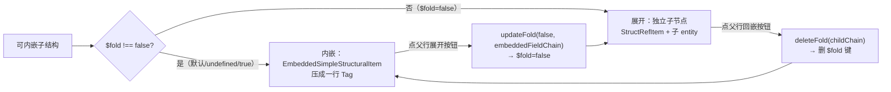

# 07 字段内嵌 embedding + `$fold`

embedding 把 trivial 的子结构（字段极少、全 primitive）压扁成父表单里的一行 Tag，不为它建独立节点。由 `$fold` 状态机驱动。

> **不讲**：普通字段渲染（→ [06](06-edit-form.md)）。本文只讲「子结构何时压扁、怎么展开 / 回嵌」。
>
> 【承前】06 的 structRef 字段（`embeddedField` 分支）。　【启后】核心闭环（看 → 改 → 撤 → 存）走完 → 扩展段 [08](08-ai-chat.md)。

---

## 一、什么是 embedding

当 struct / interface 子结构字段非常少（全是 primitive 且数量极少）时，**不渲染成独立 ReactFlow node + StructRefItem 占位**，而是「压扁」成父表单里的一行 Tag 直接显示字段值。

为什么：避免为「1 个 bool」「3 个 number」这种 trivial 子结构建独立节点，让画布节点数膨胀、连线噪声大；压缩成一行 Tag 后视觉密度与可读性更优。

判定与数据全在 [embedding.ts](../src/domain/embedding.ts)。

---

## 二、判定规则

`canBeEmbeddedCheck` → `matchEmbeddingConfig`，struct 与 interface 各一套阈值（`EMBEDDING_CONFIG`，**struct 比 interface 松**）：

| 阈值（struct / interface 各一套） | struct | interface |
|---|---|---|
| `maxFieldsForEmpty` — 无字段 | 0 | 0 |
| `maxFieldsForSinglePrimitive` — 仅 1 primitive | 1 | 1 |
| `maxNumberFields` — ≤N 个 number | 3 | 2（更紧） |
| `maxBoolFields` — ≤M 个 bool | 4 | 3（更紧） |
| `boolAndNumberCombination.totalFields` — 1 bool + 1 number | 2 | 2 |

全局开关：`common.filterEmptyLists = true`（计数前过滤值为空的 `list<>` 字段）。

`matchEmbeddingConfig` 满足任一即可内嵌（字段全集需 allPrimitive，条件 a 除外）：

```
a) 没有字段
b) 只有 1 个 primitive
c) 只有 ≤N 个 number（N = struct 3 / interface 2）
d) 只有 ≤M 个 bool（M = struct 4 / interface 3）
e) 1 bool + 1 number（共 2 字段）
```

**两个预处理**：

- `filterEmptyListFields`：计数前先过滤值为空数组的 `list<>` 字段（开关 `common.filterEmptyLists`）——避免一个空 list 把字段数顶过阈值。
- `resolveImpl`：interface 需先按 `obj.$type` 找到具体 impl 的 SStruct（`.split('.').pop()` 取 impl 名）；找不到（`$type` 缺失 / 脏数据 / 新旧 schema 不一致）→ 不可内嵌（返回 false）。

**为什么 struct 阈值比 interface 松**：interface 切 impl 时字段集可能变，给更紧阈值避免频繁在内嵌 / 展开间抖动。

---

## 三、数据结构：中间值 → 最终类型（别混淆）

内嵌数据流经**两个类型**：

**① `EmbeddingFieldValues`**（[embedding.ts](../src/domain/embedding.ts)，`extractEmbeddingFields` 的返回值——**中间产物**）：

```
EmbeddingFieldValues:
  embeddedFields: [{ value, type, name, comment? }]   // 各 primitive 字段
  implNameToDisplay?                                  // interface 非 defaultImpl 时展示的实现名
```

`getFieldValue` 带默认值处理（bool→false、int/long/float→0、str/text→''）。

**② `EmbeddedFieldData`**（[entityModel.ts](../src/domain/entityModel.ts)，**真正挂到 `StructRefEditField.embeddedField` 上的最终类型**）：

```
EmbeddedFieldData:
  fields              ← 由 embeddedFields 改名
  note?               元素 $note
  implName?           ← 由 implNameToDisplay 改名
  embeddedFieldChain? 字段完整路径，点展开时定位
```

桥接在 [recordEditEntityCreator.ts](../src/features/record/recordEditEntityCreator.ts) 的 `extractEmbeddedFieldData`：把 `EmbeddingFieldValues` 转成 `EmbeddedFieldData`——`embeddedFields → fields`、`implNameToDisplay → implName`、补 `note` + `embeddedFieldChain`。

---

## 四、与普通 structRef 的区别

- 普通 structRef 字段 = 占位行 + source Handle + **独立子 entity**。
- 内嵌 structRef 字段 = `value:'<>'`、`handleOut:true`、附 `embeddedField`、**不创建子 entity**、**不 push sourceEdge**。
- [FieldRenderer.tsx](../src/flow/edit/FieldRenderer.tsx) 通过 `if (field.embeddedField)` 把 structRef 分流到 `EmbeddedSimpleStructuralItem`（06 讲过分发）。

**两条内嵌入口**（都产 `embeddedField`、不建子 entity）：

- **(a) 普通 struct / interface 字段**：子结构满足阈值即压成一行 Tag（§二）。
- **(b) `list<struct>` / `list<interface>` 恰 1 元素且该元素可内嵌**：整个 list 字段也压成一行 Tag（[recordEditEntityCreator.ts](../src/features/record/recordEditEntityCreator.ts) 的 `tryCreateEmbeddedFieldForList`）——把唯一元素内容平铺，不建独立子节点、不 push sourceEdge。多元素或不可内嵌时退回 **funcAdd**（+ 添加按钮）。

---

## 五、`$fold` 状态机

fold 状态从 `obj.$fold` 派生（[recordEditEntityCreator.ts](../src/features/record/recordEditEntityCreator.ts)），**不再独立 React state**：

```
shouldEmbed = $fold !== false     // true 或 undefined 都内嵌
```

这意味着「**内嵌是默认行为，展开是显式 opt-out**」——任何可内嵌对象默认就被内嵌，除非用户 / 代码显式写 `$fold=false`。



**展开**：点 `ArrowsAltOutlined`（[EmbeddedSimpleStructuralItem.tsx](../src/flow/edit/fields/EmbeddedSimpleStructuralItem.tsx)）→ `editOnUpdateFold(false, nodeAnchor, embeddedFieldChain)` → `session.updateFold(false, targetChain, ...)`（03）→ bump `structureVersion` → entityMap 重算 → `shouldEmbed=false` → 建独立子节点。

展开按钮用 `embeddedFieldChain`（不是父节点 `fieldChain`）：内嵌字段在父表单里没有自己的 entity，`embeddedFieldChain` 记录它本该在的完整路径，fold 更新必须定位到这条 chain 才能正确改 `$fold`。

**回嵌**：点父表单 structRef 占位行上的 `ShrinkOutlined`（[StructRefItem.tsx](../src/flow/edit/fields/StructRefItem.tsx)，仅当子结构可内嵌且当前展开时显示）→ `session.deleteFold(childChain, ...)` **删 `$fold` 键**（undefined = 默认内嵌，不写 `$fold=true` 残留无意义键）→ 重算后回到内嵌 Tag 态。

**统一规则（fold 按钮语义正交）**：

- **节点 fold 按钮 = 折叠我自己的子节点**——只在节点标题栏，只有 `hasChild` 一种显示条件（可内嵌节点不再挂「伪 fold」按钮）。
- **子结构的收起/展开 = 父行上的开关**——embed（structRef 占位行 / 内嵌 Tag 行）与 list fold（funcAdd 行 / 摘要行）都是父行双向入口。

---

## 五-b、list/map 的折叠：`$fold_<fieldName>`

list 在 JSON 里是数组，挂不了 `$fold` 属性——折叠状态**寄存在父对象**上，键名 `$fold_<fieldName>`（如 `"$fold_equipList": true`），与 `$fold`/`$note` 同约定：随数据持久化、undo/redo 恢复 `$fold_` 键即恢复折叠态。

与 embedding 的关系：**只做 fold，不做 embed**——折叠入口面向所有会 spawn 子节点的 list/map 字段（非空、未走单元素内嵌），不论元素是否 trivial。内嵌单元素 list 只是**默认渲染形态**、不是可往返的状态：一旦展开，收起就走 list fold（摘要行 `sm (1)`），不再回到内嵌 Tag 态（除非 undo / 重新加载）。规则正交：struct 字段的折叠 = embed，list 字段的折叠 = list fold（不论几个元素）。

- **写入**：`session.updateListFold(fold, fieldName, parentChain, position)`（[editingSession.ts](../src/services/editingSession.ts)）——fold=true 写键，false **删键**（不残留 false 值）；position 锚点固定取父节点（两个方向上父节点都在，KeepStable 天然成立）。
- **读取**：`RecordEditEntityCreator.getListFoldState(obj, fieldName)`，两处消费：
  1. `createEntity` 的子节点循环：折叠 → `hasChild=true` 并 `continue`，不建子 entity、不 push sourceEdge（与节点级 fold 的 `if (fold) continue` 同构）。
  2. `createListOrMapEditField`：折叠 → 跳过单元素内嵌尝试，渲染为带 `listFold` 的 funcAdd 字段（`ListFoldData: {folded, itemCount, onUpdateListFold}`，[entityModel.ts](../src/domain/entityModel.ts)）。
- **渲染**（[FuncAddFormItem.tsx](../src/flow/edit/fields/FuncAddFormItem.tsx)）：
  - 未折叠：funcAdd 行右侧有 fold 按钮（`ShrinkOutlined`）。
  - 折叠：摘要行 = `字段名 (N)` Tag + unfold 按钮 + **保留 + 添加按钮**，行底色用 `editFoldColor` 凸显（与折叠节点 `flowNodeWithBorder` 同语义）。
- **两个自动展开**（session 层，与触发操作同一步 undo）：
  - `addArrayItem` / `addArrayItemAtIndex`：往折叠中的 list 加元素 ⇒ 删 `$fold_` 键（与 `markNewItemExpanded`「添加后立即编辑」同意图）。
  - `deleteArrayItem` 删到空：空 list 折叠无意义 ⇒ 删键。
- **惰性清理**：`$fold_xxx` 只在字段存在且非空时生效；残留键不影响渲染，靠上述编辑路径顺带清理。

---

## 六、两个特殊入口的 `$fold=false`

为避免「新建 / 切换后需再点一次才能编辑」：

- **`markNewItemExpanded`**：手工 `addArrayItem`（+添加 / 前插入）时，对可内嵌的新元素显式置 `$fold=false`。源码注释解释：否则新元素因无 `$fold`（→ undefined）被 `shouldEmbed` 视为内嵌，渲染成 `EmbeddedSimpleStructuralItem`，用户需再点一次展开按钮才能编辑，与「添加后立即编辑」相悖。
  - **仅对可内嵌元素写入**（`if (canBeEmbeddedCheck(...))`）：永不内嵌的对象不需要此 UI 标记，避免提交载荷残留无意义字段。
- **`interfaceOnChangeImpl`**（[recordEditEntityCreator.ts](../src/features/record/recordEditEntityCreator.ts)）：切 impl 后新 obj 也写 `$fold=false`，防止新 impl 默认被内嵌。

---

## 七、Cheat Sheet

**调内嵌阈值**：改 `EMBEDDING_CONFIG`（struct / interface 各一套，集中管理，勿散落魔数）。

**让某子结构强制不内嵌**：数据里显式写 `$fold=false`（或经 `updateFold(false, ...)`）。

**新建可内嵌元素想立即编辑**：`addArrayItem` 时对元素调 `markNewItemExpanded`（它内部判 `canBeEmbeddedCheck`，只对可内嵌对象写 `$fold=false`）。

**展开后想回嵌**：点父表单 structRef 占位行上的回嵌按钮（`reEmbed` → `session.deleteFold` 删 `$fold` 键）；不写 `$fold=true`，undefined 即默认内嵌。

**折叠整个 list/map**：数据里显式写 `$fold_<fieldName>=true`（或经 `updateListFold(true, ...)`）；子元素节点全部收起，父表单显示 `字段名 (N)` 摘要行（§五-b）。

---

## 一句话速记

- **embedding**：trivial 子结构（全 primitive、极少字段）压成父表单一行 Tag，不建独立节点。
- **阈值**：`EMBEDDING_CONFIG` 5 条件（无字段 / 1 primitive / ≤N number / ≤M bool / 1bool+1number），struct 比 interface 松；先 `filterEmptyListFields` 再计数；interface 需 `resolveImpl`。
- **`$fold` 状态机**：`shouldEmbed = $fold !== false`——内嵌默认、展开 opt-out（写 `$fold=false`）、回嵌删键（`deleteFold`）。开关都在父行：展开按钮在内嵌 Tag 行，回嵌按钮在 structRef 占位行；节点 fold 按钮只有「折我的子节点」一种语义。
- **list/map 折叠**：状态寄存父对象 `$fold_<fieldName>`（数组挂不了属性）；折叠 = 不建子节点 + 摘要行（`字段名 (N)`，editFoldColor 底色）；加元素 / 删到空自动展开；`updateListFold` 写/删键。
- **数据**：`extractEmbeddingFields` 产中间值 `EmbeddingFieldValues`（`embeddedFields`/`implNameToDisplay`），再经 `recordEditEntityCreator` 转成最终类型 `EmbeddedFieldData`（`fields`/`implName`/`note`/`embeddedFieldChain`）挂在父字段 `embeddedField` 上。
- **特殊入口**：`markNewItemExpanded`（新建可内嵌元素置 `$fold=false` 立即可编辑，仅对可内嵌对象写）/ `interfaceOnChangeImpl`（切 impl 同理）。
