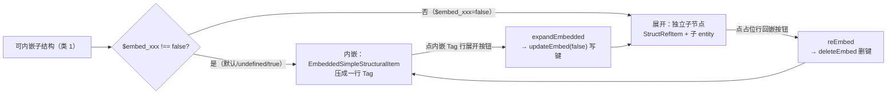

# 07 字段内嵌 embedding：`$fold`（节点级）+ `$embed_<fieldName>`（字段级）

embedding 把子结构「不收进画布」——不为它建独立 ReactFlow node，而是在父表单里渲染一行代表它。由两组正交的状态键驱动：**节点级 `$fold` 只有一种语义（折叠我自己的子节点）；字段级 `$embed_<fieldName>` 统一表达「该字段的子结构不进画布」**。

> **不讲**：普通字段渲染（→ [06](06-edit-form.md)）。本文只讲「子结构何时收进父行、怎么展开 / 收回」。
>
> 【承前】06 的 structRef 字段（`embeddedField` 分支）。　【启后】核心闭环（看 → 改 → 撤 → 存）走完 → 扩展段 [08](08-ai-chat.md)。

---

## 一、什么是 embedding

embed 是 umbrella 概念，**本质是「子结构不 spawn 子节点、寄生父行」**，分两类：

| 类 | 适用字段 | 默认态 | 收起形态 | 显式非默认键 |
|---|---|---|---|---|
| **类 1（自动嵌入）** | 字段值通过 `canBeEmbeddedCheck`（含 `list<>` 恰 1 元素且元素可内嵌） | **嵌入** | 内嵌 Tag（字段值平铺显示） | `$embed_<fieldName>=false` → 展开 |
| **类 2（list 嵌入）** | 其余非空 `list<>` / `map<>` | **展开** | 摘要行（`字段名 (N)`，不显示内容） | `$embed_<fieldName>=true` → 嵌入 |

- **类 1** 面向 trivial 子结构（字段极少、全 primitive）：避免为「1 个 bool」「3 个 number」建独立节点，让画布节点数膨胀、连线噪声大。
- **类 2** 面向所有会 spawn 子节点的 list/map（非空、未走类 1），不论元素是否 trivial：一键收起整列子节点。

**键语义跨类一致**：`true` = 收起，`false` = 展开，**键只存当前类的非默认值**（回到默认态就删键）。两类的差别只在默认值方向。

**类由数据决定，不由键决定**：同一字段随数据变化会跨类（如 list 从 1 元素变 2 元素）。读侧先定类、再在类语义内解读键；写侧由三个归一化执行点维护不变式（§六）。

判定与数据全在 [embedding.ts](../src/domain/embedding.ts)。

---

## 二、判定规则（类 1）

`canBeEmbeddedCheck` → `matchEmbeddingConfig`，struct 与 interface 各一套阈值（`EMBEDDING_CONFIG`，**struct 比 interface 松**）：

| 阈值（struct / interface 各一套） | struct | interface |
|---|---|---|
| `maxFieldsForEmpty` — 无字段 | 0 | 0 |
| `maxFieldsForSinglePrimitive` — 仅 1 primitive | 1 | 1 |
| `maxNumberFields` — ≤N 个 number | 3 | 2（更紧） |
| `maxBoolFields` — ≤M 个 bool | 4 | 3（更紧） |
| `boolAndNumberCombination.totalFields` — 1 bool + 1 number | 2 | 2 |

`matchEmbeddingConfig` 满足任一即可内嵌（字段全集需 allPrimitive，条件 a 除外）：

```
a) 没有字段
b) 只有 1 个 primitive
c) 只有 ≤N 个 number（N = struct 3 / interface 2）
d) 只有 ≤M 个 bool（M = struct 4 / interface 3）
e) 1 bool + 1 number（共 2 字段）
```

**两个预处理**：

- `filterEmptyListFields`：计数前**固定**过滤值为空数组的 `list<>` 字段（无开关——原 `common.filterEmptyLists` 配置已删除，它本就没有外部配置入口）——避免一个空 list 把字段数顶过阈值。
- `resolveImpl`：interface 需先按 `obj.$type` 找到具体 impl 的 SStruct（`.split('.').pop()` 取 impl 名）；找不到（`$type` 缺失 / 脏数据 / 新旧 schema 不一致）→ 不可内嵌（返回 false）。

**为什么 struct 阈值比 interface 松**：interface 切 impl 时字段集可能变，给更紧阈值避免频繁在内嵌 / 展开间抖动。

---

## 三、数据结构：中间值 → 最终类型（别混淆）

类 1 的内嵌数据流经**两个类型**：

**① `EmbeddingFieldValues`**（[embedding.ts](../src/domain/embedding.ts)，`extractEmbeddingFields` 的返回值——**中间产物**）：

```
EmbeddingFieldValues:
  embeddedFields: [{ value, type, name, comment? }]   // 各 primitive 字段
  implNameToDisplay?                                  // interface 非 defaultImpl 时展示的实现名
```

`getFieldValue` 带默认值处理（bool→false、int/long/float→0、str/text→''）。

**② `EmbeddedFieldData`**（[entityModel.ts](../src/domain/entityModel.ts)，**真正挂到 `StructRefEditField.embeddedField` 上的最终类型**）：

```
EmbeddedFieldData:
  fields              ← 由 embeddedFields 改名
  note?               元素 $note
  implName?           ← 由 implNameToDisplay 改名
```

桥接在 [recordEditEntityCreator.ts](../src/features/record/recordEditEntityCreator.ts) 的 `extractEmbeddedFieldData`：把 `EmbeddingFieldValues` 转成 `EmbeddedFieldData`——`embeddedFields → fields`、`implNameToDisplay → implName`、补 `note`。

---

## 四、与普通 structRef 的区别

- 普通 structRef 字段 = 占位行 + source Handle + **独立子 entity**。
- 内嵌 structRef 字段 = `handleOut:true`、附 `embeddedField` + `expandEmbedded`、**不创建子 entity**、**不 push sourceEdge**。
- [FieldRenderer.tsx](../src/flow/edit/FieldRenderer.tsx) 通过 `if (field.embeddedField)` 把 structRef 分流到 `EmbeddedSimpleStructuralItem`（06 讲过分发）。

**两条类 1 内嵌入口**（都产 `embeddedField` + `expandEmbedded`、不建子 entity）：

- **(a) 普通 struct / interface 字段**：子结构满足阈值即压成一行 Tag（§二）。
- **(b) `list<struct>` / `list<interface>` 恰 1 元素且该元素可内嵌**：整个 list 字段也压成一行 Tag（[recordEditEntityCreator.ts](../src/features/record/recordEditEntityCreator.ts) 的 `createEmbeddedListField`）——把唯一元素内容平铺。多元素或不可内嵌时退回 **funcAdd**（+ 添加按钮），即类 2 的渲染载体。

---

## 五、状态键分工：`$fold` 与 `$embed_<fieldName>`

**`$fold`（节点级，单义）**：写在节点自己的 obj 上，`true` = 折叠我自己的子节点（`createEntity` 的 `if (fold) continue`）。`session.updateFold(fold, ...)`：true 写键，false **删键**（不残留 inert 的 false 值）。节点标题栏的 fold 按钮只有这一种语义。

**`$embed_<fieldName>`（字段级）**：list 在 JSON 里是数组、挂不了属性；统一后**所有字段级 embed 状态都寄存在父对象上**，键名 `$embed_<fieldName>`（如 `"$embed_equipList": true`），与 `$fold`/`$note` 同约定：随数据持久化、undo/redo 恢复键即恢复嵌入态。

读取（`RecordEditEntityCreator.getEmbedState(obj, fieldName)`），**先定类、再解读**。list 字段的类判定统一收口在 `classifyListField`（createEntity 子节点循环与 createListOrMapEditField 两条读路径共用，防止漂移）：

```
类 1（字段值 / 单元素 list 可内嵌）：embed = $embed_xxx !== false   // true 或 undefined 都内嵌
类 2（其余非空 list/map）：         embed = $embed_xxx === true     // 仅 true 才嵌入
```

写入（[editingSession.ts](../src/services/editingSession.ts)，`embedKey` 统一键格式）：

- `session.updateEmbed(embed, fieldName, parentChain, position)`：写**字面布尔值**——类 1 展开传 `false`，类 2 折叠传 `true`。
- `session.deleteEmbed(fieldName, parentChain, position)`：**删键**回当前类默认态（类 1 回嵌 / 类 2 展开共用）。
- position 锚点固定取父节点（两个方向上父节点都在，KeepStable 天然成立）。



**展开（类 1）**：点 `ArrowsAltOutlined`（[EmbeddedSimpleStructuralItem.tsx](../src/flow/edit/fields/EmbeddedSimpleStructuralItem.tsx)）→ 字段自带的 `expandEmbedded` 闭包 → `session.updateEmbed(false, fieldName, parentChain, ...)` → bump `structureVersion` → entityMap 重算 → 建独立子节点。

闭包在 `createStructuralRefEditField` / `createEmbeddedListField` 创建字段时生成，捕获 `fieldName + fieldChain`——**不再需要旧设计里的 `embeddedFieldChain`**：embed 状态在父对象上，写入目标恒为父节点，不存在「内嵌字段没有自己的 entity、fold 更新要定位到它本该在的路径」的问题。

**回嵌（类 1）**：点父表单 structRef 占位行上的 `ShrinkOutlined`（[StructRefItem.tsx](../src/flow/edit/fields/StructRefItem.tsx)，仅当子结构可内嵌且当前展开时显示）→ `reEmbed` → `session.deleteEmbed(...)` **删键**（undefined = 类 1 默认内嵌，不写 `$embed=true` 残留与默认值同义的键）→ 重算后回到内嵌 Tag 态。

**类 2 渲染**（[FuncAddFormItem.tsx](../src/flow/edit/fields/FuncAddFormItem.tsx)）：

- 未嵌入：funcAdd 行右侧有嵌入按钮（`ShrinkOutlined`）。
- 嵌入：摘要行 = `字段名 (N)` Tag + 展开按钮 + **保留 + 添加按钮**，行底色用 `editFoldColor` 凸显（与折叠节点 `flowNodeWithBorder` 同语义）。
- 字段数据为 `ListEmbedData: {embedded, itemCount, onUpdateListEmbed}`（[entityModel.ts](../src/domain/entityModel.ts)）。

**统一规则（按钮语义正交）**：

- **节点 fold 按钮 = 折叠我自己的子节点**——只在节点标题栏，写节点自己的 `$fold`。
- **子结构的收起/展开 = 父行上的开关**——类 1（内嵌 Tag 行 / structRef 占位行）与类 2（funcAdd 行 / 摘要行）都是父行双向入口，统一读写父对象 `$embed_<fieldName>`。

---

## 五-b、list 字段的 embed 状态机

list 字段是唯一会**跨类**的字段类型（元素个数决定类），单独把它的全部状态与迁移画出来。以 `list<struct>` 为例（map 同理）。

**四个稳态**（键 = 父对象上的 `$embed_<fieldName>`）：

| 状态 | 前提 | 键 | 画布 / 父表单 |
|---|---|---|---|
| 空 list | — | 无键（归一化保证） | funcAdd 行（只有 + 按钮） |
| 内嵌 Tag | 恰 1 元素且可内嵌（类 1） | 无键（默认收起） | 父表单一行 Tag，元素不建节点 |
| 单元素展开 | 恰 1 元素（类 1 或不可内嵌） | `false`（可内嵌时）/ 无键（不可内嵌时） | 元素建独立节点 + funcAdd 行 |
| 多元素展开 | ≥2 元素（类 2） | 无键（默认展开） | 每个元素建节点 + funcAdd 行 |
| 摘要行 | 非空（多为类 2） | `true` | `字段名 (N)` 摘要行，子节点全收起 |


**读图要点**：

- **键始终等于「当前类的非默认值」**：类 1 只有 `false` 一种合法键，类 2 只有 `true` 一种合法键；跨类瞬间由归一化改写（§六），所以任何一条边上都不出现「类 1 的 true」或「类 2 的 false」。
- **「收起」意图跨类延续**：摘要行（类 2 的收起）删到 1 变成内嵌 Tag（类 1 的收起），展开删到 1 仍是展开——用户不会看到自己正展开的节点被偷偷压回去。
- **内嵌 Tag 可往返**（展开 ⇄ 回嵌），与旧设计「展开后回不到内嵌态」不同：因为状态在父对象上、跨类归一化保证键意明确，回嵌不再有歧义。
- **加载态**（初次打开 record）也走同一张表：无键 1 元素可内嵌 → 内嵌 Tag；数据里手工写了 `false` → 单元素展开。

---

## 六、不变式与三个归一化执行点

**不变式：任何增删/切换之后，`$embed_xxx` 若存在，必须是「当前类」的非默认值。**

类边界只可能被三类操作跨越，归一化逻辑就挂在对应 session 方法里、**与用户操作同一步 undo**（[editingSession.ts](../src/services/editingSession.ts)）。`canBeEmbeddedCheck` 判定在 feature 层（creator）算好以参数传入——session 不反向依赖 domain 的 embedding 判定。

**① `addArrayItem` / `addArrayItemAtIndex(defaultItem, ..., markExpanded)`**：

- **0→1 且新元素可内嵌**（`markExpanded`，调用方用 `canBeEmbeddedCheck` 算）：写 `$embed_xxx=false`——新元素默认展开成节点、立即可编辑（原 `markNewItemExpanded` 语义的新家：从往子对象写 `$fold=false` 改为往父对象写 `$embed_xxx=false`）。
- **其余（≥2，或单元素不可内嵌）**：删键——同时覆盖「折叠中加元素自动展开」（原语义）与「1→2 后 false 键变残留」两种情形。

**② `deleteArrayItem(index, ..., undoAnchorId?, embeddableWhenSingle?)`**：

- **删到空**：删键（空 list 嵌入无意义）。
- **删到恰剩 1 且元素可内嵌**（跨入类 1）：`true`（折叠）→ 删键——内嵌 Tag 延续「收起」意图；否则写 `false`——保持展开（含「展开的多元素 list 删到 1」：不把用户正看着的展开节点压回 Tag）。
- **删到恰剩 1 且元素不可内嵌**（类 2）：删键（默认展开）。

`embeddableWhenSingle` 由 creator 在子节点循环里预算（`fArrLen === 2 ? canBeEmbeddedCheck(剩余元素, itemType) : undefined`）。

**③ `updateInterfaceValue(newObj, ..., embeddable)`**（impl 切换）：

切换入口只在展开态（`InterfaceFormItem`，内嵌 Tag 行只有只读 impl 名展示），embed 状态在父对象上、随子对象替换天然存活，只需双向归一化：

- **新 impl 可内嵌** → 确保 `$embed_xxx=false`（无则补写，保持展开）。
- **新 impl 不可内嵌** → 删残留键。

`embeddable` 由 `interfaceOnChangeImpl` 用 `canBeEmbeddedCheck(newObj, sInterface)` 算好传入。

**惰性清理**：归一化只覆盖上述三条编辑路径；手工改数据产生的残留键由读侧的类语义消化（如类 1 上的 `true` 视同默认收起），不影响正确性。

---

## 七、旧格式迁移（一次性决策）

- **`$fold=true`（节点折叠）**：同键同义，天然兼容。
- **`$fold=false`（旧的 embed opt-out，写在子对象上）**：变为 inert 残留，语义丢失——旧存档里显式展开的内嵌项加载后回嵌。**接受丢失**（视觉状态，不伤数据正确性），残留键随编辑惰性清理。
- **`$fold_<fieldName>`（旧的 list fold）**：同理失效，折叠的 list 加载后展开。下游消费方同步改为 `$embed_` 约定。

---

## 八、Cheat Sheet

**调内嵌阈值**：改 `EMBEDDING_CONFIG`（struct / interface 各一套，集中管理，勿散落魔数）。

**让某可内嵌子结构强制展开**：父对象上写 `$embed_<fieldName>=false`（或经 `updateEmbed(false, ...)`）；回嵌删键（`deleteEmbed`），不写 `$embed=true`。

**折叠节点自己的子树**：节点 obj 上写 `$fold=true`（或经 `updateFold(true, ...)`）。

**新建可内嵌元素想立即编辑**：`addArrayItem` 传 `markExpanded = canBeEmbeddedCheck(defaultValue, sFieldable)`——0→1 时 session 写 `$embed_xxx=false`（同一步 undo）。

**折叠整个 list/map**：父对象上写 `$embed_<fieldName>=true`（或经 `updateEmbed(true, ...)`）；子元素节点全部收起，父表单显示 `字段名 (N)` 摘要行（§五）。

**改 embed 相关读写逻辑前**：先默念不变式——键只存当前类的非默认值；三个归一化执行点（add / delete / impl 切换）必须同步改。

---

## 一句话速记

- **embedding**：「子结构不进画布、寄生父行」。两类：类 1（可内嵌子结构，默认嵌入，内嵌 Tag 平铺内容）、类 2（其余非空 list/map，默认展开，摘要行 `字段名 (N)`）。list 字段的四稳态与跨类迁移全图见 §五-b。
- **状态键正交**：`$fold` = 节点级（折我自己的 children，true 有效）；`$embed_<fieldName>` = 字段级（父对象上，true=收起 / false=展开 / 删键回默认），键只存当前类的非默认值。
- **阈值**：`EMBEDDING_CONFIG` 5 条件（无字段 / 1 primitive / ≤N number / ≤M bool / 1bool+1number），struct 比 interface 松；空 list 字段计数前固定过滤；interface 需 `resolveImpl`。
- **开关都在父行**：类 1 展开按钮在内嵌 Tag 行（`expandEmbedded` → `updateEmbed(false)`），回嵌按钮在 structRef 占位行（`reEmbed` → `deleteEmbed`）；类 2 双向入口在 funcAdd 行 / 摘要行。
- **不变式**：键必须是当前类的非默认值，由三个归一化执行点维护（`addArrayItem` / `deleteArrayItem` / `updateInterfaceValue`，判定经参数注入、与用户操作同一步 undo）。
- **数据**：`extractEmbeddingFields` 产中间值 `EmbeddingFieldValues`（`embeddedFields`/`implNameToDisplay`），再经 `recordEditEntityCreator` 转成最终类型 `EmbeddedFieldData`（`fields`/`implName`/`note`）挂在父字段 `embeddedField` 上。
- **迁移**：旧 `$fold=false` / `$fold_xxx` 失效（接受视觉状态丢失、惰性清理）；`$fold=true` 节点折叠天然兼容。
