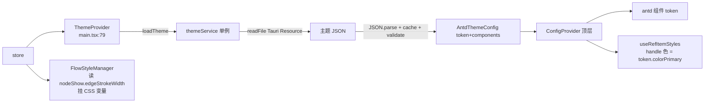

# 09 横切关注点

贯穿各篇但不属主线的支撑性基础设施：i18n、主题、剪贴板、窗口、资源工具、Tauri IPC。

> 【承前】散见 01-08 各篇。　【启后】收尾，回到 [README](README.md)。

---

## 一、i18n

[`app/i18n.ts`](../src/app/i18n.ts) 用 i18next + react-i18next + `LanguageDetector`。翻译**内联在 `resources`**（en / zh 两段），无独立 locales 目录：

```ts
i18n.use(LanguageDetector).use(initReactI18next).init({
    fallbackLng: 'en',
    interpolation: { escapeValue: false },
    resources: { en: { translation: {...} }, zh: { translation: {...} } },
});
```

组件用 `useTranslation()` 读 `t('key')`（如 `t('retryLayout')`、`t('nodeFold')`）。`fallbackLng: 'en'`——缺 key 时回退英文。

---

## 二、主题（三层）



> [colors.ts](../src/flow/layout/colors.ts) **不在上图**——它是纯函数做节点 / 边 / 文字配色，**刻意与 antd token 解耦**（无 hook 上下文、拿不到 `useToken`），配色来自 `nodeShow` + `NODE_SHOW_DEFAULTS`（04）。

- **`ThemeProvider`**（[main.tsx](../src/main.tsx):79）：读 `store.themeConfig.themeFile` → `themeService.loadTheme` → 合并 `defaultTheme` → antd `ConfigProvider`（顶层单实例，包整个 app）。
- **`themeService`**（[themeService.ts](../src/services/themeService.ts)）：`ThemeService` 单例（`getInstance`），`loadTheme` 从 Tauri `Resource` 目录读主题 JSON（`readFile` + `JSON.parse` + `cache` + `validateThemeConfig`）。`AntdThemeConfig = {token, components}`。
- **`FlowStyleManager`**（[FlowStyleManager.tsx](../src/flow/FlowStyleManager.tsx)）：app 顶层单实例，挂 CSS 变量（`--edge-stroke-width`），供非 antd 的 SVG / CSS 消费。**为什么上提到顶层**：CSS 变量全局唯一，多实例并存时一个 unmount 的 cleanup 会抹掉另一实例仍在用的变量（05 讲过）。

主题 token（`colorPrimary`）驱动 [useRefItemStyles.ts](../src/flow/edit/shared/useRefItemStyles.ts) 的 handle 色（06）；[colors.ts](../src/flow/layout/colors.ts) 是**纯函数**做节点 / 边 / 文字配色，**刻意与 antd token 解耦**（04）。

---

## 三、剪贴板（app 级跨记录）

[`clipboard.ts`](../src/services/clipboard.ts) 是 **app 级**剪贴板（模块级 `copiedObject`），**独立于 EditingSession（会话级）**——因为跨记录复制粘贴是现有能力（record A 复制 → 切到 record B → 同类型字段右键粘贴）：

```ts
let copiedObject: JSONObject = {'$type': ''};

export function structCopy(obj: JSONObject): void { copiedObject = structuredClone(obj); }
export function getCopiedObject(): JSONObject { return copiedObject; }
export function isCopiedFitAllowedType(allowedType: string): boolean {
    const type = copiedObject.$type;
    if (type == allowedType) return true;
    if (type.startsWith(allowedType)) return type[allowedType.length] == '.';   // 简单判断 interface.impl，不查 schema
    return false;
}
```

- `structCopy`：`structuredClone`（深拷，独立于源对象后续变异）。
- `getCopiedObject`：EditingSession 的 `pasteStruct` 用（03 §2.2，`import {getCopiedObject}`）。
- `isCopiedFitAllowedType`：类型匹配——简单 `startsWith` + `.` 判 `interface.impl`（不查 schema，注释明说「简单判断」）。

---

## 四、窗口

[`windowUtils.ts`](../src/services/windowUtils.ts) 极简，只有 `toggleFullScreen`（Tauri `getCurrentWebviewWindow`）。关窗 flush 在 main.tsx:65（02 §4.4 讲过三层防丢）：

```ts
// main.tsx —— Tauri 关窗：preventDefault → flushAllPrefsAsync 写盘 → destroy
void Window.getCurrent().onCloseRequested(async (event) => {
    event.preventDefault();
    try { await flushAllPrefsAsync(); } catch { /* 写盘失败也不阻止关窗 */ }
    await Window.getCurrent().destroy();
});
```

---

## 五、全局快捷键（react-hotkeys-hook）

`react-hotkeys-hook` 注册的全局快捷键，**单实例根注册**（CfgEditorApp.tsx:75 等）：

| 快捷键 | 作用 | 注册点 |
|---|---|---|
| `alt+s` | 提交当前编辑会话（`getCurrentEditingSession().submit()`）| CfgEditorApp.tsx:75 |
| `alt+1/2/3/4` | 路由切换（table / tableRef / record / recordRef）| HeaderBar.tsx:50-54 |
| `alt+enter` | 全屏切换 | HeaderBar.tsx |
| `alt+c` / `alt+v` | 上一条 / 下一条记录 | HeaderBar.tsx:69-70 |
| `ctrl+z` / `ctrl+y` | undo / redo | Record.tsx:100, 105 |

**为什么 `alt+s` 上提到 CfgEditorApp 单实例**（CfgEditorApp.tsx:70-77 注释）：FlowGraph 在 Splitter 布局下可能多实例，原先每个 EntityForm 各注册 `useHotkeys` 靠 DOM 冒泡「碰巧」命中，是历史多次触发 submit bug 的过设计修复（EntityForm.tsx:19-21）。监听必须在更高的单实例点——快捷键是 app 级语义，不属任一节点。

---

## 六、资源工具 res/

[`res/`](../src/res) 处理配表引用的资源文件（图片 / 视频 / 音频 / 字幕 SRT→VTT）：

- `readResInfosAsync`：启动门卫第二段触发（02，`resInfo` query 的 queryFn），读资源索引。
- `findAllResInfos` / `resUtils`：资源查找工具。
- `summarizeResAsync`：把 resMap 按 table 汇总成 `_res.csv` 文件（TauriSetting 的「资源分析」按钮调用）。
- `getResBrief`（[getResBrief.ts](../src/res/getResBrief.ts)）：节点资源摘要按钮用（FlowNode.tsx，`emoji=true` 返回 `🎬2 🔊1` 带空格的 emoji 串）；`emoji=false` 的紧凑串 `2v1a` 由 `summarizeResAsync` 写进 `_res.csv`。
- `ResPopover`（[ResPopover.tsx](../src/flow/ResPopover.tsx)，FlowNode 用）：资源弹出层。**仅字幕 SRT→VTT** 在 effect 里 `createObjectURL`（blob URL 生命周期管理）；视频 / 音频 / 图片走 Tauri 的 `convertFileSrc`。

---

## 七、Tauri IPC

cfgeditor 是 Tauri 桌面应用，原生能力经 Tauri API：

- **文件系统**（`@tauri-apps/plugin-fs`）：`storage` 读写 yml（02）、`themeService` 读主题 JSON、`res` 读资源。`BaseDirectory.Resource`（打包后可写、随应用走）。
- **窗口**（`@tauri-apps/api/window` + `webviewWindow`）：关窗 flush（main.tsx）、`toggleFullScreen`。
- **`isTauri()` 守卫**：非 Tauri（纯 Web，如 dev 的 vite）环境降级——`storage.readPrefAsyncOnce` / `themeService.loadTheme` 都判 `isTauri()`，Web 下跳过文件操作。

```ts
// storage.ts:66 —— isTauri 守卫
export async function readPrefAsyncOnce() {
    if (alreadyRead) return true;
    alreadyRead = true;
    if (!isTauri()) return true;        // Web 环境无 yml，直接返回
    localStorage.clear();
    await readConf(CFGEDITOR_YML);
    await readConf(CFGEDITOR_SELF_YML);
    return true;
}
```

> 注意：Tauri fs 2.0.1 之后 `readTextFile` 出来是乱码，故用 `readFile` + `new TextDecoder().decode(contentBytes)`（storage.ts:84-85、themeService.ts:81-82）。

---

## 八、Cheat Sheet

**加翻译**：在 `app/i18n.ts` 的 `resources.en.translation` / `resources.zh.translation` 各加一条（key 一致）。组件用 `t('key')`。

**加主题 token**：主题 JSON 的 `token` / `components`（符合 antd 主题规范）→ `themeService.loadTheme` 自动加载。

**复制粘贴跨记录**：`structCopy` 存 + `getCopiedObject` 取 + `isCopiedFitAllowedType` 判类型；EditingSession `pasteStruct` 消费。

**用 Tauri 原生能力**：文件 `@tauri-apps/plugin-fs`（`readFile` + TextDecoder，别用 `readTextFile`）、窗口 `@tauri-apps/api/window`；**判 `isTauri()`** 守 Web 环境。

---

## 一句话速记

- **i18n**：`resources` 内联 en / zh，无独立 locales；`useTranslation().t('key')`。
- **主题三层**：`ThemeProvider`（main 顶层）→ `themeService` 单例（读 Tauri 主题 JSON）→ `FlowStyleManager`（app 顶层 CSS 变量）；token 驱动 `useRefItemStyles` 的 handle 色，**colors.ts 纯函数与 token 解耦**。
- **剪贴板 app 级**：模块级 `copiedObject`，跨记录复制粘贴，独立于 EditingSession；`structuredClone` + 简单类型匹配。
- **窗口**：`toggleFullScreen` + 关窗 `flushAllPrefsAsync`（02 三层防丢）。
- **res/**：资源索引 / 查找 / `summarizeResAsync` 出 `_res.csv`；`getResBrief` 节点摘要；`ResPopover`（FlowNode）管 blob URL。
- **Tauri IPC**：fs（`readFile`+TextDecoder，别用 `readTextFile`）+ window；`isTauri()` 守 Web 降级。
