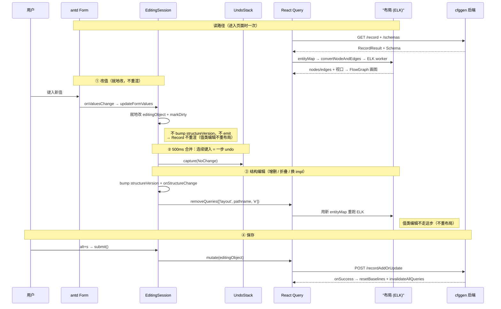

# cfgeditor 源码阅读与设计

> 这套文档帮你**读懂源码、理解设计**——不是 API 手册，不是用户指南。读完你应该能回答：一条记录从后端到屏幕、再被编辑回后端，代码走了哪条路？每一步为什么这么设计？
>
> **怎么读**：按 `01 → 09` 顺序，每篇承前启后。也可跳读——每篇开头引文块标了【讲什么】【不讲什么】【前置】。命令 / 构建 / 易踩坑在 [`../CLAUDE.md`](../CLAUDE.md)，本套文档只讲源码与设计。

## 一、cfgeditor 是什么

cfgeditor 是 [cfggen](../) 配表体系的**可视化前端**：策划在图形界面里浏览 / 编辑配表（游戏配置数据），编辑完的数据由 cfggen 生成多语言程序代码。

React 19 + TypeScript + Vite + Tauri 桌面应用，图形用 React Flow（`@xyflow/react`），UI 用 Ant Design v6，状态用 Resso + React Query。**自己不存配表数据**——所有数据来自一个 Java 后端：

```
cfgeditor (React 前端，本仓库)
      ↕  HTTP（默认 localhost:3456）
cfggen.jar -gen server (Java 后端，../app)
      ↕  读写
Excel / CSV / JSON 配表文件（磁盘）
```

> cfgeditor 是瘦前端，数据在后端。后端端点 / 缓存策略见 [01 数据流](01-data-flow.md)。

## 二、核心概念词汇表

新人最容易卡住：同一个东西，在**类型系统（cfggen 领域）**和**画布视图（cfgeditor 前端）**里叫不同的名字。先把这层分清，后面所有文档都好读。

### 领域层（cfggen 的类型系统，从后端 `/schemas` 拉来）

| 概念 | 一句话 | 锚点 |
|---|---|---|
| **schema** | 整个类型系统：有哪些 struct / table / interface，各自什么字段。编辑是否允许也由它（`isEditable`）决定。 | [`schema.ts`](../src/domain/schema.ts) `Schema` 类；类型 [`schemaModel.ts`](../src/api/schemaModel.ts) |
| **table** | 一张**配表**的定义：字段 + 主键 + 已有记录 id 列表 + 外键。schema 里 `type=='table'` 的条目。 | `schemaModel.ts` `STable` |
| **record** | 一条**真实数据**：由 `(table, id)` 定位，内容是 JSON 对象（带 `$type` 指明它是哪个结构体）。 | [`recordModel.ts`](../src/api/recordModel.ts) `RecordResult` |

> struct / interface 是 schema 里的另两类条目（复合类型 / 可多态接口），和 table 一起构成类型系统。先记住 **schema（类型）/ table（表定义）/ record（数据）** 三个就够建心智模型。

### 视图层（cfgeditor 把数据画到画布上用的模型）

| 概念 | 一句话 | 锚点 |
|---|---|---|
| **entity** | 画布上**一个节点的视图模型**（只读 / 可编辑 / 卡片三态）。由 record 数据 + schema 类型信息**变换**而来。 | [`entityModel.ts`](../src/domain/entityModel.ts) `Entity` 联合类型 |
| **node** | React Flow 里的**节点**，把 entity 包一层（再加呈现信息）。画布上的点就是它。 | [`FlowGraph.tsx`](../src/flow/FlowGraph.tsx) `EntityNode` |
| **res** | 挂在 entity 上的**资源元数据**（视频 / 音频 / 图片 / 字幕路径），供预览。 | [`resInfo.ts`](../src/domain/resInfo.ts) `ResInfo` |

### 一条变换主线（最该记住的图）

```
record (数据)  ┐
               ├─→  entity (视图模型)  ─→  node + edge  ─→  React Flow 画布
schema (类型)  ┘    (recordEditEntityCreator /          (FlowGraph)
                      entityToNodeAndEdge)
```

一条 record 不是直接渲染的：它先和 schema 一起**变换成若干 entity**（一条记录常展开成多个节点——主节点 + 它引用的、被引用的节点），entity 再包成 node + 连线，最终上画布。**编辑就是反着走**：在 node 表单里改值 → 写回 record 数据对象 → 提交回后端。

## 三、一条记录的旅程（主线）

贯穿全套文档的故事线——一条编辑从键入到落盘的全程，四个机制（EditingSession / UndoStack / React Query / 布局）接力：



每个站点的深挖见对应专题（03 编辑会话 / 04 布局 / 01 数据流）。

## 四、分层地图

八个目录、四组分层，**依赖只能向下**（`app/features → flow/res → store/services → domain → api`）：

```
app/        入口与壳：CfgEditorApp, AppLoader, PathNotFound, SidePanelShell, i18n（main.tsx / ThemeProvider 在 src/ 根）
features/   业务页面：record, table, finder, headerbar, add(含 Chat), setting
─────────────────────────────────────────────────────────────
flow/       图与编辑：FlowGraph, EntityCard, useEntityToGraph, nodeAnchor, layout/, edit/
res/        资源工具：resUtils, findAllResInfos, readResInfosAsync
─────────────────────────────────────────────────────────────
store/      状态机制：resso.ts(vendored), store.ts, storage.ts
services/   服务：editingSession, queryKeys/queryClient, clipboard, themeService, windowUtils
─────────────────────────────────────────────────────────────
domain/     纯逻辑：entityModel, schema, embedding, undoStack, entityPredicates, resInfo, nodeShowLayoutKeys, storageJson(生成)
api/        HTTP：apiClient, recordModel, schemaModel, noteModel, searchModel, chatModel
```

**纯度判据**：越「纯」（纯类型 / 纯函数 / 无副作用）越往下沉 `domain`；越「有状态 / 副作用」浮到 `store` / `services`；有 UI 的浮到 `flow` / `features`。

方向由 [`.oxlintrc.json`](../.oxlintrc.json) 的 `no-restricted-imports` 强制——每个目录禁 import 它的上层，**反向 import 立即被 oxlint 拦下**。动代码前先确认依赖方向。规则以 `.oxlintrc.json` 为准：

| 目录 | 不得 import |
|---|---|
| `api/` | `@/domain` `@/store` `@/services` `@/flow` `@/res` `@/features` |
| `domain/` | `@/store` `@/services` `@/flow` `@/res` `@/features` |
| `flow/` | `@/app` `@/features` |
| `store/` | `@/app` `@/features` `@/flow` |
| `services/` | `@/app` `@/features` `@/flow` `@/store` |
| `res/` | `@/app` `@/flow` `@/features` |

特例：`store/resso.ts`（vendored）关 `rules-of-hooks`；`main.tsx` 关 `only-export-components`；`domain/storageJson.ts`（quicktype 产出）进 `ignorePatterns`。

## 五、文档索引

| # | 主题 | 文件 |
|---|---|---|
| 01 | 数据流：URL → API → React Query | [01-data-flow.md](01-data-flow.md) |
| 02 | 状态管理：五种方案分工 | [02-state-management.md](02-state-management.md) |
| 03 | 编辑会话 + Undo/Redo | [03-editing-session-undo.md](03-editing-session-undo.md) |
| 04 | 布局引擎 + 视口 | [04-layout-viewport.md](04-layout-viewport.md) |
| 05 | Flow 图层（XYFlow 集成） | [05-flow-graph.md](05-flow-graph.md) |
| 06 | 编辑表单 | [06-edit-form.md](06-edit-form.md) |
| 07 | 字段内嵌 embedding + `$fold` | [07-embedding.md](07-embedding.md) |
| 08 | AI Chat | [08-ai-chat.md](08-ai-chat.md) |
| 09 | 横切关注点 | [09-cross-cutting.md](09-cross-cutting.md) |

## 一页速记

- cfgeditor = **瘦前端**，数据在后端（cfggen `-gen server`）。
- record + schema → entity → node + edge → 画布；编辑反着走（表单改值 → 写回 record → 提交后端）。
- 八目录四组分层，依赖**只能向下**，oxlint `no-restricted-imports` 守门。
