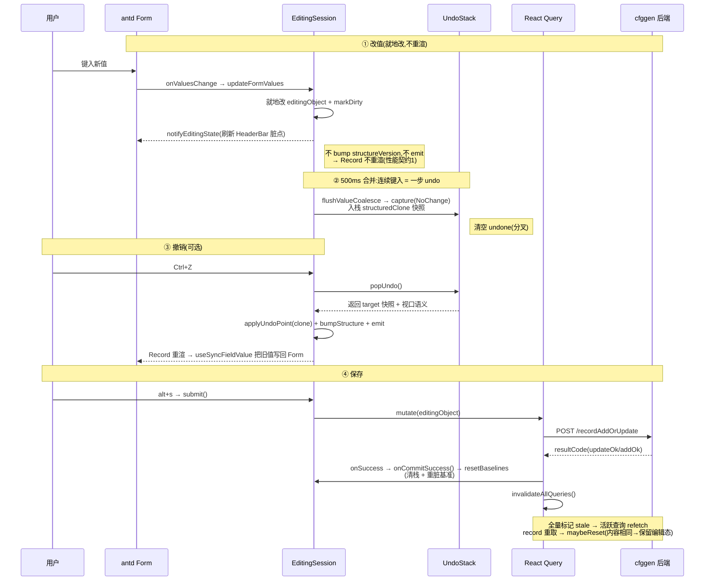

# 数据生命周期：一条编辑的全程

> 本文是一张**地图**:把"用户改一个字段值,到这个值落盘、画布刷新"的全旅程画在一张时序图上,讲清每个站点交给谁、为什么这么接力。**它不复述任何机制的内部**——每个站点的深挖都有专门一篇,文中给链接。
>
> 如果你只读一篇就想理解"这应用的数据怎么转一圈",读这篇。

---

## 0. 定位:为什么需要这张图

cfgeditor 的编辑链横跨四个独立机制:**就地编辑态**(`EditingSession`)、**撤销栈**(`UndoStack`)、**服务端缓存**(React Query)、**视口稳定**。每篇机制文都只讲自己那段;但一条编辑实际是**它们接力**完成的——没人把全程画在一张图上。本文补的就是这张图。

> ⚠️ 本文**不重复**已有的详细描述:
> - 编辑态内部(useSyncExternalStore、脏标记、就地变异)→ [`状态管理-总结与演进.md`](./状态管理-总结与演进.md) §6、§7(§7 本就是"一次编辑的全链路" prose 版)
> - undo 快照栈 / coalescing / 提交边界 → [`undo-redo.md`](./undo-redo.md) §2.5、§3
> - React Query 缓存 / mutation / 失效 → [`url-api-reactquery.md`](./url-api-reactquery.md) §5、§6
>
> 下面图里每到一个机制,只说"它在全程里干什么",细节点链接。

---

## 1. 前置:数据怎么到屏幕(读路径)

编辑发生前,被编辑的那条记录已经在画布上了。它是这么来的:

```
URL(table/id) → React Query useQuery(['record',...]) → GET /record → RecordResult
              → record + schema 变换成 entity → node+edge → 画布
```

这条**读路径**本文不展开(它和数据缓存、queryKey 设计深度绑定)——见 [`url-api-reactquery.md`](./url-api-reactquery.md) §5.1。下面只讲**写路径**。

---

## 2. 写旅程:改一个字段值 → 落盘 → 刷新



---

## 3. 接力说明:每个握手"为什么"这么设计

图里四个关键交接,每个都对应一个机制文。这里只点破"为什么",不讲"怎么实现"。

### ① 为什么改值不立刻重渲整个图?

字段值改动只**就地改** `editingObject`(同一个对象引用),然后 `markDirty` + 通知 HeaderBar 刷脏点——但**故意不 bump structureVersion、不 emit**。于是那条记录的节点表单不重渲、整张 entityMap 不重建。

- **为什么**:一张记录常含几十个表单输入,每键一次就重建一次布局会卡。这是 undo/编辑链必须守住的"性能契约1"。
- 代价是值类编辑后,React 看到的 `field.value` 快照停在旧值——所以需要 ③ 里的 `useSyncFieldValue` 在 undo 时把它校正回来。
- 细节:[`状态管理`](./状态管理-总结与演进.md) §6.1 / [`undo-redo`](./undo-redo.md) §2.2。

### ② 为什么 undo 要先合并(coalescing)?

每键一个字符就 `capture` 一步 undo 的话,"打一个词"会变成十几步 undo,按 Ctrl+Z 要按十几次才能撤销一个词——不可用。所以同字段连续键入在一个 **500ms 窗口**内合并成一步(换字段、blur、或做结构操作时关闭当前组)。

- 细节:[`undo-redo`](./undo-redo.md) §3.5。

### ③ 为什么 undo 后要手动把值写回 Form?

见 ① 的代价:值类编辑不重渲,所以 Form 内部值和 `editingObject` 会不同步。undo 让 `editingObject` 回到旧值并 bump 重渲,此时 `useSyncFieldValue` 发现 Form 内部值(新)≠ `field.value`(旧),就把旧值写回 Form。

- 细节:[`undo-redo`](./undo-redo.md) §3.9。

### ④ 为什么"重基准"挂在网络成功之后,而不是提交时?

`submit()` 只是发请求;**重置脏基准 + 清 undo 栈**发生在 mutation 的 `onSuccess`(`onCommitSuccess` → `resetBaselines`)。

- **为什么**:提交是异步网络调用,可能失败。如果在 `submit()` 发请求时就清栈重基准,一旦失败——undo 历史没了(没法退回重改)、脏标记还误报"已保存"——数据就危险了。挂在 `onSuccess` 才保证"只有真落盘了,才算这次编辑结束"。
- 紧接着 `invalidateAllQueries()` 全量失效缓存:因为后端写入可能改了**引用关系**等衍生数据,与其猜测哪些缓存脏了,不如全标 stale 让活跃查询重取。refetch 回来的 record 进 `maybeReset`,内容相同就保留当前编辑态(此刻它已是 clean baseline)。
- 细节:[`状态管理`](./状态管理-总结与演进.md) §6.5 / [`undo-redo`](./undo-redo.md) §3.6 / [`url-api-reactquery`](./url-api-reactquery.md) §6.1。

---

## 4. 一句话速记

> 改值**就地改、不重渲**(性能);连续键入**合并成一步 undo**(可用);**重基准只在落盘成功后**(安全);落盘后**全量失效缓存重取**(一致)。四个机制各管一段,本文把它们串成了同一条线。
