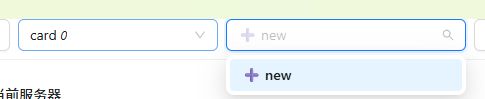

# 快速开始

欢迎使用 cfgeditor 配置编辑器！本指南将帮助您快速掌握 cfgeditor 的基本使用方法。cfgeditor 是一款基于节点的图形化配置工具，让您能够直观地查看和编辑配置文件。

## 🚀 启动服务器

在使用 cfgeditor.exe 之前，需要先启动后端服务器。

### 启动命令

执行以下命令启动服务器：

```bash
java -jar ../cfggen.jar -datadir ../example/config -gen server
```

### 服务器配置选项

您可以在启动命令中添加以下参数来自定义服务器行为：

| 参数 | 说明 | 示例值 |
|------|------|--------|
| `port` | 服务器监听的端口号，cfgeditor 将通过此端口连接 | `port=3456` |
| `note` | 存储非 JSON 格式标注信息的位置 | `note=_note.csv` |
| `watch` | 文件监控间隔（秒），大于 0 时自动重载修改后的配置文件 | `watch=5` |
| `postrun` | 配置重载后执行的脚本文件路径 | `postrun=reload.bat` |

---

## 📱 界面概览

### 页面切换

cfgeditor 提供了两种不同的视图模式，方便您从不同角度查看数据：

- **数据视图**：显示实际的配置记录内容（默认视图）
- **结构视图**：显示数据表的结构定义（schema）

通过界面顶部的切换按钮，您可以轻松在两种视图间切换：


### 编辑模式

要开始编辑数据，只需在主界面中右键点击，然后从弹出的菜单中选择编辑选项：


---

## 🧭 导航功能

### 1. 主导航
界面的左上角是主要导航区域：
- **表选择**：下拉菜单，用于在不同数据表之间切换
- **ID 选择**：输入框，用于快速定位特定记录


### 2. 关联数据
当您查看某条记录时，系统会自动显示与该记录相关联的其他记录列表，方便您查看数据间的关联关系：


### 3. 历史记录
cfgeditor 会记录您的操作历史：
- **访问历史**：查看您最近访问过的记录
- **修改历史**：查看每条记录的修改历史，了解数据变更过程

### 4. 搜索功能
通过搜索功能，您可以快速找到需要的配置记录。支持关键词搜索和高级筛选：


### 5. 关系图导航
关系图功能让您能够以可视化方式查看和导航数据间的关联关系。

#### 设置关系图
1. 在右侧视图中查看当前记录的关系图
2. 点击"固定当前页面"按钮
3. （可选）修改关系图的目录名称
4. 点击"设置固定页面"保存关系图配置


#### 使用关系图
设置好关系图后，您只需双击左侧关系图中的任意记录节点，右侧就会自动打开对应的记录供您编辑：


---

## ✏️ 数据操作

### 新增或更新记录

cfgeditor 提供了多种方式来新增或更新配置记录：

#### 方法一：编辑后更新（推荐）
这是最常用的方式：
1. 在编辑界面修改记录内容
2. 点击"更新"按钮
   - **更新操作**：如果记录 ID 已存在，系统会更新该记录
   - **新增操作**：如果记录 ID 不存在，系统会创建新记录


#### 方法二：快速新增
当您首次使用某个数据表时，ID 搜索框会显示 "+new" 按钮，点击即可快速创建第一条记录：



#### 方法三：直接添加 JSON
对于熟悉 JSON 格式的用户，可以通过"设置" → "+" 菜单直接粘贴 JSON 数据来批量新增记录：


#### 方法四：AI 生成
参考ai生成章节

### 删除记录

要删除当前显示的记录：
1. 进入"设置" → "操作"菜单
2. 点击"删除当前数据"按钮

**⚠️ 重要提示**：删除操作**不可撤销**，请务必确认后再执行。建议在删除前先备份重要数据。


