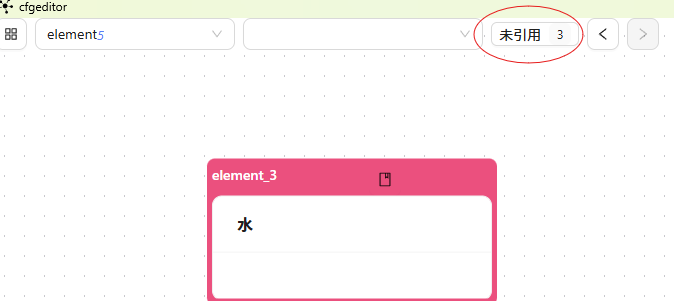
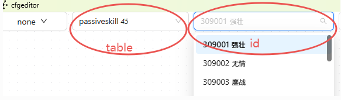
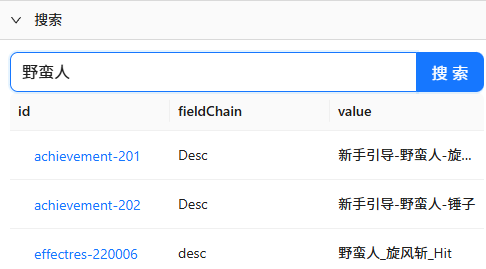
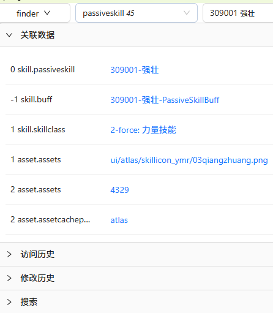

# 🎮 配置编辑器

配置编辑器是一个基于节点的可视化配置编辑工具,旨在简化游戏开发中复杂数据结构的浏览和编辑工作。通过图形化界面,您可以直观地查看表结构、浏览记录、编辑数据,并可视化展示记录之间的关联关系。

---

## 📋 功能概述

### 核心功能

- **🔍 可视化浏览**
  - 表结构图形化展示,直观理解数据模型
  - 表与表之间关系的可视化
  - 记录之间引用关系的图形化展示

- **✏️ 数据编辑**
  - 直接编辑记录数据
  - 添加新记录
  - 删除记录
  - JSON 批量导入

- **🔎 强大的搜索**
  - 快速查找记录
  - 全文搜索
  - 跳转到指定记录

- **🧠 AI 辅助**
  - AI 聊天界面
  - 智能生成配置数据

- **🛡️ 数据一致性检测**
  - 未引用记录检测
  - 引用完整性验证

---

## 🚀 安装和启动

### 方式一:使用预编译版本 (推荐)

1. **下载最新版本**
   - 从项目的 [Release 页面](https://github.com/stallboy/cfggen/releases) 下载 `cfgeditor.zip`
   - 解压 zip 文件

2. **启动编辑器**
   ```bash
   cd cfgeditor
   ./cfgeditor.exe  # Windows
   # 或
   ./cfgeditor      # Linux/Mac
   ```

### 方式二:从源码构建

1. **前置要求**
   - 安装 [Node.js](https://nodejs.org/) (推荐 v18+)
   - 安装 [pnpm](https://pnpm.io/): `npm install -g pnpm`
   - 安装 [Rust](https://www.rust-lang.org/) (用于构建桌面应用)

2. **安装依赖**
   ```bash
   cd cfgeditor
   pnpm install
   ```

3. **构建可执行文件**
   ```bash
   genexe.bat  # Windows
   # 或
   genexe.sh   # Linux/Mac
   ```

4. **生成的文件**
   - 可执行文件位于: `src-tauri/target/release/cfgeditor.exe`

### 开发模式启动

如果您需要修改编辑器代码或参与开发:

1. **启动后端服务器**
   ```bash
   # 在项目根目录
   java -jar cfggen.jar -datadir example/config -gen server,watch=1
   ```

2. **启动前端开发服务器**
   ```bash
   cd cfgeditor
   pnpm run dev
   ```

3. **访问编辑器**
   - 打开浏览器访问: `http://localhost:5173/`

---

## 🎨 界面介绍

### 主界面布局

编辑器采用分割面板设计,可以同时查看多个视图:

- **左侧面板**: 导航菜单和页面选择
- **主工作区**: 可分割的多个页面视图
- **设置面板**: 可视化配置和应用设置

### 主要视图类型

#### 1️⃣ 表视图 (Table View)


*图:展示数据库表结构和表之间的关联关系*

**功能**:
- 图形化展示所有表及其结构
- 显示表与表之间的外键关系
- 点击表名可查看该表的记录列表

#### 2️⃣ 记录视图 (Record View)


*图:查询单个记录的详细信息*

**功能**:
- 输入记录 ID 查看具体记录
- 显示记录的所有字段和数据
- 支持折叠/展开复杂结构
- 显示记录的引用关系

#### 3️⃣ 记录编辑视图 (Edit View)


*图:编辑单个记录的字段数据*

**功能**:
- 修改记录的字段值
- 保存修改到后端
- 自动验证数据类型
- 支持复杂结构的编辑

#### 4️⃣ 记录关系视图 (Record Reference View)


*图:可视化展示记录之间的关联关系*

**功能**:
- 以图形方式显示当前记录的引用
- 显示被哪些记录引用(反向引用)
- 支持多级引用展开
- 点击节点跳转到对应记录

#### 5️⃣ 表关系视图 (Table Reference View)


*图:展示表与表之间的外键关系*

**功能**:
- 显示所有表的外键引用关系
- 区分主键、唯一键、外键
- 帮助理解数据模型

---

## ⚙️ 基本操作

### 连接服务器

首次使用需要配置后端服务器地址:

1. 打开编辑器
2. 点击设置按钮
3. 配置服务器地址 (默认: `http://localhost:3456`)
4. 保存设置

### 查看记录

1. **在表视图中点击表名**
   - 显示该表的所有记录列表
   - 点击记录 ID 查看详情

2. **直接输入记录 ID**
   - 切换到记录视图
   - 选择表名和记录 ID
   - 点击查询

### 编辑记录

1. 打开要编辑的记录
2. 点击编辑按钮进入编辑模式
3. 修改字段值
4. 点击保存

### 添加新记录

1. 在表视图中点击"添加记录"按钮
2. 填写必填字段
3. 点击保存

### 删除记录

1. 打开要删除的记录
2. 点击删除按钮
3. 确认删除

---

## 🔧 高级功能

### 未引用记录检测


*图:检测未被引用的孤立记录*

**功能**:
- 自动检测没有被其他记录引用的孤立数据
- 帮助清理无效配置
- 支持批量删除

### 节点导航


*图:在记录之间快速导航*

**功能**:
- 前进/后退导航历史 (Alt+C / Alt+V)
- 快速跳转到相关记录
- 支持键盘快捷键

### 搜索功能


*图:快速查找记录*

**功能**:
- 全文搜索
- 按表名过滤
- 按字段名过滤
- 实时显示搜索结果

### 记录查找器


*图:高级查找功能*

**功能**:
- 多条件组合查询
- 支持外键关联查询
- 保存常用查询

### JSON 批量导入


*图:批量导入 JSON 数据*

**功能**:
- 从 JSON 文件批量导入数据
- 自动验证数据格式
- 支持更新现有记录

---


## ❓ 常见问题

### Q: 编辑器无法连接到服务器?

**A**: 检查以下几点:
1. 确认后端服务器已启动: `java -jar cfggen.jar -datadir config -gen server`
2. 检查服务器地址配置 (默认: `http://localhost:3456`)
3. 检查防火墙设置

### Q: 如何自定义可视化样式?

**A**:
1. 打开设置面板
2. 进入"可视化配置"
3. 调整节点宽度、边样式、布局间距等参数
4. 实时预览效果

### Q: 支持哪些数据格式?

**A**:
- 输入: Excel (.xlsx, .xls), CSV, JSON
- 输出: JSON, 程序代码 (通过代码生成)

### Q: 如何部署为 Web 应用?

**A**:
```bash
cd cfgeditor
pnpm run build
cd dist
# 使用任意 Web 服务器部署 dist 目录
```

---

## 📚 相关文档

- [配表系统文档](../cfggen/)
- [结构定义](../cfggen/03.schema.md)
- [AI 生成配置](../aigen/)
- [MCP 服务器集成](../aigen/03.mcpserver.md)

