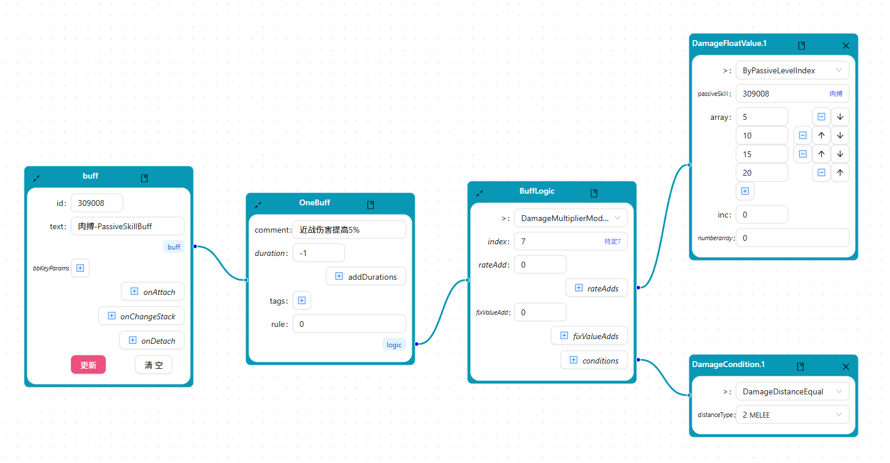
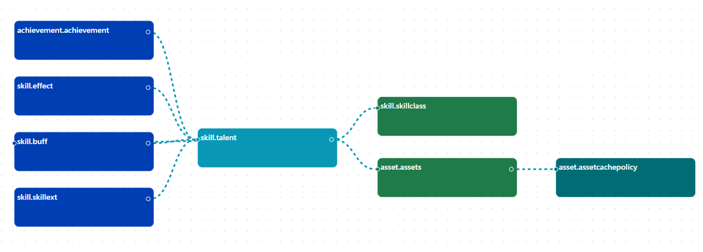

# 🎮 配置编辑器

## 📋 概述

配置编辑器是一个基于节点的通用编辑工具，旨在简化游戏开发中复杂数据结构的编辑工作。通过定义数据结构，您可以快速创建用于任务、行为树、技能等系统的专用编辑器，无需为每个系统单独开发编辑工具。

## 📸 界面展示

### ✏️ 编辑记录

*图：编辑单个记录的界面，支持字段编辑和保存*

### 📄 查看记录详情

*图：查看记录详细信息的界面*

### 🔍 记录关系视图

*图：可视化展示记录之间的关联关系*

### 📊 表结构管理

*图：管理数据库表结构的界面*

### 🔗 表关系视图

*图：展示表与表之间关系的可视化界面*

