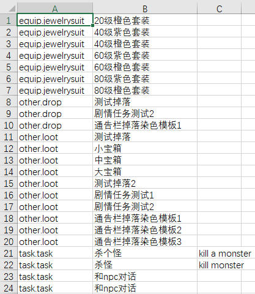

# 🌐 国际化支持
{: .no_toc }

- TOC
{:toc}
---

```
只需要在结构定义的.cfg文件里，把需要国际化的字段类型从str改为text。
```


## 🎯 设计


然后在实际需要国际化时，通过以下流程来支持 单语言版本的国际化，或者多语言版本的国际化。


一般传统做法是：策划在需要国际化的字段填id，统一索引到一个文件里，最后翻译时只用处理这一个文件就好。
这样的缺点是策划多一个间接层，要维护id对应关系，心智负担比较大。同时如果开始做的时候没有考虑到国际化需求，没有使用id，
后期修改比较麻烦。

我们的做法：让工具来自动索引，自动提取到一个文件里，这一切都对策划透明，避免了以上的缺点。

处理时先查table，然后在单个table里，找对应的翻译文本。按查找的key分两种：

1. 📝 方案1-以原始文本为key （对应流程1）
2. 🔑 方案2-以原始文本所在行的主键 + 所在这行的具体位置的field name chain为key （对应流程2）


这里介绍方案1，下一节介绍[方案2](./09.i18n2.html)

例子： https://github.com/stallboy/cfggen/blob/master/example/i18n_method1

假如要翻译text为en,kr,tw这三种语言

在i18n_method1目录下，执行以下命令

## 📄 1. 生成或更新 翻译文件

```bat
# -i18nfile en.csv  使得新生成的文件用上之前的翻译结果 （第一次时可以不加这个参数，或者手工创建空的en.csv文件）
java -jar ../../cfggen.jar -datadir ../config  -i18nfile en.csv -gen i18n,file=en.csv
java -jar ../../cfggen.jar -datadir ../config  -i18nfile kr.csv -gen i18n,file=kr.csv
java -jar ../../cfggen.jar -datadir ../config  -i18nfile tw.csv -gen i18n,file=tw.csv
```

生成的文件如下：




```
第一列是table名称，第二列是提取出来的待翻译的文本，第三列需要人用填写翻译结果
```

## ✏️ 2. 人工编辑

```
如图所示
翻译`杀个怪`为`kill a monster`
翻译`杀怪`为`kill monster`
来测试
```

## 🚀 3. 生成代码和数据文件

* 要生成多语言版本：

```bat
# 在命令行上加上 -langswitchdir <dir>，(-defaultlang 默认为zh_cn)：
-langswitchdir . -gen ...
```
就遍历-langswitchdir目录下的.csv文件作为多语言。


* 要生成单语言版本：

```bat
# 在命令行上加上 -i18nfile <.csv file>：
-i18nfile en.csv -gen ...
```

## 🔄 迭代

* 如果翻译要修改，运行2,3

* 如果配表有更新，运行1把新的text字段的字符串提取到i18n目录文件下（同时保持了原先的翻译），然后运行2,3


## 📚 术语表检查

把术语翻译放到term_en.xlsx里，第一列是中文，第二列是英文，然后运行

```
-i18nfile en.csv -compareterm term_en.xlsx
```

会检查翻译文件en.csv中，原始文本包含中文术语，但翻译文本中却不包含对应英文术语的情况，输出。