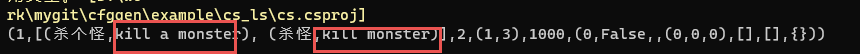

# 🌐 国际化支持方案2
{: .no_toc }

- TOC
{:toc}
---

```
只需要在结构定义的.cfg文件里，把需要国际化的字段类型从str改为text。
```

内部运行原理是：以原始文本所在行的主键 + 所在这行的具体位置的field name chain为key


例子： https://github.com/stallboy/cfggen/blob/master/example/i18n


## 📄 1. 生成或更新翻译文件


```bat
java -jar ../../cfggen.jar -datadir ../config -langswitchdir langs  -gen i18nbyid,dir=langs,backup=backup
```

- `-langswitchdir langs`参数表示会读取这个目录下所有的语言（本目录下的子目录名为语言名）
- 一般使用这个bat，这样一下就可以生成所有语言的翻译文件了。

会创建多个_todo_[lang].xlsx（[lang]是语言代码，就是目录名称）
此文件包含两个工作表：
- todo：包含待翻译文本

  

- 参考用：包含已翻译文本

  


## ✏️ 2. 人工编辑

此时有两个流程可以选择：

- 使用todo流程
  1. 每次生成完后，把它发给翻译人员，翻译人员填todo分页的就行了。
  2. 翻译人员返回todo文件后，把它放到对应目录下（i18n/langs）

- 或忽略todo，直接在具体翻译文件（如item.xlsx）中填写翻译内容


当同一翻译项在item.xlsx和todo文件中同时存在时，优先采用todo文件中的翻译内容。
若它为空，则回退使用item.xlsx中的翻译内容。

也就是说todo拥有更高的优先级。


## 🔄 迭代
1,2循环迭代

todo文件改变后，再次`生成或更新翻译文件`后，则会把现有todo里的内容填回到具体的比如item.xlsx文件里，
同时todo文件会再次更新，内含新的todo待翻译文本和参考用已翻译文本两个工作表。


## 🚀 3. 生成代码和数据文件

* 要生成多语言版本：

```bat
java -jar ../cfggen.jar -datadir config -langswitchdir i18n/langs -gen ...
```

- `-langswitchdir i18n/langs`参数，此目录下有子目录，则表明在用方案2，就遍历此目录下的子目录作为多语言。

* 要生成单语言版本：

```bat
java -jar ../cfggen.jar -datadir config -i18nfile i18n/langs/en -gen ...
```

- `-i18nfile i18n/langs/en`参数，发现参数是个目录，不是文件，则表明在用方案2


例子：在example下运行 i18n_gencsharp.bat，
到cs_ls目录下，dotnet run可以看到输出，红字就是en



## 🔄 方案1，方案2切换

1. 从方案1切换到方案2

```
-i18nfile i18n/en.csv -gen i18nbyid,dir=i18n/langs/en,backup=backup
```

2. 从方案2切换到方案1

```
-i18nfile i18n/langs/en -gen i18n,file=i18n/en.csv
```


## 📚 术语表检查

把术语翻译放到term_en.xlsx里，第一列是中文，第二列是英文，然后运行

```
# i18nfile 可以是个目录
-i18nfile langs/en -compareterm term_en.xlsx
```

会检查翻译目录langs/en下的excel文件，原始文本包含中文术语，但翻译文本中却不包含对应英文术语的情况，输出。