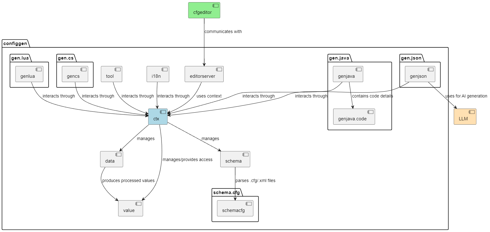

# 🔧 inside cfggen
{: .no_toc }

## Table of contents
{: .no_toc .text-delta }

- TOC
{:toc}
---

## 🏗️ 整体架构

cfggen 采用以 Context 为核心的模块化架构，通过统一的配置定义生成多语言代码。系统支持 Excel、CSV、JSON 等多种数据源，可输出 Java、C#、Go、Lua、TypeScript 等目标语言。

## 核心模块

### 1. 上下文管理模块 (ctx)
系统核心控制器，协调所有模块的交互和数据流。

- **Context**：全局上下文管理
- **DirectoryStructure**：目录结构管理
    - **ExplicitDir**：显式目录配置
- **Watcher**：文件监控器

### 2. Schema管理模块 (schema)
配置Schema的定义、解析和验证。

- **CfgSchema**：Schema模型
- **CfgSchemaResolver**：Schema解析器
- **CfgSchemaFilterByTag** 被tag过滤后的Schema

### 3. 数据读取模块 (data)
从不同格式文件读取配置数据。

- **CfgData**：数据模型
- **CfgDataReader**：数据读取器
- **CfgSchemaAlignToData** 根据数据修改Schema

### 4. 值处理模块 (value)
配置值的解析、转换和验证。

- **CfgValue**：值模型
- **CfgValueParser**：值解析器
    - **VTableParser**：excel表解析器
    - **VTableJsonParser**：josn表解析器
- **RefValidator** 数据一致性验证

### 5. 国际化模块 (i18n)
多语言配置和术语管理。

- **GenI18nById**：基于ID的国际化
- **GenI18nByValue**：基于值的国际化

### 86. 代码生成器模块
多语言代码生成实现。

- **GenJavaCode**：Java代码生成器
- **GenCs**：C#代码生成器
- **GenGo**：Go代码生成器
- **GenLua**：Lua代码生成器
- **GenTs**：TypeScript代码生成器
- **GenJson**：JSON生成器
- **GenJsonByAI**：AI辅助JSON生成器

### 7. 编辑器服务模块 (editorserver)
为外部编辑器提供配置服务。

- **EditorServer**：编辑器服务
    - **RecordService**：记录服务
    - **SchemaService**：Schema服务

### 8. MCP服务器模块 (mcpserver)
为AI助手提供配置数据查询和操作能力。

- **CfgMcpServer**：MCP服务器主类
    - **WriteRecordTool**：记录写入工具（添加/更新记录）
    - **ReadRecordTool**：记录读取工具（查询记录）
    - **SearchTool**：搜索工具（字符串/数字搜索）
    - **SchemaTool**：模式查询工具（表结构查询）

### 9. 数据写入模块 (write)
负责配置数据的持久化存储和文件操作。

- **VTableStorage**：table格式表存储（核心写入逻辑）
- **VTableJsonStorage**：JSON格式的表存储
- **RecordBlockMapper**：记录块映射器（VStruct到RecordBlock映射）
- **RecordBlock**：记录块（数据块表示）
- **TableFile**：表文件接口
    - **ExcelTableFile**：Excel表文件实现
    - **CsvTableFile**：CSV表文件实现
    - **ColumnModeExcelTableFile**：列模式Excel表文件
    - **ColumnModeCsvTableFile**：列模式CSV表文件


## 数据流和模块交互

### 核心数据流

```
┌─────────────┐    ┌─────────────┐    ┌─────────────┐    ┌─────────────┐
│   Schema    │───▶│    Data     │───▶│    Value    │───▶│  Generators │
│  (Schema)   │    │  (数据)     │    │  (值处理)   │    │  (生成器)   │
└─────────────┘    └─────────────┘    └─────────────┘    └─────────────┘
         │                │                │                │
         └────────────────┼────────────────┼────────────────┘
                          │                │
                    ┌─────▼────────────────▼─────┐
                    │          Context           │
                    │         (核心协调)         │
                    └────────────────────────────┘
```

### 处理流程

1. **初始化**
   - Context创建和模块注册
   - 目录结构配置

2. **Schema处理**
   - 解析Schema定义文件
   - 构建类型系统
   - 验证Schema完整性

3. **数据读取**
   - 识别数据源文件
   - 解析Excel/CSV/JSON格式
   - 转换为内部数据结构

4. **值处理**
   - 解析和转换配置值
   - 类型推断和约束检查
   - 构建关联关系

5. **代码生成**
   - 选择目标语言生成器
   - 渲染代码模板
   - 输出生成文件

### 通信机制

- **上下文传递**：Context对象在各模块间传递状态
- **数据传递**：Schema→Data→Value→Generators
- **写入管道**：editorserver/mcpserver/genjsonbyAI→write→文件系统

## 设计特点

### 1. 模块化
- 职责分离，便于维护扩展
- 接口清晰，模块间解耦
- 可插拔架构，灵活替换

### 2. 多语言支持
- 统一Schema定义
- 模板驱动代码生成
- 适配各语言特性

### 3. 国际化
- 双模式（ID/值）支持
- 运行时语言切换
- 术语验证管理

### 5. 扩展性
- 生成器注册管理
- 自定义模板支持
- AI辅助生成
