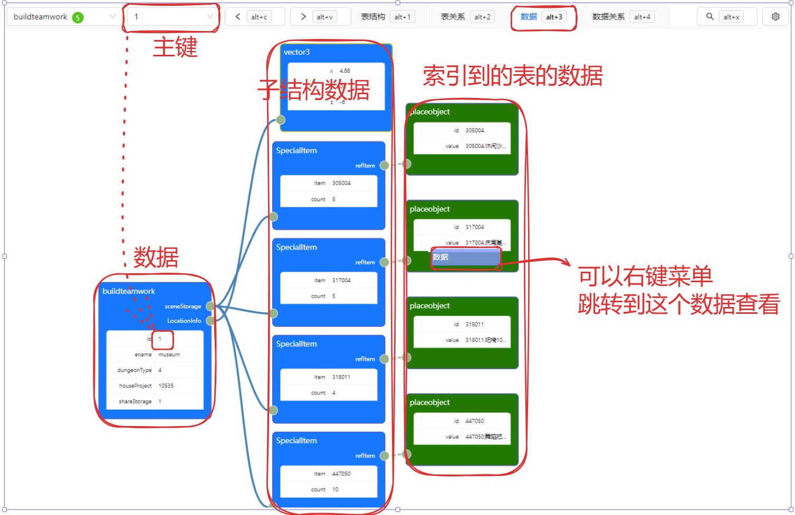
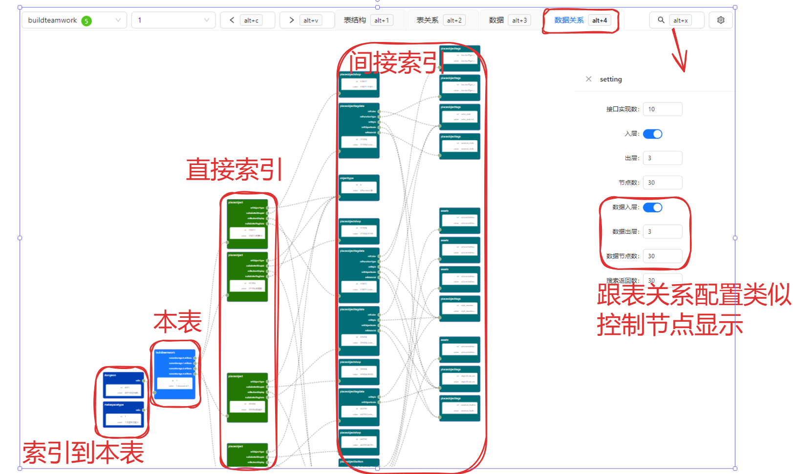

# 编辑器
{: .no_toc }

## Table of contents
{: .no_toc .text-delta }

- TOC
{:toc}
---

## why？
一般游戏开发组会为任务、行为树、技能等复杂的结构，做专门的编辑器工具。
这个工具本意是要做基于节点的通用编辑工具，只要定义好结构，以上的专用编辑器都不用写了。

### 浏览数据

以下节点都可以右键点击跳转。
这样方便查看各个表，各个记录的链接关系，通过这个链接的节点方便的导航查看整个数据，
再加上一个全局数据搜索功能，这比打开excel来浏览应该是要方便很多。

### 编辑数据

编辑数据会保存成json文件

## 查看表结构

## 查看表关系 

## 查看记录

## 查看记录关系

## 搜索记录

