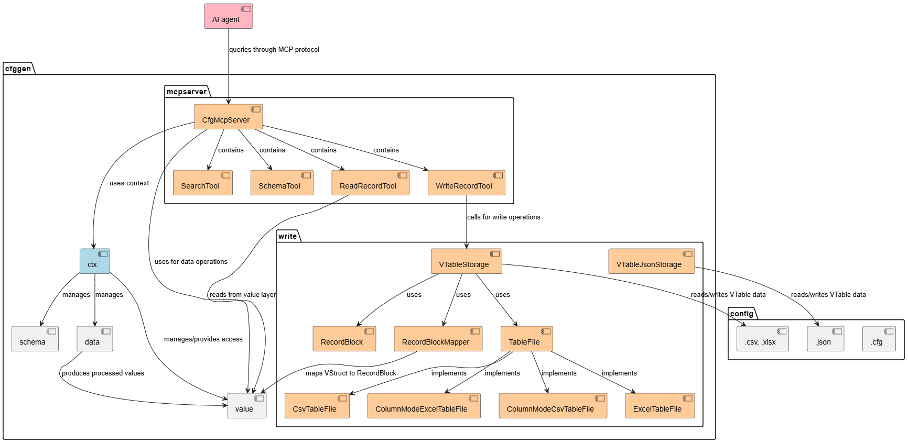

# 🔌 MCP服务器

MCP（Model Context Protocol）服务器为配置系统提供了与AI助手交互的能力，允许通过自然语言查询和操作配置数据。

## 🎯 主要使用目的

**根据策划描述自动生成策划配表**：通过AI助手理解策划需求，自动创建和修改游戏配置数据，大幅提升策划配表效率。

### 典型工作流程
1. **策划描述需求** → AI理解需求并查询现有配置结构
2. **AI分析数据关系** → 使用搜索和查询工具了解相关配置
3. **AI生成配置数据** → 自动创建新的配置记录或修改现有记录
4. **实时验证和调整** → 通过查询工具验证配置正确性

## 🚀 快速开始

### 启动MCP服务器

```bash
# 使用默认端口3457启动MCP服务器
java -jar cfggen.jar -datadir [配置目录] -gen mcpserver

# 指定端口启动
java -jar cfggen.jar -datadir [配置目录] -gen mcpserver,port=8080

# 启用文件监视和自动重载
java -jar cfggen.jar -datadir [配置目录] -gen mcpserver,watch=5,postrun=reload.bat
```

### 配置参数

| 参数 | 说明 | 默认值 |
|------|------|--------|
| `port` | MCP服务器端口 | 3457 |
| `watch` | 文件监视延迟秒数（0表示不监视） | 0 |
| `postrun` | 重载配置后执行的脚本 | null |
| `own` | 只提取包含指定tag的数据 | null |

## 🛠️ 可用工具

MCP服务器提供了以下工具来查询和操作配置数据：

### 📋 Schema查询工具

#### `readTableSchema` - 读取表结构定义

查询指定表的完整结构定义，包括字段、类型、外键关系等信息。

**参数：**
- `table` (必需): 表的完整名称

**示例：**
```
查询 "user" 表的结构定义
```

**返回：** 表的结构定义信息，包括字段列表、数据类型、外键关系等。

### 🔍 搜索工具

#### `searchString` - 字符串搜索

在全表范围内搜索包含指定字符串的记录。

**参数：**
- `q` (必需): 
- `table` : 搜索特定table
- `maxCount` : 最大返回结果数量

**示例：**
```
搜索包含 "admin" 的记录，最多返回10条结果
```

**返回：** 包含匹配记录的表格格式结果，显示表名、主键、字段路径和值。

#### `searchNumber` - 数字搜索

在全表范围内搜索等于指定数字的记录。

**参数：**
- `q` (必需): 搜索的数字
- `table` : 搜索特定table
- `maxCount` (必需): 最大返回结果数量

**示例：**
```
搜索值为 100 的记录，最多返回5条结果
```

**返回：** 包含匹配记录的表格格式结果，显示表名、主键和字段路径。

### 📖 记录读取工具

#### `listTableRecord` - 列出表记录

列出指定表的所有记录。

**参数：**
- `table` (必需): 表的完整名称
- `extraFields`: 额外的字段，默认只包含pk和title定义的字段

**示例：**
```
列出 "skill" 表的所有记录
```

**返回：** 表的记录列表，以CSV格式显示。

#### `readRecord` - 读取单条记录

根据主键读取指定表的单条记录。

**参数：**
- `table` (必需): 表的完整名称
- `recordId` (必需): 记录的主键ID

**示例：**
```
读取 "user" 表中ID为 "1001" 的记录
```

**返回：** 记录的JSON格式数据。

### ✏️ 记录写入工具

#### `addOrUpdateRecord` - 添加或更新记录

向指定表添加新记录或更新现有记录。

**参数：**
- `table` (必需): 表的完整名称
- `recordJsonStr` (必需): 记录的JSON字符串

**示例：**
```
向 "item" 表添加一条新记录
```

**返回：** 操作结果信息，包括存储路径。

#### `deleteRecord` - 删除记录

从指定表删除指定记录。

**参数：**
- `table` (必需): 表的完整名称
- `recordId` (必需): 要删除的记录ID

**示例：**
```
从 "user" 表中删除ID为 "1001" 的记录
```

**返回：** 删除操作结果信息。

## 🔄 文件监视和自动重载

当配置数据文件发生变化时，MCP服务器可以自动重新加载配置：

```bash
# 启用文件监视，5秒延迟后自动重载
java -jar cfggen.jar -datadir [配置目录] -gen mcpserver,watch=5

# 重载后执行额外脚本
java -jar cfggen.jar -datadir [配置目录] -gen mcpserver,watch=5,postrun=reload.bat
```

## 🔧 集成到AI助手

### Claude Code

- 添加

```bash
claude mcp add --transport http cfggen http:/localhost:3457/mcp
```

- 删除

```bash
claude mcp remove cfggen
```

- 检验是否ok

```bash
claude mcp list
```


### 其他MCP客户端

MCP服务器遵循标准的Model Context Protocol协议，可以与任何兼容的MCP客户端集成。

### inside


