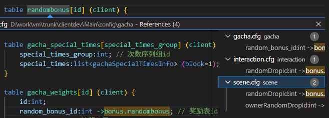

# 🔧 vscode插件

## 🚀 快速开始

1. **📥 安装扩展**：在 VSCode 扩展商店中搜索 "cfg-support" 并安装
2. **📂 打开 CFG 文件**：打开任何 `.cfg` 文件

## ✨ 功能特性

### 🎨 语法高亮
- **结构定义高亮**：`struct`、`interface`、`table` 名称
- **类型标识符高亮**：自定义类型名称（非基础类型）
- **外键引用高亮**：`->table1`、`=>table1[field2]` 等外键语法
- **元数据关键字高亮**：`nullable`、`mustFill`、`enumRef` 等
- **主键字段高亮**：在表定义中的主键字段

### 🔗 跳转到定义
- **类型跳转**：Ctrl+点击类型名称跳转到其定义
- **外键跳转**：Ctrl+点击外键引用跳转到目标表
- **接口内跳转**：在接口内部定义的 struct 优先在当前接口内查找

### 📋 大纲视图
- **结构导航**：使用大纲视图快速浏览文件结构
- **层级展示**：清晰显示接口、结构、表的层级关系

### 🔍 查找引用
- **引用查找**：右键点击类型或表名选择"查找所有引用"
- **跨文件分析**：支持分析整个项目的引用关系

    