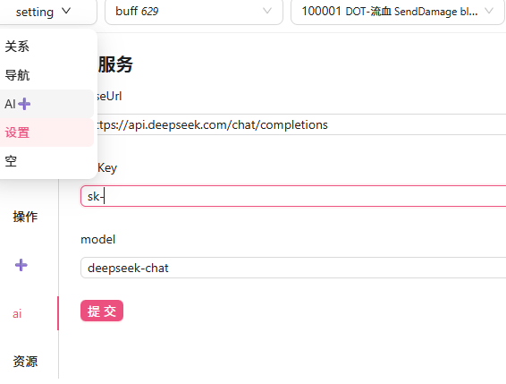

AI 生成功能允许您使用自然语言描述自动生成符合结构定义的配置数据。通过集成 AI 能力,可以大幅提升配置效率,减少手动编写的工作量。

## 核心功能

- **自然语言生成**: 用中文描述需求,AI 自动生成 JSON 配置
- **结构化验证**: 生成的数据自动符合 CFG 结构定义
- **迭代优化**: 支持多次对话修改和完善配置
- **外键智能**: 自动处理外键关联,生成有效的引用关系
- **自动格式转换**: AI 生成 JSON 后,系统根据 table 的存储类型自动保存为对应格式(JSON/CSV/Excel)

## 方式一:交互式生成

### 1. 设置 AI

在配置编辑器中打开 AI 设置页面,配置您的 API 信息:



**配置示例**:
```json
{
  "baseUrl": "https://api.deepseek.com",
  "apiKey": "sk-xxxxxxxxxxxxxxx",
  "model": "deepseek-chat"
}
```

### 2. 使用 AI 生成

打开 AI Chat 页面,选择要生成配置的表,输入您的需求描述:


### 3. 输入需求描述示例

```
请帮我生成一个新手任务:
- 任务名称: "初次战斗"
- 要求击杀10只史莱姆
- 奖励100金币和一把新手剑
- 完成后接取下一个任务
```

### 4. 迭代优化

- 查看生成的配置
- 如果不满意,继续与 AI 对话修改
- 直到满意为止

## 方式二:批量生成

批量生成模式允许您一次性生成多个配置记录。

### 命令行参数

```bash
-gen byai
    own=null             提取部分配置,跟cfg中有tag标记的提取
    cfg=ai.json          AI配置文件,兼容OpenAI API
    ask=ask.txt          问题文件,每行生成一个json
    table=skill.buff     表名称
    retry=1              重试次数,默认1代表不重试
```

### AI 配置文件 (ai.json)

```json
{
  "baseUrl": "https://api.deepseek.com",
  "apiKey": "sk-xxxxxxxxxxxxxxx",
  "model": "deepseek-chat"
}
```

### 问题文件 (ask.txt)

每行描述一个配置需求:

```txt
100,攻速提高140%
101,击败敌人时有15%概率提高10%移速,持续10秒,最高叠加5层
102,提高30%移速,受到伤害时失去此加成4秒
103,造成的所有冰寒伤害提高30%
```

### 运行示例

```bash
java -jar cfggen.jar -gen byai table=skill.buff cfg=ai.json ask=ask.txt
```

## 简单示例

### 示例 1: 生成任务配置

**用户输入**:
```
创建一个主线任务"勇者的试炼":
- 玩家需要达到5级
- 击杀20只哥布林
- 奖励500经验、1000金币
- 包含3个随机奖励物品
- 完成后开启新地图
```

**AI 生成**:
```json
{
  "taskid": 1001,
  "name": "勇者的试炼",
  "type": "main",
  "description": "完成勇者的试炼,证明你的实力!",
  "completecondition": {
    "$type": "ConditionAnd",
    "cond1": {
      "$type": "LevelReach",
      "level": 5
    },
    "cond2": {
      "$type": "KillMonster",
      "monsterid": 2001,
      "count": 20,
      "$note": "击杀哥布林"
    }
  },
  "exp": {
    "$type": "ByLevel",
    "levelcoef": 100.0,
    "value": 500,
    "$note": "基于等级的500经验"
  },
  "rewards": [
    {
      "chance": 10000,
      "itemids": [1001],
      "range": {
        "rmin": 1,
        "rmax": 1
      }
    }
  ],
  "nexttask": 1002
}
```

### 示例 2: 生成装备配置

**用户输入**:
```
生成一件稀有装备"龙鳞铠甲":
- 防御力100-150
- 增加500点生命值
- 需要20级才能装备
- 火属性抗性+30%
```

**AI 生成**:
```json
{
  "id": 5001,
  "name": "龙鳞铠甲",
  "type": "armor",
  "rank": "rare",
  "levelReq": 20,
  "attributes": [
    {
      "attrId": 1,
      "value": 125,
      "$note": "防御力(100-150的中间值)"
    },
    {
      "attrId": 2,
      "value": 500,
      "$note": "生命值"
    },
    {
      "attrId": 10,
      "value": 30,
      "$note": "火属性抗性(%)"
    }
  ],
  "description": "用真龙鳞片打造的铠甲,提供卓越的防护。"
}
```

## 数据格式说明

> **重要**: AI 生成过程中展示的都是 **JSON 格式**,便于阅读和验证。但当您确认保存时,系统会根据 table 在 `.cfg` 中定义的**存储类型**,自动将数据保存为对应格式:
>
> - **JSON 存储** → 保存为独立的 `.json` 文件(位于 `_表名/` 目录)
> - **CSV 存储** → 更新 `.csv` 文件(新增/修改记录)
> - **Excel 存储** → 更新 `.xlsx` 文件(新增/修改记录)
>
> 这样设计的好处是:
> -  AI 生成时使用通用的 JSON 格式,便于处理复杂结构
> -  保存时自动转换为实际的存储格式,无需手动转换
> -  同一套 AI 规则可以支持不同的存储后端
> -  支持对已有记录的修改和替换,不限于追加

### 存储类型与保存格式的关系

| Table 定义 | 存储类型 | AI 生成格式 | 实际保存行为 |
|-----------|---------|-----------|-------------|
| `ai.json` | JSON | JSON | 新记录:创建 `1.json`, `2.json` 等 |
| `equip.csv` | CSV | JSON → 自动转换 | 根据ID判断:新增则追加,已有则替换 |
| `task.xlsx` | Excel | JSON → 自动转换 | 根据ID判断:新增则追加,已有则替换 |

## 应用场景

- **快速原型**: 快速生成测试数据
- **批量配置**: 批量生成相似的配置记录
- **填充数据**: 为新系统快速填充初始数据
- **数据迁移**: 从描述性文档转换为结构化配置

## 相关文档

- [配置指南](../config-guide/) - 详细的配置文件和目录结构说明
- [MCP 服务器集成](../mcpserver/) - 在编辑器中使用 AI 生成
- [Schema 生成](../schema-gen/) - 使用自然语言生成 CFG Schema 定义文件
- [AI 翻译](../translate/) - 使用 AI 翻译多语言文本
- [配置编辑器](../../editor/overview/) - 可视化配置编辑工具
- [结构定义](../../core/schema/) - CFG 结构定义语法
