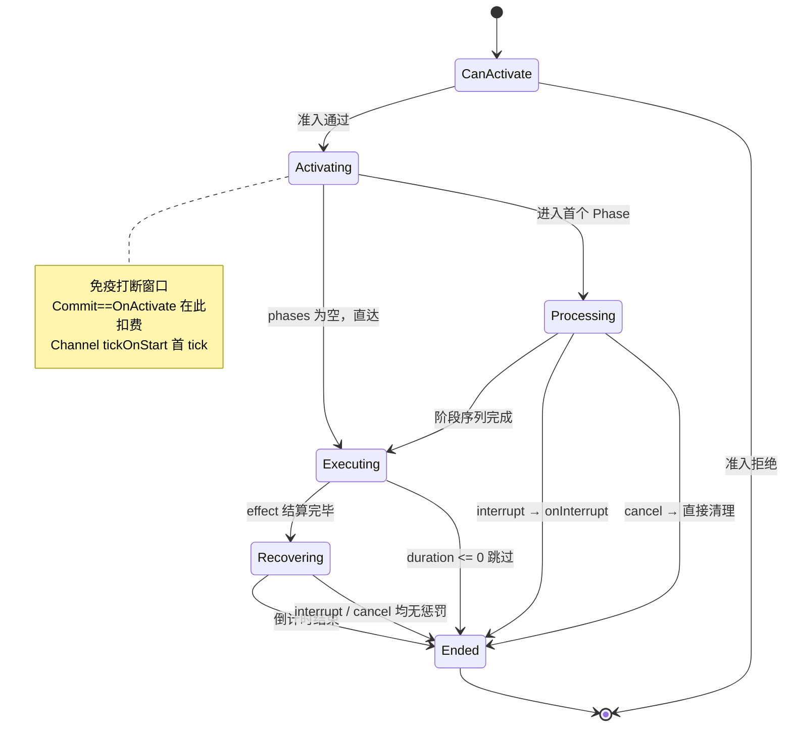

基于全数据驱动理念与深度架构推演，本模型旨在彻底解决动作游戏与 RPG 中复杂的技能生命周期管理问题。

## 设计原则

1. **瞬发零开销**：空 `phases`（瞬发）等同于极简的"扣资源-触发"行为，不被复杂的生命周期拖累。
2. **生命周期原生托管**：前摇（Startup）、引导（Channel）甚至后摇（Recovery），都是技能**真实占用角色时间**的生命周期阶段，必须由 `AbilityInstance` 原生接管，以保证动作取消、UI 表现、并发锁的精确性。
3. **打断与取消双轨语义**：TagRules 提供 `interruptsAbilities`（硬打断，有惩罚）和 `cancelsAbilities`（软取消，无惩罚）两种打断动词。技能在前摇时被眩晕是"打断"，在后摇时被翻滚截断是"动作取消"，底层逻辑完全自洽。
4. **阶段序列原语**：施法过程是有序的 `Phase` 序列（`Startup` 时间门控 / `Charge` 输入门控 / `Channel` 周期），可任意串联（如蓄力→前摇→出伤）。空序列 = 瞬发。Phase 是"主动意图的时间容器"——承载 `Status`/`Behavior.Timeline` 没有的三样东西：**输入门控、commit 经济性、interrupt/cancel 双轨打断**。连招、形态切换等复合需求通过"标签 + 组合"实现。

---

## Ability 表结构

```cfg
table ability[id] (json) {
    id: int;
    name: text;
    description: text;

    abilityTags: list<str> ->gameplaytag;
    
    // 准入检查
    activationConditions: list<Condition>;
    costs: list<ResourceCost>;
    cooldown: FloatValue;

    // 瞄准与输入要求
    targeting: TargetingRequirement;
    
    // 施法过程：有序的 Phase 序列。空列表 = 瞬发（直达 Executing）。
    phases: list<Phase>;

    // 所有 phase 跑完后的核心结算（出伤、发子弹、挂 Buff 等）
    effect: Effect;

    // 技能主体逻辑执行完毕后的收招阶段
    recovery: RecoveryConfig;
}

struct ResourceCost {
    resource: str ->resource_definition;
    value: FloatValue;
}
```

**Cost / Cooldown 的 FloatValue 约束**：`costs[].value` 与 `cooldown` 在激活期（`CanActivate` / `StartCooldown`）用 `WithoutPayload` 路径求值，**此时没有事件上下文**。因此禁止使用 Payload-relative 表达式（`PayloadMagnitude` / `PayloadVar`）——否则会静默求值为 0，导致**零消耗 / 零冷却**。

---

## 瞄准与输入 (Targeting)

`TargetingRequirement` 定义了技能激活前需要收集什么输入，以及在持续施法期间对输入的容忍策略。

```cfg
interface TargetingRequirement {
    // 无需外部输入（如：战吼、自身Buff）
    struct None {}

    // 需要选中一个实体
    struct SingleTarget {
        allowedRelations: list<Relation>;
        tagQuery: TagQuery;
        maxRange: FloatValue;
        onTargetLost: TargetLostPolicy;
    }

    // 需要指定一个地点（如：火雨）
    struct PointTarget {
        maxRange: FloatValue;
    }

    // 需要指定一个方向（如：非指向性冲刺、扫射射线）
    struct DirectionalTarget {}
}

enum TargetLostPolicy {
    Cancel;     // 目标死亡或超出范围，触发 cancel
    Continue;   // 继续施法（对空放）
}
```

### 动态 Targeting 数据流

引擎在 `Activate` 时，将瞄准数据写入 `instanceState` 中。
引擎在 `Processing` 阶段（蓄力、引导期间）**每帧根据玩家鼠标/摇杆实时更新这些变量**。当结算 `effect` 时，读取到的永远是玩家动作那一刻的最精确输入。

| Targeting 类型 | context.target 初始值 | instanceState 写入 |
|---|---|---|
| `None` | 施法者自身 | 无 |
| `SingleTarget` | 选中的目标 Actor | `targetingActor` = 选中目标 |
| `PointTarget` | 施法者自身 | `targetingPoint` = 选中地点 |
| `DirectionalTarget`| 施法者自身 | `targetingDir` = 选中方向 |

**SingleTarget 的 Processing 阶段追踪**：每帧验证目标存活 ∧ 目标在 maxRange 内 ∧ 目标满足 tagQuery。验证失败时按 `onTargetLost` 处理（`Cancel` 触发 cancel，`Continue` 不处理）。`PointTarget` 和 `DirectionalTarget` 的数据为标量，不存在"丢失"概念，无需追踪。

---

## 施法阶段 (Phases)

施法过程是一个**有序的 `Phase` 序列**（`phases`）。引擎按顺序推进每个 Phase：进入时施加其 `statuses`、运行其时间/输入逻辑、完成后进入下一个 Phase；全部完成后进入 `Executing` 结算 `effect`。**空列表 = 瞬发**（Activate 直达 Executing）。

Phase 是"主动意图的时间容器"。它和 `Status`（被动持续容器）、`Behavior.Timeline`（纯时间轴）形似神不似——Phase 独自承载三样后者没有的东西：**输入门控、commit 经济性、interrupt/cancel 双轨打断**。因此施法生命周期必须由 Phase（Ability 层）托管，不能下放给 behavior——否则前摇/后摇的打断边界会消失，无法区分 interrupt 与 cancel（详见文末决策记录）。

```cfg
interface Phase {
    // 时间门控阶段（固定前摇，读条）
    struct Startup {
        duration: FloatValue;

        // 进入 Apply / 离开 Remove（生命周期由本 Phase 托管，施加永久、退出时 Remove）
        statuses: list<StatusCore>;

        commitOnComplete: bool;       // 前摇完成瞬间扣费
        onInterrupt: list<Effect>;    // 被 interruptsAbilities 命中时的瞬时惩罚
    }

    // 输入门控阶段（按住蓄力，松手/到 max 完成）
    struct Charge {
        minTime: FloatValue;
        maxTime: FloatValue;
        releaseOnMax: bool;

        statuses: list<StatusCore>;

        commitOnRelease: bool;        // 松手且达 minTime 时扣费（蓄力不足取消不扣）
        onInterrupt: list<Effect>;
    }

    // 周期阶段（按节奏反复触发 tickEffect）
    struct Channel {
        tickSchedule: TickSchedule;   // 触发节奏（等间隔 / 时刻表）
        duration: FloatValue;         // 总时长硬截断
        tickEffect: list<Effect>;     // 每 tick 的瞬时结算

        statuses: list<StatusCore>;

        commitOnFirstTick: bool;      // 首次 tick 时扣费
        onInterrupt: list<Effect>;
    }
}
```

**Phase 字段职责**（互不重叠）：

| 字段 | 性质 | 说明 |
|---|---|---|
| 时间参数（duration / min-max / releaseOnMax / tickSchedule） | Phase 独有 | 决定阶段如何**推进**（时间 / 输入信号 / 周期） |
| `statuses` | 持续物收敛点 | 身份标签、表现、持续效果**全部**在此。挂载即 `grantedTags` 进 TagContainer，TagRules 照常 O(1) 查询 |
| `tickEffect` | Channel 独有 | 周期性瞬时结算 |
| `commit*` | 经济性 | 扣 costs + 启 CD 的锚点（见下） |
| `onInterrupt` | 瞬时动作 | 被 `interruptsAbilities` 命中时触发一次（不随 phase 持续） |

> **为什么没有 Instant Phase？** 瞬发 = 空 `phases` 列表（Activate 直达 Executing）。Instant 作为 Phase 没有时间、没状态，是冗余原语。

> **为什么 tags/cues 不在 Phase 顶层？** `StatusCore` 已有 `grantedTags` + `cuesWhileActive` + `behaviors`，更完备；且 Status 挂载后 `grantedTags` 自动写入 TagContainer，TagRules 无需 Phase 另维一份 tags。持续物单一出口收敛到 `statuses`，避免概念重复。

### Commit：扣费锚点与退费语义

每个 Phase 用**一个 bool** 声明自己的 commit 锚点（`commitOnComplete` / `commitOnRelease` / `commitOnFirstTick`）。规则：

- 所有 `commit*` 全 `false` → **默认 `OnActivate`**（激活即扣，最常见，零配置）
- 恰好一个 `true` → 在该里程碑扣费
- 多个 `true` → `ConfigPostProcessor` **fail-fast** 报错

commit 锚点不只决定"何时扣"，还**隐含定义退费边界**——这是它存在的根本原因：

| 被打断/取消发生在 commit 锚点 | 结果 |
|---|---|
| **之前** | 尚未扣费 → 无损失（"蓄力不足取消不扣费"靠 `commitOnRelease`） |
| **之后** | 已扣费 → 不退（"激活即扣被打断不退"靠默认 `OnActivate`） |

策划选锚点 = 同时选了扣费时机与退费策略。

### 旧 castMode 对照

| 旧单选 castMode | 新 phases |
|---|---|
| `Instant` | `phases: []` |
| `Startup{commit:OnComplete}` | `phases:[Startup{commitOnComplete:true}]` |
| `Charge{commit:OnRelease}` | `phases:[Charge{commitOnRelease:true}]` |
| `Channel{commit:OnFirstTick}` | `phases:[Channel{commitOnFirstTick:true}]` |
| 无法表达：蓄力→前摇→出伤（前摇可被打断） | `phases:[Charge, Startup]` |

### Channel 的触发节奏

```cfg
interface TickSchedule {
    // 等间隔：经典连发 / 无限引导
    struct Fixed {
        interval: FloatValue;
        maxTicks: int;        // -1 = 无限，由 Channel.duration 截断
        tickOnStart: bool;    // 进入 Channel 后是否立即触发首个 tick（否则再等一个 interval）
    }
    // 时刻表：非等间隔（快-快-慢 / 节奏型连发）
    struct At {
        times: list<FloatValue>;  // 每次 tick 相对进入 Channel 的时刻（秒），单调递增
        // tickOnStart 等价于 times[0]==0；maxTicks 等价于 times.length，二者被吸收无需单列
    }
}
```

### 引擎标准输出变量

部分引擎产物的语义对所有同类 Phase 技能完全一致，不再让每个技能重复声明，而是收敛为全局约定（在 `combat_settings` 中统一配置）。配置端通过 `FloatValue.ContextVar(varKey)` 读取。

| 变量 | 来源 | 语义 | 配置位置 |
|---|---|---|---|
| `chargeProgressVar` | Charge 阶段每帧写入 instanceState | 当前蓄力在 [minCharge, maxCharge] 区间的归一化进度（0~1，单调递增） | `combat_settings.chargeProgressVar` |
| `channelTickIndexVar` | Channel 每次 tick 触发 effect 前写入 localScope | 当前是本次引导的第几次 tick（从 0 开始） | `combat_settings.channelTickIndexVar` |

> 红线：只有「引擎产出 + 语义跨同类技能统一」的变量才进 `combat_settings`。技能局部计数器（命中次数、连击数等）仍由技能自身在 instanceState 中按 var_key 维护。

> **tick 序号的作用域与命名**：Channel / Periodic / Repeat 都向触发 effect 的 **localScope** 写入"第几次"序号（从 0 开始），effect 内统一用 `ContextVar` 读取（分层查找，localScope 优先于 instanceState）。三者的区别仅在 var_key 归属——
> - **Channel** 的 tick 序号语义跨所有 Channel 技能统一（本次引导的第几次），且一个 Ability 只有一个 Channel，故 var_key 收敛到 `combat_settings.channelTickIndexVar`。
> - **Periodic**（一个 Status 可挂多个，如掉血+掉蓝并存）/ **Repeat**（一棵 Effect 树可嵌套多个）各自独立计数，var_key 必须 per-behavior 自配（`indexVarTag` 字段），全局一个 key 会互相覆盖。

---

## 生命周期与状态机 (Lifecycle)

Ability 运行时由「激活动作」切入三大核心阶段（Phase）：`Processing`、`Executing`、`Recovering`。

> 对齐 `StatusInstance.Apply`：`AbilityInstance` 的构造只做无副作用的字段初始化，真正的首帧动作（Commit / 首 tick）由 `Activate()` 显式执行，并直达首个真实阶段。`Activate` 执行期间免疫打断——首帧挂载的标签可能触发 `OnTagAdded` 级联，免疫窗口防止级联回调重入尚未完成的激活流程。



### CanActivate

推荐检查顺序（从快到慢，尽早拒绝）：

1. TagRules 的 `blocksAbilities` 是否拦截当前 `abilityTags`
2. `cooldown` 就绪
3. `costs` 资源充足（检查但不扣除）
4. `activationConditions` 条件满足
5. `maxConcurrentAbilitiesPerActor` 未超限
6. `targeting` 验证（目标/地点/方向已由引擎收集且合法）

全部通过才进入 Activating。Targeting 验证放在最后，引擎可在步骤 1-5 通过后再触发目标选择 UI。

### 打断 (Interrupt) 与 取消 (Cancel)

| 方面 | interrupt | cancel |
|---|---|---|
| 触发源 | TagRules 的 `interruptsAbilities` | TagRules 的 `cancelsAbilities`、玩家主动操作、TargetLost |
| 执行 ability.effect | 否 | 否 |
| 执行 onInterrupt | **是**（仅 Processing 阶段） | **否** |
| 已 commit 资源 | 保留 | 保留 |
| 未 commit 资源 | 不扣 | 不扣 |
| 广播事件 | `Ability_Interrupted` | `Ability_Cancelled` |
| Recovery 阶段行为 | 等同 cancel（无惩罚） | 直接清理结束 |

**关键规则**：Recovery 阶段（ability.effect 已成功执行）无论被 `interruptsAbilities` 还是 `cancelsAbilities` 命中，均视为动作取消——不执行 `onInterrupt`，广播 `Ability_Completed`。

---

## Recovery 阶段（后摇）

若 duration <= 0 则直接跳过此阶段。
必须由系统原生托管后摇，以保证 UI 占用状态准确，防范"动作未完但逻辑可重入"的穿透 Bug。

```cfg
struct RecoveryConfig {
    duration: FloatValue;
    statuses: list<StatusCore>;   // 后摇期间维持的状态（身份/表现），进入施加/离开移除
}
```

通过 `statuses`（其 `grantedTags`）与 `tag_rules` 的组合，策划可精确控制每个技能后摇的"硬度"：

| 后摇类型 | statuses 授予的标签 | 表现 |
|---|---|---|
| 轻型后摇 | `Actor.Cast.Recovery` | 不能攻击/施法，但可以翻滚取消 |
| 重型后摇 | `Actor.Cast.Recovery.Heavy` | 不能攻击/施法/翻滚，必须等后摇结束 |
| 无后摇 | duration=0，跳过 Recovery | 即时释放下一个动作 |

---

## 状态与 TagRules 的交互示例
TagRules 的完整定义见 `ability-design.md`。此处展示其 `interruptsAbilities`（硬打断）、`cancelsAbilities`（软取消）和`blocksAbilities`（施法约束）在施法生命周期中的具体运用示例：

```
tag_rules {
    name: "CoreCombatRules";
    rules: [
        // 硬控打断
        { whenPresent: "Actor.Debuff.Control.Stun";
          interruptsAbilities: ["Ability.Type"];
          blocksAbilities: ["Ability.Type"];
          description: "眩晕：硬打断并封锁所有技能"; },

        { whenPresent: "Actor.Debuff.Control.Silence";
          interruptsAbilities: ["Ability.Type.Spell"];
          blocksAbilities: ["Ability.Type.Spell"];
          description: "沉默：硬打断并封锁法术类技能"; },

        // 软取消
        { whenPresent: "Actor.Motion.Dodging";
          cancelsAbilities: ["Ability.Type"];
          description: "翻滚：软取消任何技能（含后摇）"; },

        { whenPresent: "Actor.Motion.Moving";
          cancelsAbilities: ["Ability.Cancel.Move"];
          description: "移动：软取消标记为可移动取消的前摇技能"; },

        // 施法约束
        { whenPresent: "Actor.Cast.Recovery";
          blocksAbilities: ["Ability.Type.Spell", "Ability.Type.Melee"];
          description: "后摇期间禁止攻击和施法"; },

        { whenPresent: "Actor.Cast.Recovery.Heavy";
          blocksAbilities: ["Ability.Type.Movement"];
          description: "重型后摇期间禁止移动类技能"; }
    ];
}
```

### 技能配置示例：移动取消前摇

```
// 可被移动取消的治疗术
ability {
    id: 1001; name: "治疗术";
    abilityTags: ["Ability.Type.Spell", "Ability.Cancel.Move"];
    //         ▲ 标记为可被移动取消

    phases: [
        Startup {
            duration: Const { value: 2.5; };
            statuses: [
                StatusCore {
                    grantedTags: ["Actor.Cast.Startup.Spell"];
                    //         ▲ 不含 Actor.Motion.Immobile → 移动不被 block
                    //           但 TagRules: Actor.Motion.Moving cancelsAbilities Ability.Cancel.Move
                    //           → 玩家一动，此技能被 cancel（无惩罚，不扣费）
                    cuesWhileActive: ["Startup.Heal"];
                }
            ];
            commitOnComplete: true;
        }
    ];

    effect: ...;
}

// 站桩带前摇的火球术（移动直接被禁止）
ability {
    id: 1002; name: "火球术";
    abilityTags: ["Ability.Type.Spell"];
    //         ▲ 没有 Ability.Cancel.Move → 移动不会取消此技能

    phases: [
        Startup {
            duration: Const { value: 2.0; };
            statuses: [
                StatusCore {
                    grantedTags: ["Actor.Cast.Startup.Spell", "Actor.Motion.Immobile"];
                    //         ▲ Actor.Motion.Immobile → TagRules blocks Ability.Type.Movement → 按不动
                    cuesWhileActive: ["Startup.Fireball"];
                }
            ];
            commitOnComplete: true;
            onInterrupt: [ GrantTag {
                    grantedTags: ["Actor.Lockout.Ability"];
                    duration: Const { value: 0.5; };
                },
                FireCue { cue: "Startup.Interrupted"; }
            ];
        }
    ];

    effect: ...;
    recovery: {
        duration: Const { value: 0.3; };
        statuses: [ StatusCore { grantedTags: ["Actor.Cast.Recovery"]; } ];
    };
}

// 霸体蓄力重剑：按住蓄力(霸体)，松手后进入极短前摇(失去霸体，可被打断)
ability {
    id: 3001; name: "重剑蓄力斩";
    abilityTags: ["Ability.Type.Melee"];

    phases: [
        // Phase 1: 蓄力期
        Charge {
            minTime: Const { value: 0.5; };
            maxTime: Const { value: 2.0; };
            releaseOnMax: true;
            statuses: [
                StatusCore {
                    grantedTags: ["Actor.Cast.Charging", "Actor.Buff.SuperArmor"]; // 霸体护甲
                    cuesWhileActive: ["Cue.ChargeHeavy"];
                }
            ];
            commitOnRelease: false; // 蓄力期间不扣费
            onInterrupt: [ FireCue { cues: ["Cue.ChargeBroken"]; } ]; // 仅当被无视霸体的击飞打断时触发
        },
        
        // Phase 2: 松手后的前摇期
        Startup {
            duration: Const { value: 0.4; };
            statuses: [
                StatusCore {
                    // 移除霸体，暴露出前摇弱点标签
                    grantedTags: ["Actor.Cast.Startup.Heavy"]; 
                    cuesWhileActive: ["Cue.SwingWindup"];
                }
            ];
            commitOnComplete: true; // 前摇完成（出伤瞬间）才扣费进CD
            onInterrupt: [ 
                GrantTag { grantedTags: ["Actor.Debuff.Control.Stun.Self"]; duration: Const{value: 1.0;} }, // 被打断导致自身硬直
                FireCue { cues: ["Cue.WeaponFumbled"]; } 
            ];
        }
    ];

    effect: RunPipeline { ... }; // 出伤
}
```

---

## 生命周期广播事件


存在**两套事件、两种 payload 语义**

| 事件族 | instigator | target |
|---|---|---|
| Ability 生命周期事件（`Ability_Activated/Committed/Executed/...`） | 施法者 | 施法者 |
| Pipeline 伤害事件（`Damage_Deal_Pre/Post`、`Damage_Take_Pre/Post`） | 攻击者 | 被击者 |

| 事件名 | 触发时机 | 典型用途 |
|---|---|---|
| `Ability_Activated` | 进入 Activating 阶段 | 触发"准备施法时获得霸体"被动 |
| `Ability_Committed` | 实际扣除资源并启动 CD 的瞬间 | 触发"消耗法力时回血"被动 |
| `Ability_Executed` | `ability.effect` 执行完毕 | 触发"释放法术后强化下一次普攻"被动 |
| `Ability_Interrupted` | Processing 阶段被 `interruptsAbilities` 命中 | 触发"被打断时获得激怒"被动 |
| `Ability_Cancelled` | 玩家主动停止 / `cancelsAbilities` 命中 / TargetLost | UI 提示"蓄力失败" |
| `Ability_Completed` | Executing 阶段完成后最终退出（无论 Recovery 是否被取消）| |

---

## 复合模式：连招设计指引

连招不作为底层原语，通过"多段独立 Ability + Tag 窗口"实现。

```text
[普攻一段] (id:1001)               [普攻二段] (id:1002)
 瞬发 (空 phases)                  瞬发 (空 phases)
 CD: 0.0s                          CD: 0.0s
                                   activationConditions: 
                                     HasTag "Combo.Attack.S2"

 recovery:                         recovery:
   duration: 0.6s                    duration: 0.8s
   statuses:[Actor.Cast.Recovery]         statuses:[Actor.Cast.Recovery]

 effect:                           effect:
   + Damage(50)                      + PurgeStatusByTag ["Combo.Attack"]
   + GrantTag                       + Damage(80)
     "Combo.Attack.S2"               + GrantTag
     duration: 1.0s                    "Combo.Attack.S3"
                                       duration: 1.0s
```

**逻辑解剖**：一段普攻挥出后，产生 0.6s 后摇（不可走位），但同时抛出 1.0s 的 `Combo.Attack.S2` 窗口标签。在这 1.0s 内按下攻击，二段普攻释放，TagRules 自动 cancel 掉一段普攻的 Recovery，实现丝滑派生。

---

## 设计决策记录

### 为什么 interruptsAbilities 和 cancelsAbilities 需要分开

旧版只有一个 `cancelsAbilities`，无法区分"眩晕打断前摇（应有惩罚）"和"翻滚取消后摇（不应有惩罚）"。拆分后：
- 策划可以精确控制"移动取消前摇"这类柔性中断——不触发 `onInterrupt`，不扣费
- Recovery 阶段两种动词效果相同（均为无惩罚清理），保持了语义一致性
- 硬控（眩晕/沉默）用 `interruptsAbilities`，玩家主动行为（翻滚/移动）用 `cancelsAbilities`，职责清晰

### 为什么连招不作为 Phase 原语

连招的本质是"多个行为按条件链接"。每段的消耗、打断容忍度、后摇通常不同。用独立 Ability + GrantTag 窗口串联，每段保持完整的 Ability 语义，TagRules 自然覆盖。

### 为什么切换型不作为 Phase 原语

切换型是"瞬发 Ability（空 phases）+ 持续 Status"的直接组合。作为原语不增加表达力。

### Recovery 阶段为什么不区分 interrupt 和 cancel

ability.effect 已成功执行，"被打断惩罚"的语义不适用。无论何种外力终止后摇，玩家的核心诉求都是"尽快恢复行动自由"。统一为无惩罚清理，消除了策划的认知负担。

### 为什么从单选 castMode 演进为 phases 序列

旧版 `castMode` 是四选一互斥（Instant/Startup/Charge/Channel），无法表达"蓄力→前摇→出伤"这类阶段串联。根因是它把两个正交维度扁平化了：

- **Instant/Startup/Channel** 是"出伤节奏"（时间如何流逝→如何结算 effect）
- **Charge** 是"输入门控"（何时允许进入结算，由松手信号推进）

两者本不同层，塞进同一个互斥枚举导致组合无法表达。改为有序 `Phase` 序列后，任意串联成为可能（`[Charge, Startup]` = 蓄力后接可打断前摇），且 `releaseCharge` 不再是 Charge 的怪方法——它是"推进过输入门控 Phase"的通用信号，其他 Phase 由时间自动推进故不需要它。

### 为什么 Phase 不下放给 Behavior

Phase 和 `Behavior.Timeline` 形似（都是时间段序列），但 Phase 独自承载三样 Timeline 没有的东西：**输入门控、commit 经济性、interrupt/cancel 双轨打断**。

若把施法生命周期交给 behavior（如 ability 关联一个 timeline behavior、打断 = 干掉 behavior），则前摇被眩晕打断（应惩罚）与后摇被翻滚截断（不应惩罚）在 behavior 层是同一个"提前结束"操作，无法区分——这正是 interrupt/cancel 无法区分的根因。Phase 必须留在 Ability 层，靠 phase 边界界定双轨打断的触发范围：Processing 阶段被命中 = `interrupt`（触发 `onInterrupt`），Recovery 阶段被命中 = `cancel`（无惩罚）。

### 为什么 Phase 的持续物收敛进 statuses

`StatusCore` 已有 `grantedTags` + `cuesWhileActive` + `behaviors`，比 Phase 顶层单列 tags/cues 更完备。且 Status 挂载后 `grantedTags` 自动写入 TagContainer（见 `ability-design.md`），TagRules 照常 O(1) 引用计数查询——Phase 无需另维一份 tags 供 TagRules 使用。持续物（身份/表现/效果）单一出口收敛到 `statuses`，消除概念重复。代价：纯身份标签（无属性修改）也需包一个空 `StatusCore`，配置略繁，换取概念统一。

### 为什么 commit 用 Phase 内 bool 而非全局 enum

旧版三个 `*CommitTiming` enum 死绑 CastMode。phases 化后若用全局 `CommitPoint{index}`：一无法表达 Phase 内部里程碑（Channel 首次 tick），二绝对 index 脆弱（phases 调序失效）。改为**每个 Phase 一个 bool**（`commitOnComplete`/`commitOnRelease`/`commitOnFirstTick`）后：

- 每个 Phase 只暴露自己语义有效的锚点（类型安全——Startup 没有 `commitOnFirstTick`）
- 标记贴在 Phase 上，自动跟随调序
- 全 `false` 默认 `OnActivate`（最常见，零配置）；多个 `true` 由 `ConfigPostProcessor` fail-fast
- commit 锚点隐含退费边界：锚点前被打断 = 未扣无损失；锚点后 = 已扣不退

---

## 运行时结构参考

```java
class AbilityComponent {
    Actor owner;
    List<Ability> grantedAbilities;
    SafeList<AbilityInstance> activeInstances;

    ActivateResult tryActivate(int abilityId);
    void tick(float dt);
}

enum ActivateResult {
    Success; BlockedByTags; OnCooldown; InsufficientCost; 
    ConditionFailed; MaxConcurrent; TargetInvalid;
}

class AbilityInstance implements IPendingKill {
    Ability config;
    Context context;
    Actor owner;

    AbilityPhase phase;          // 生命周期大阶段（Activating/Processing/Executing/Recovering/Ended）
    int currentPhaseIndex;       // Processing 内：当前推进到 phases 序列的第几个施法 Phase
    float phaseElapsed;
    boolean isCommitted;
    boolean pendingKill;

    void tick(float dt);
    
    // 由输入/引擎系统调用
    void releaseCharge(); // 推进过 Charge Phase（玩家松手且达 minTime）
    void cancel();        // 玩家主动取消 / TagRules cancelsAbilities 驱动
    void interrupt();     // TagRules interruptsAbilities 驱动
}

enum AbilityPhase {
    Activating;
    Processing;
    Executing;
    Recovering;
    Ended;
}
```