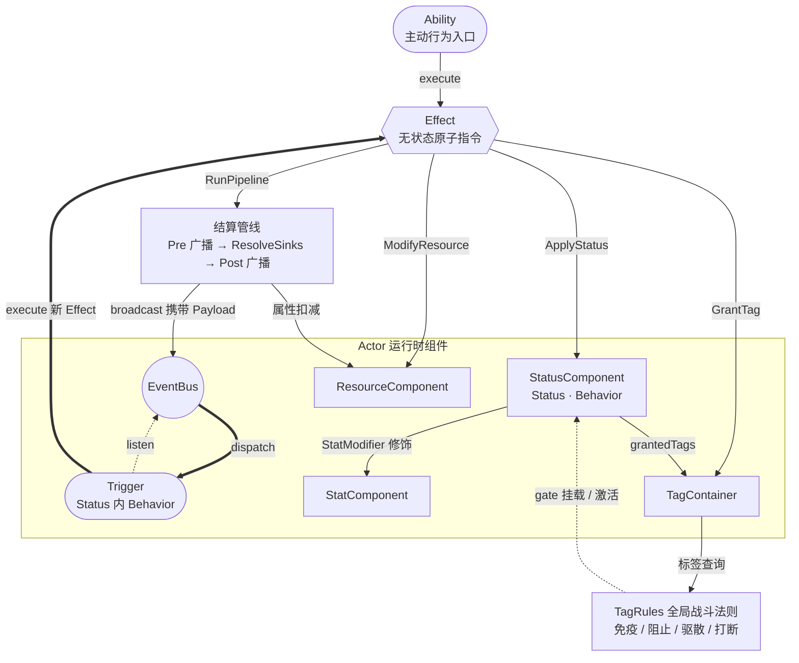

基于 Unreal GAS 核心理念的**全数据驱动**技能系统配置标准。本文档是**架构基准**，具体游戏应在此基础上裁剪和扩展。


## Architecture Overview

> 本节提供系统的全局视图。建议首次阅读时先通读本节建立心智模型，再进入后续各章的详细定义。

---

### 核心概念速览

| 概念 | 职责 | 生命周期 |
|------|------|----------|
| **Ability** | 行为入口 — 准入检查、资源消耗、触发 Effect | 瞬发执行 |
| **Effect** | 无状态原子指令 — 改属性、挂状态、走结算管线、生成投射物 | 即时执行，不持有任何状态 |
| **Status** | 持续状态容器 — 挂载在 Actor 上，管理时长、堆叠与标签授予 | 有限时长 / 永久，可堆叠 |
| **Behavior** | Status 内部的逻辑零件 — 属性修饰、周期脉冲、事件监听 | 随 Status 生死 |
| **EventBus** | Actor 级事件总线 — 广播携带 Payload 的标准事件 | Actor 组件，常驻 |
| **Pipeline** | 结算管线 — 将 RunPipeline 展开为多阶段广播与属性扣减 | 单次结算，无持久状态 |
| **TagRules** | 全局交互法则 — 基于标签的免疫、阻止、驱散、打断 | 战斗配置，常驻 |

---

### 执行流全景



图中 **Actor 框内**是挂载在实体上的运行时组件；框外的 Ability / Effect / 结算管线 / TagRules 是无状态指令或全局配置，本身不持有状态。粗箭头 `==>` 标出贯穿全局的**响应式循环**——它是整个系统的驱动核心：

1. **Ability**（主动）或 **Status** 内的 **Behavior**（被动 / 周期）触发 **Effect**
2. Effect 是无状态原子指令，按动作分流：`ApplyStatus` 挂 Status、`GrantTag` 写 TagContainer、`ModifyResource` 改资源池；`RunPipeline` 则进入结算管线
3. 结算管线在 Pre / Post 两个阶段向 **EventBus** 广播事件（携带 **Payload**），中段 `ResolveSinks` 将载荷落地为属性扣减
4. 其他 Status 中的 **Trigger**（Behavior 的一种）监听到事件，执行新的 Effect
5. 新 Effect 可能再次走 `RunPipeline` → 回到步骤 2，循环往复

**TagContainer ↔ TagRules** 横切这条循环：Status 的 `grantedTags` 与 Effect 的 `GrantTag` 都向 TagContainer 写入；TagRules 基于标签查询执行**免疫 / 阻止 / 驱散 / 打断**，在 Status 挂载、Ability 激活等关口拦截。

系统通过 `combat_settings.maxDispatchDepth` 限制事件派发的嵌套深度，防止无限循环（如反伤互相触发）。


### 三层正交原则

系统中的三个实体类型严格正交，各司其职：

| | **Ability** | **Effect** | **Status** |
|---|---|---|---|
| **本质** | 入口 | 指令 | 容器 |
| **是否持有状态** |  | 否（无状态，即时消费） | 是（时长、层数、行为零件） |
| **与 Actor 关系** | | 不关联，只消费 Context | 挂载在 Actor 上 |
| **典型用途** | 主动技能、战术位移 | 扣血、加 Buff、发射投射物 | 持续增益/减益、被动技能、光环 |

**组合规则**：
- Ability 的 `effect` 字段触发 Effect 树
- Effect 中的 `ApplyStatus` 将 Status 挂载到目标身上
- Status 中的 Behavior（Trigger/Periodic/Timeline）在运行时触发新的 Effect
- **被动技能** 不走 Ability，本质是永久 Status（`duration: -1`）

这种正交分离确保每一层只关注自己的职责——Ability 不关心效果如何执行，Effect 不关心状态如何持续，Status 不关心谁触发了它。复杂机制通过**组合**而非继承构建。


### Philosophy

1. **层级化标签驱动**：树状 Tag（如 `Actor.Debuff.Control.Stun`）是逻辑交互的唯一通用语言。支持父级包含查询——查询 `Actor.Debuff` 可命中 `Actor.Debuff.Control.Stun`。

2. **两阶段事件管线**：所有逻辑通信通过 `EventBus` 广播标准消息。`Pre` 阶段注入 `Modifier` 篡改数值（如减伤），`Post` 阶段触发副作用（如反伤）。源与监听者彻底解耦。

3. **逻辑与表现隔离**：逻辑层仅输出 `CueKey`，客户端独立维护 Tag 到资源的映射。

4. **三层正交分离**：`Ability`（行为入口）、`Status`（持续状态）、`Effect`（无状态原子指令）严格正交。通过组合构建复杂机制。

---

## Data Foundation

> 标签（gameplaytag）、属性（stat_definition）、资源（resource_definition）、事件（event_definition）、表现键（cue_key）、变量键（var_key）的原子定义，以及 **gameplaytag 命名规范**（`Actor.*` / `Char.*` / `Status.*` / `Ability.*` / `Combat.*` 五域），已拆分到独立专题：**`data-foundation.md`**。

---

## Runtime Core

本章节定义技能系统在游戏运行时的**心智模型**：静态配置表（Config）是如何在内存中实例化、存储状态并互相通信的。

### 执行流上下文

Context 和 Payload 是连接静态表达式与动态计算的桥梁，也是贯穿整个技能执行树的“血液”。

#### Context (环境上下文)
`Context` 代表一个行为（Ability/Behavior/SpawnedObj）执行时的**持久化环境**。
- **生命周期**：随 Ability 施放或 StatusInstance 生成或 SpawnedObj 诞生而创建，在其整个存活期内保持活跃。
- **作用域**：当执行流遇到 `WithTarget`、`WithLocalVar` 时，会拷贝并派生新的 Context 子作用域。

```java
record Context(
    Actor instigator,   // 真正的发起者 (如：玩家)
    // 实例状态, 原地被改变，跨节点共享
    // 含激活时写入的 targeting 数据、蓄力进度等
    InstanceState instanceState,
    
    // --- 以下被改变都要 new Context
    // StatusInstance 里存储的context：causer=target=host
    // SpawnedObj 里存储的context：causer=target=self
    Actor causer,  // 造成效果的物理实体 (如：玩家发射的火球)
    // 对于 Effect，target = 当前作用的目标。
    // 对于 Behavior，target = 当前status的宿主host
    Actor target,  // 当前正在结算的目标 (被 WithTarget 改变)
    // 局部作用域：仅对当前及子节点树有效 (由 WithLocalVar 绑定，要建新的ReadOnlyStore对象)
    ReadOnlyStore localScope,
    StatusInstance ownerStatus
){}

class InstanceState implements Store {
    int abilityLevel = 1;   // 技能等级（由 Ability 注入，默认为 1）
    Actor targetingActor;
    Vec2 targetingPointOrDir;
}

interface ReadOnlyStore {
    float getFloat(int varId);
    Actor getActor(int varId);
    Vec2 getLocation(int varId);
}

interface Store extends ReadOnlyStore {
    // ...
}
```

**术语隔离**：Context 侧与 Payload 侧的 `Instigator` 同名但语义不同，极易混淆。下表是权威对照：

| 概念 | 所属 | 语义 | 典型场景 |
|---|---|---|---|
| `Context.Instigator` | 宿主上下文来源 | "这一段执行逻辑归功于谁"——挂载/施放这一段执行的发起者 | 反伤被动持有者、光环拥有者 |
| `Context.Causer` | 宿主上下文来源 | "造成效果的物理实体是谁"——如玩家发射的火球 | 投射物、法阵 |
| `Context.Target` | 宿主上下文来源 | "当前正在结算的目标是谁"（被 WithTarget 改变） | AOE 逐目标结算 |
| `Payload.Instigator` | 事件来源 | "本次伤害/事件的攻击者"——谁砍的这一刀 | 反伤事件里的攻击者 |
| `Payload.Target` | 事件来源 | "本次伤害/事件的承受者"——谁挨的这一刀 | 反伤事件里的被击者 |


**InstanceState 跨边界共享（设计决策）**：

`ApplyStatus` / `ApplyStatusInline` / `SpawnObj` 跨边界时，只替换 `Causer` / `Target` / `LocalScope`，**刻意保留同一份 `InstanceState`**。其语义由两条不变式约束，代价如下。

**不变式一：按每次施法隔离**

`Context.Of` 每次激活都新建 `InstanceState`。两次施法之间黑板互不可见；共享只发生在**同一次施法派生出的那棵树内部**。

**不变式二：`Instigator` + `InstanceState` 是身份对，跨所有边界不变**

被替换的（`Causer` / `Target` / `LocalScope` / `OwnerStatus`）都是瞬态角色；`Instigator` 与 `InstanceState` 这对始终共进退——`Instigator` 说这次施法是*谁*，`InstanceState` 是这次施法的黑板。`ApplyStatus` / `RunEffect` 引用的外部配置、`SpawnObj` 派生的投射物，一经调用即继承这次施法的身份对。这正是"蓄力等级 → 结算伤害 → 投射物速度"能贯通的原因。

**可变黑板**

`InstanceState` 继承自 `Store`，是这次施法的黑板，无任何不可变性。整棵派生树共享同一份引用，任何节点（效果树、派生 status、飞行投射物）都能读写；一处写入，其余节点下次读取即可见。这是设计的有意代价——使派生树内状态贯通。


#### Payload (瞬时载荷)

Payload 是事件携带的瞬时载荷，Trigger 通过它读取"发生了什么"并注入ChangSet修饰。
```java
record GameplayEvent(
    DEventDefinition eventCfg,
    Payload payload
){}

record Payload(
    Actor instigator,   // 发起者 (谁砍的这一刀)
    Actor target,       // 承受者 (谁挨的这一刀)

    float magnitude,    // 主值（如伤害量、治疗量）
    Store extras,       // 附加数据，支持 MutatePayloadVar 修改
    TagContainer payloadTags,

    // --- Change 收集器（Pre 阶段使用）---
    ChangeSet magnitudeChanges,
    Int2ObjectMap<ChangeSet> extraChanges
){}

// ChangeSet 瞬时态，聚合数值标量，处理载荷最终结算。
class ChangeSet {
    float additives;
    float mulAdditiveSum;   // ΣMulAdditive，结算时 +1 作为乘子
    float multipliers;      // ΠMul：真倍率连乘
    OverrideOp override;

    // 优先override，然后 (Base + ΣAdd) * (1 + ΣMulAdditive) * ΠMul
    float resolve(float baseValue);
}

record OverrideOp(
    float value,
    int priority
){}
```

**关于 Payload 的作用域与生命周期：**

- **顺流而下**：`Trigger` 监听到事件后，会拿到一个 `Payload`。这个 Payload 会顺着该 Trigger 触发的 `Effect` 动作树一直往下传，沿途节点随时可读。
- **传递边界**：当执行流遇到 `ApplyStatus/SpawnObj` 时，Payload 的传递**终止**。
- **延迟捕获**：为了省性能，系统不在 Trigger 处存数据，而是把在新状态需要用到触发时的瞬时数据（如：按受击伤害来算流血值），**在 `ApplyStatus/WithLocalVar` 节点里通过 `VarBinding` 手动把它截留下来。**

 ```
   Event dispatch
     │
     ▼
   Trigger.onEventFired(GameplayEvent event)
     │  Payload = event.payload（活的）
     ▼
   Effects.execute(effect, ctx, payload)
     │
     ├── ModifyPayload → 修改 payload ✅
     ├── WithTarget-Damage → 用payload的信息组成新的伤害数值 ✅
     ├── ApplyStatus → 在此处 payload 被 snapshot 为局部变量，之后传递终止 ❌
     ├── SpawnObj → 同上 ❌
     └── RunEffect → payload 继续传递 ✅
 ```

**策划配置红线：**

- 带有 `Payload`的节点（如 `PayloadInstigator`、`PayloadMagnitude`），**只能**在带有事件上下文的 `Effect` 执行链中使用。

- 如果在**没有前置事件**的地方直接用，必定报错。遇到这种情况请严格走标准管线：**前面先用 `VarBinding` 截留 -> 后面再用 `ContextVar` 读取**。


### 实体与组件架构

游戏内的所有战斗实体（玩家、怪物、甚至复杂的投射物）都被抽象为持有四大核心组件的 `Actor`。

```java
class Actor {
    StatusComponent statusComponent; // 状态机：管理所有 Buff/Debuff
    StatComponent statComponent;     // 属性集：管理血量、攻击力等数字
    EventBus eventBus;               // 神经网：监听与广播战斗事件
    TagContainer tagContainer;       // 基因库：实体的当前特征标签
}
```

#### Status 层级模型
 (Component -> Instance -> Behavior) 宏观的倒计时驱动与微观的战斗逻辑被严格分层管理。

```java
// 1. 宏观调度层 (挂载在 Actor 上)
class StatusComponent {
    SafeList<StatusInstance> statusInstances;
    // 负责 Tick 驱动倒计时，以及处理同名 Status 的堆叠/刷新策略 (Stacking Policy)
}

// 2. 生命周期层 (单体 Buff/Debuff 在内存中的活体)
class StatusInstance {
    StatusCore coreConfig;
    Context context;                 // 固化了挂载瞬间的环境 (施法者是谁等)
    float remainingDuration;
    int currentStacks;
    
    // 容纳根据 Config 实例化出来的具体逻辑零件
    List<BehaviorInstance<?>> behaviorInstances; 
}

// 3. 业务执行层 (极细粒度的逻辑单元)
abstract class BehaviorInstance<T extends Behavior> {
    T config;
    StatusInstance parentStatus;
    abstract void onStart();
    abstract void onEnd();
    void tick(float dt) {}
}
```


#### Stat 属性模型
游戏内所有数值统一为 `Stat` 对象。临时状态（Buff加攻击）与永久状态（受击扣血）在此完美融合与隔离。

```java
class StatComponent {
    Int2ObjectMap<Stat> stats;
}

class Stat {
    float baseValue;      // 面板基础值 / 当前真实血量
    float currentValue;   // 暴露给外部读取的最终值 (包含了 modifiers 的修饰)

    // 收集所有依附在该属性上的临时状态 (如: 战吼加攻)
    // additives;        // ΣAdd：扁平加法（如 +10 攻击）
    // mulAdditives;     // ΣMulAdditive：百分比增量（如 0.5 = +50%），两个 0.5 → 1 + (0.5+0.5) = 2.0
    // multipliers;      // ΠMul：真倍率（如 1.5 = ×1.5），顺序连乘，两个 1.5 → 2.25
    // overrides;
    // currentValue = override ?? (baseValue + ΣAdd) * (1 + ΣMulAdditive) * ΠMul
    // float evaluate();
}
```

**乘法修饰器语义（重要）**：`Mul` / `MulAdditive` 均属 `AggregateModifierOp`（聚合型，用于 `StatModifier` / `PreModifyPayload`）。即时型 `InstantModifierOp` 只有 `Add`/`Mul`/`Override`，无 `MulAdditive`（即时路径无 Σ 累积概念）。下表对照聚合型的两种乘法：

| 运算符 | 语义 | 配置记法 | 多个叠加 | 业界对照 |
|--------|------|----------|----------|----------|
| `Mul` | **真倍率**（独立乘区），顺序连乘 | value 即倍率：`1.5` = ×1.5 | 两个 `1.5` → `2.25` | PoE `More` / Diablo 套装倍率 / 独立 damage bucket |
| `MulAdditive` | **百分比增量**（同类相加后乘一次） | value 即增量比例：`0.5` = +50%（减伤写 `-0.4`） | 两个 `0.5` → `1 + (0.5+0.5) = 2.0` | PoE `Increased` / Diablo 桶内元素伤 |

- **选择原则**：凡描述"百分比增减"（增伤、减伤、易伤）默认用 `MulAdditive`；仅当明确需要"独立乘区、互不稀释"（如套装倍率、Burst 增益）时才用 `Mul`。
- **完整公式**：`result = (base + ΣAdd) × (1 + ΣMulAdditive) × ΠMul`。`Stat.Evaluate` 与 `ChangeSet.Resolve` 共用此公式

#### 瞬态与常态修饰器的对比

| 维度 | StatMod (常态属性修饰) | ChangeSet (瞬态载荷修饰) |
|------|-----------------|-----------|
| **生命周期** | 跟随 `StatusInstance` 存活 | 单次 `Payload` 结算管线后即销毁 |
| **作用对象** | `Stat.currentValue` (如：角色攻击力) | `Payload.magnitude` (如：本次火球伤害) |
| **配置来源** | `Behavior.StatModifier` | `Trigger` 触发的 `ModifyPayload` |
| **结算时机** | `isRealtime=false`时Status 挂载时，立即执行一次 `FloatValue.Evaluate`，否则实时计算 | Pipeline Pre 结算阶段 聚合求值 |

**Override 优先级**：`Stat.Evaluate` 与 `ChangeSet.SetOverride` 采用**统一规则**——同优先级时**先到先得**（保留最早添加的值，严格 `>` 比较）。


### 事件总线 (EventBus)

以 `EventTagId` 为键，直连底层的监听队列。

**重入语义**：事件派发期间新增的监听器（经 SafeList 的 `pendingAdds` 缓冲）**从下一次迭代起生效**，同一事件的当次派发不会收到。这是 SafeList 双缓冲隔离的固有特性——派发期间的结构性修改被缓冲，迭代结束后 compact + flush。语义上：Trigger 触发的新 Effect 若再次 Dispatch，走的是新的派发调用（深度 +1），新监听器可在其中生效。

```java
class EventBus {
    Int2ObjectMap<SafeList<TriggerInstance>> listeners;
    SceneInstance scene;

    void dispatch(GameplayEvent event) {
        if (!tryEnterDispatch()) return; // 全局深度检查
        try {
            SafeList<TriggerInstance> list = listeners.get(event.eventId);
            if (list == null) return;
            for (var trigger : list) {
                if (!trigger.isPendingKill()) trigger.onEventFired(event);
            }
        } finally {
            exitDispatch();
        }
    }

    boolean tryEnterDispatch() {
        if (scene.dispatchDepth >= scene.maxDispatchDepth) return false;
        scene.dispatchDepth++;
        return true;
    }

    void exitDispatch() {
        scene.dispatchDepth--;
    }

}
```
---

## Core Entities

本章节定义系统的主体部分：Ability 是入口，Effect 是动作，Status 是持续状态，逻辑递进。

### Ability

Ability 是整个系统的**逻辑入口点**。它负责处理玩家或 AI 的主动意图，并将其转化为具体的战斗效果。

**核心职责：**
1. **执行准入检查**：验证冷却（Cooldown）、资源消耗（Cost）及自定义激活条件。
2. **定义生命周期**：管理从按键触发到效果结算的全过程（含前摇、蓄力、引导等阶段）。
3. **驱动效果执行**：在特定时机触发 `Effect` 树。

**配置标准：**
为了支持动作游戏复杂的生命周期管理，Ability 的详细表结构、施法模型（Startup/Charge/Channel）、瞄准逻辑以及完整的运行时状态机已拆分为独立专题文档。

> **关于 Ability 的详细配置定义、生命周期及状态机，请严格参考：`ability-cast.md`**

**设计红线：**
* **主动性**：只有主动触发的行为（含 Dash、瞬移等）才使用 Ability。
* **被动解耦**：被动技能严禁使用 Ability 实现，本质应为挂载在 Actor 上的永久 `Status`。
* **无状态性**：Ability 配置本身是静态的，所有运行时数据（如当前蓄力时长）必须存储在 `AbilityInstance` 的 `context.instanceState` 中。

### Effect

`Effect` 是瞬间执行、**无状态**的指令流。

```cfg
interface Effect {
    struct None {
    }
    
    // --- 资源与载荷 ---
    // 直接改资源（即时：单次调用立即改值）
    struct ModifyResource {
        resource: str ->resource_definition;
        op: InstantModifierOp;
        value: FloatValue;
    }

    // 发射载荷 (外部入口，发起一次带规则的伤害/治疗) ---
    struct RunPipeline {
        pipeline: str ->pipeline;
        magnitude: FloatValue;
        tags: list<str> ->gameplaytag;   // 如 ["Combat.DamageType.Fire"]
        impactCues: list<str> ->cue_key_pulse;   // 受击 cue：结算命中瞬间播放（溅血/受击音效/伤害数字）
    }

    // 篡改载荷（即时：直接覆盖当前值，无聚合）
    struct ModifyPayload {
        varKey: str ->var_key (nullable); // 如果为空，则修改magnitude
        op: InstantModifierOp;
        value: FloatValue;
    }

    // Pre 阶段篡改载荷（聚合：收集到 ChangeSet，管线末尾 Resolve 聚合求值）
    struct PreModifyPayload {
        varKey: str ->var_key (nullable); // 如果为空，则修改magnitude
        op: AggregateModifierOp;
        value: FloatValue;
        overridePriority: int;
    }

    struct GrantPayloadTag {
        tags: list<str> ->gameplaytag;
    }

    // 结算载荷 (管线末端，将载荷落地到具体资源池)
    struct ResolvePayload {
        flow: SinkFlow;
        sinks: list<Sink>;
    }

    // --- 状态操作 ---
    // 引用标准 Status (适用于需要 UI 图标、多端网络同步的常规状态，如“中毒”, “护盾”)
    struct ApplyStatus {
        statusId: int ->status;
        bindings: list<VarBinding>; // 等价于WithLocalVar
    }

    // 内联型 Status (拥有完整功力，适用于无需 UI 显示的一次性专属机制)
    struct ApplyStatusInline {
        duration: FloatValue;        // -1 = 永久（必填：内联即图灵活，时长应显式给）
        core: StatusCore;
        bindings: list<VarBinding>;
    }

    // 授予标签（快捷方式：极简内联微状态，不创建 Status 实例）
    //   duration > 0  ：临时标签，到期自动移除
    //   duration <= 0 ：持久标签，持续到 actor 死亡（ActorManager.Kill 时随 TagComponent.Cleanup 一并清理）
    //   可被 RevokeTag 主动移除
    struct GrantTag {
        grantedTags: list<str> ->gameplaytag;
        duration: FloatValue;
    }

    // 移除标签：强制移除 GrantTag 授予的裸标签（含进行中的临时标签，提前结束其倒计时）
    //   不触碰 Status 授予的标签（那是 Status 的属性，应走 PurgeStatus）
    //   受引用计数约束：若该标签还被其他来源授予，移除一次不一定消失
    struct RevokeTag {
        tags: list<str> ->gameplaytag;
    }

    // 驱散（按标签）：移除 statusTags 或 grantedTags 命中查询的 Status
    struct PurgeStatusByTag {
        query: TagQuery;
        matchStatusTags: bool;  // 匹配 "它是什么" (如: 魔法, 中毒)
        matchGrantedTags: bool; // 匹配 "它造成了什么" (如: 眩晕, 沉默)
    }

    // 驱散（按ID）：精确移除指定 Status；
    struct PurgeStatus {
        anyIds: list<int> ->status;
    }

    // 瞬移
    struct Teleport {
        destination: LocationSelector;
    }

    // 发送事件（target接收）
    struct SendEvent {
        event: str ->event_definition;
        magnitude: FloatValue;
        extras: list<VarBinding>;
    }

    // 生成物 (子弹/法阵)
    struct SpawnObj {
        duration: FloatValue;
        objTags: list<str> ->gameplaytag;
        moveInfo: ObjMoveInfo; // 移动，弹道，碰撞在这里定义
        cuesWhileActive: list<str> ->cue_key_state; // 飞行时的呼啸声、法阵的底图特效
        effectsOnCreate: list<Effect>; // 诞生时：瞬间触发的逻辑 (如：落地瞬间的拉扯，伤害的定时触发）
    }

    // Cue 触发
    struct FireCue {
        cues: list<str> ->cue_key_pulse;
        magnitude: FloatValue;
    }

    // --- 作用域 & 控制流 ---
    struct Sequence { effects: list<Effect>; }

    struct Conditional {
        condition: Condition;
        thenEffect: Effect;
        otherwise: list<Effect>;
    }

    struct Repeat {
        count: FloatValue; // 取下界
        indexVarTag: str -> var_key (nullable); // 放入localScope里，从0开始
        effect: Effect;
    }

    struct WithTarget {
        target: TargetSelector;
        effect: Effect;
    }

    struct WithTargets {
        targets: TargetScan;
        effect: Effect;
    }

    struct WithLocalVar {
        bindings: list<VarBinding>;
        effect: Effect;
    }
    
    struct RunEffect {
        sharedEffectId: int ->shared_effect; // 逻辑复用
        bindings: list<VarBinding>;
    }
}

struct VarBinding {
    varKey: str ->var_key;
    value: VarValue;
    bindMode: BindMode;
}

interface VarValue {
    struct Float { value: FloatValue; }
    struct Actor { selector: TargetSelector; }
    struct Location { selector: LocationSelector; }
}

enum BindMode {
    // 传值 (Pass-by-Value)
    // 行为：在绑定的瞬间立即求值，将算出的具体数字、实体引用固化在 Store 中。
    // 适用：事件传参、截留施法瞬间的攻击力。
    Snapshot; 

    // 传名/闭包 (Pass-by-Name / Thunk)
    // 行为：不立即求值，而是把 VarValue 的配置和当前 Context 存入 Store。每次读取时，重新计算。
    // 适用：Status 中随施法者当前攻击力实时变化的持续伤害 (DOT)；或者每次读取时获取实体的最新坐标。
    Dynamic;  
}

// 聚合型：先收集到列表/聚合器，求值时聚合。用于 StatModifier / PreModifyPayload（→ Stat / ChangeSet）
enum AggregateModifierOp {
    Add;          // ΣAdd：扁平加法，+10 攻击
    Mul;          // ΠMul：真倍率顺序连乘，1.5 = ×1.5，两个 1.5 → 2.25。对照 PoE More / 套装倍率
    MulAdditive;  // 1+Σ增量：百分比增量同类相加后乘一次，0.5 = +50%，两个 0.5 → 2.0。对照 PoE Increased
    Override;     // priority 仲裁，同优先级先到先得
}

// 即时型：单次调用立即改值，无 Σ 累积。用于 ModifyResource / ModifyPayload（→ ResourceComponent / ModifierOps.Eval）
enum InstantModifierOp {
    Add;          // value + delta
    Mul;          // value * delta（真倍率）
    Override;     // 直接覆盖（无 priority 仲裁）
}

// 高频复用的effect
table shared_effect[effectId] (json) {
    effectId: int;
    name: text;
    description: text;
    effect: Effect;
}
```

### Status

Status 是持续状态的容器，挂载在 Actor 上，拥有独立的生命周期、堆叠策略和行为零件。

```cfg
table status[id] (json) {
    id: int;
    name: text;
    description: text;
    icon: str;

    stackingPolicy: StackingPolicy;
    duration: FloatValue;        // -1 = 永久（容器外壳属性，与 stackingPolicy 同层）
    core: StatusCore;
}

struct StatusCore {
    statusTags: list<str> ->gameplaytag;  // Status 自身分类（用于外部查询/移除）
    grantedTags: list<str> ->gameplaytag; // 存在期间授予宿主的标签

    cuesWhileActive: list<str> ->cue_key_state;
    behaviors: list<Behavior>;
}

interface StackingPolicy {
    // 独立计时：每层是一个独立实例，各自独立倒计时
    // 因为拥有多个独立的“时间槽”，满槽时需要明确数据层是拒绝新槽，还是踢掉旧槽
    // ⚠ Independent 下每个实例的 CurrentStacks 恒为 1，不可配合 StackScaling / CurrentStacks 做层数缩放
    struct Independent {
        stackLimit: int;
        overflow: StatusOverflowPolicy;
    }

    // 共享计时：所有层共享一个计数器和一个倒计时
    // 重复施加 → 按 refreshMode 调整倒计时 + 层数 +1；满层后再施加 → 层数 Clamp，触发 OnOverflow
    // 是"越叠越强"型 DOT/Buff（配合 StackScaling）的唯一正确选择
    struct Shared {
        stackLimit: int;
        refreshMode: RefreshMode;
    }

    // 不可叠加：同名 Status 全局只允许存在一个实例
    // 重复施加只按 refreshMode 处理，层数恒为 1
    struct Single {
        refreshMode: RefreshMode;
    }
}

enum RefreshMode {
    ResetDuration;  // 重置倒计时（重新回到最大持续时间，如 LOL 大多数 Buff）
    ExtendDuration; // 延长倒计时（在当前残余时间上累加时间，如某些持续流血）
    KeepDuration;   // 保持倒计时（无视新事件，任由老时间继续倒计时至结束）
}

enum StatusOverflowPolicy {
    Reject;         // 拒绝：丢弃新层，维持现有的老层数和各自的倒计时
    ReplaceOldest;  // 替换：踢掉当前残余时间最少（最快到期）的那一个，把新的塞进去
}
```

#### StackingPolicy 选择

| 需求 | 选用 | CurrentStacks 语义 | 是否可配合 StackScaling | UI 表现 |
|---|---|---|---|---|
| **越叠越强**（DOT 叠毒、护甲叠加，伤害/数值随施加次数放大） | **Shared** | 当前层数（1..stackLimit） | ✅ 推荐 | 1 个图标 + ×N 角标 + 1 条倒计时条 |
| **多次施加互不刷新**（多把飞刀各自流血、多源施加同一 debuff） | **Independent** | 恒为 1（每实例独立） | ❌ 禁止 | 通常聚合成 1 个图标，或如 MMO 分多行显示 |
| **唯一存在**（光环、姿态、被动） | **Single** | 恒为 1 | 一般不用 | 1 个图标，无角标 |

**关键约束**：`StackScaling`、`CurrentStacks`、`OnStackChange` 这三个**层数相关机制只在 Shared 模式下有意义**。Independent 模式下每个实例的 `CurrentStacks` 始终为 1，配 `StackScaling` 会得到"恒等于 baseValue"的错误结果（既不报错也不缩放，是静默 bug）。Independent 想表达"多个独立实例并存"时，应在配置层面接受这一点，不要试图用层数做缩放。

`Independent` 没有 `refreshMode` 字段，因为它的每个槽位是独立实例，重复施加要么开新槽（未满时）要么溢出替换（满时由 `overflow` 决定），不存在"重置已有实例倒计时"这种共享计时行为。RefreshMode 是 Shared/Single 专属概念——它预设了"同名 Status 全局存在共享计时器"。Independent 若需要"刷新"，本质是"替换某个实例"，由 `overflow: ReplaceOldest` 表达，而非 RefreshMode。

> **独立计时 + 叠层缩放**这个组合在主流游戏（DOTA2/LOL/WoW）中几乎不存在，概念上也自相矛盾：独立计时意味着"各层互不相干"，而层数缩放预设了"层数是有意义的聚合量"。需要"叠毒"请用 Shared。

### Behavior

Behavior 是附着在 Status 上的逻辑零件。其运行在 `StatusInstance`（内含 `Context`）内。

```cfg
interface Behavior {
    // 属性修饰器
    struct StatModifier { // 属性修饰器（聚合：依附到 Stat 列表，Evaluate 时聚合）
        stat: str ->stat_definition;
        op: AggregateModifierOp;
        value: FloatValue;
        overridePriority: int;
        requiresAll: list<Condition>;
        isRealtime: bool; // 是否实时计算（每次访问都重新评估 value 和 requiresAll）
    }

    // 程序化移动控制 (接管角色的物理移动)
    struct Movement {
        // 运动模式
        motionType: MotionType;
        
        // 当移动过程中物理胶囊体撞到别的 Actor 时触发的瞬间逻辑
        onSweepHit: OnSweepHitAction (nullable);
    }

    // 周期性触发 (DOT/HOT)
    struct Periodic {
        period: FloatValue;
        executeOnApply: bool;
        indexVarTag: str ->var_key (nullable); // 当前是第几次周期 tick（从0开始），写入 localScope，effect 内用 ContextVar 读取
        effect: Effect;
    }

    // 时间轴
    struct Timeline {
        phases: list<TimelinePhase>;
    }

    // 光环
    struct Aura {
        scan: TargetScan; 
        grantedStatusId: int ->status; 
        updateInterval: FloatValue; 
    }

    // 事件触发器
    struct Trigger {
        listenEvent: str ->event_definition;
        requiresAll: list<Condition>;
        effect: Effect;

        maxTriggers: int;
        cooldown: FloatValue;
    }

    // 生命周期钩子
    struct OnApply { effect: Effect; }
    struct OnStackChange { effect: Effect; }
    struct OnOverflow { effect: Effect; }
    struct OnExpire { effect: Effect; }
    struct OnPurge { effect: Effect; }
    struct OnRemove { effect: Effect; }
}
```

### Status 移除原因 → 触发钩子矩阵

Status 的所有移除原因归入下表，每类移除触发对应钩子（所有移除都会兜底触发 OnRemove）：

| 移除原因 | 专属前置钩子 | 兜底钩子 | 来源 |
|---|---|---|---|
| **Purge**（驱散） | OnPurge | OnRemove | tag_rules.purgesTags / PurgeStatus / PurgeStatusByTag effect |
| **Expire**（到期） | OnExpire | OnRemove | 倒计时归零 |
| **Replace**（堆叠替换） | （无） | OnRemove | Independent 溢出踢旧层 |
| **ActorDeath** | （无） | OnRemove | 宿主死亡/销毁 |

**钩子执行顺序（R-6）**：`Kill` 的完整顺序为：

```
OnDetach（卸 StatModifier / DetachCue）
  → RevokeTags（撤销 grantedTags）
  → OnPurge / OnExpire（专属前置，仅这两种原因）
  → OnRemove（兜底）
```

**设计意图**：OnRemove 是兜底钩子，应看到**干净的宿主**——修饰器已卸、grantedTags 已撤、Cue 已 detach。这样：
- OnRemove 内 `HasTags(Host, 本status.grantedTag)` 返回 false（标签已撤）。
- OnRemove 内读最终 stat 值为卸修饰器后的真实值（"死亡清算按当前攻强触发某 effect" 不会读到错误值）。
- OnPurge / OnExpire 同样看到干净宿主。

---

## Expression Layer

### FloatValue

提供多态求值能力，将静态配置转化为上下文敏感的运行时指令，替代硬编码参数。

```cfg
interface FloatValue {
    struct Const { value: float; }
    struct Math { op: MathOp; a: FloatValue; b: FloatValue; }
    struct Actor {
        source: TargetSelector;
        value: ActorFloatValue;
    }

    struct StatValue { // 取Current
        source: TargetSelector;
        stat: str ->stat_definition;
    }

    struct ResourceValue {
        source: TargetSelector;
        res: str ->resource_definition;
    }

    // 上下文变量，优先localScope，然后instanceState
    struct ContextVar { varKey: str ->var_key; }

    // 事件载荷变量
    struct PayloadMagnitude { }
    struct PayloadVar { varKey: str ->var_key; }

    // Status 层数。
    // ⚠ 仅在 Shared 堆叠下有意义；Independent 下每个实例恒为 1。
    struct CurrentStacks {}

    // 按层数缩放：(baseValue + perStackAdd * stacks) * perStackMul ^ stacks
    // ⚠ 仅适用于 Shared 堆叠；Independent 下 stacks 恒为 1，配置无缩放效果。
    struct StackScaling {
        baseValue: float;
        perStackAdd: float;
        perStackMul: float;   // 1.0 = 无乘法缩放
    }

    // 读当前技能等级（来自 context.instanceState.abilityLevel）
    struct AbilityLevel {}
}

interface ActorFloatValue {
    struct Math { op: MathOp; a: ActorFloatValue; b: ActorFloatValue; }
    struct StatValue { stat: str ->stat_definition; }
    struct StatBaseValue { stat: str ->stat_definition; }
    struct ResourceValue { res: str ->resource_definition; }
}

enum MathOp { Add; Sub; Mul; Div; Max; Min; }
```

### Condition

提供执行准入标准，与 FloatValue 配合实现动态逻辑判断。

```cfg
interface Condition {
    struct Const { value: bool; }
    struct And { args: list<Condition>; }
    struct Or { args: list<Condition>; }
    struct Not { arg: Condition; }
    struct Compare {
        left: FloatValue;
        op: CompareOp;
        right: FloatValue;
    }
    struct Actor {
        source: TargetSelector;
        cond: ActorCondition;
    }
    struct HasTags {
        source: TargetSelector;
        query: TagQuery;
    }

    struct PayloadHasTag { query: TagQuery; }
    
    struct Chance { probability: FloatValue; } // 随机概率
}

interface ActorCondition {
    struct And { args: list<ActorCondition>; }
    struct Or { args: list<ActorCondition>; }
    struct Not { arg: ActorCondition; }
    struct Compare {
        left: ActorFloatValue;
        op: CompareOp;
        right: ActorFloatValue;
    }
    struct HasTags {
        query: TagQuery;
    }
}

enum CompareOp {
    Gt; Gte; Lt; Lte; Eq; Neq;
}

struct TagQuery {
    requireAll: list<str> ->gameplaytag; // 必须全部包含
    requireAny: list<str> ->gameplaytag; // 包含其中之一即可生效 (最常用)
    exclude: list<str> ->gameplaytag;    // 包含任何一个则拦截/失效
}
```

### TargetSelector
用于动态选取一个目标实体。
```cfg
interface TargetSelector {
    struct ContextTarget {}
    struct ContextInstigator {}
    struct ContextCauser {}
    struct ContextVar { varKey: str ->var_key; }

    struct PayloadInstigator {}
    struct PayloadTarget {}
    struct PayloadVar { varKey: str ->var_key; }
}
```

### LocationSelector
```cfg
interface LocationSelector {
    struct ActorLocation {
        target: TargetSelector;
    }
    
    // 某个实体的前方/偏移位置 (如：闪现到目标背后 2 米)
    struct ActorOffset {
        target: TargetSelector;
        forwardOffset: FloatValue;
        rightOffset: FloatValue;
        upOffset: FloatValue;
    }

    // 从 Context/Payload 的变量中读取保存的坐标
    struct ContextVar { varKey: str ->var_key; }
    struct PayloadVar { varKey: str ->var_key; }
}
```

### TargetScan
```cfg
struct TargetScan {
    shape: ScanShape;

    relationTo: TargetSelector;
    allowedRelations: list<Relation>;
    tagQuery: TagQuery;
    exclude: list<TargetSelector>; 

    maxCount: int; // -1 = 无限
    sort: SortStrategy;
}

interface ScanShape {
    struct Sphere {
        center: TargetSelector;
        radius: FloatValue;
    }

    struct Sector {
        center: TargetSelector;
        facingOf: TargetSelector;   // 取该实体的朝向作为扇形正方向
        radius: FloatValue;
        angle: FloatValue;
    }

    struct Box {
        center: TargetSelector;
        facingOf: TargetSelector;
        width: FloatValue;
        length: FloatValue;
    }

    struct PartyOf {
        source: TargetSelector;
    }
}

enum Relation { Self; Friendly; Hostile; Neutral; }
enum SortStrategy { Nearest; Farthest; HpPercentAsc; HpPercentDesc; Random; None; }
```

---

## combat_settings

本章节定义全局性的战斗规则，这些规则以配置表的形式存在，由底层引擎直接读取，作为战斗系统的“最高物理法则”。

```cfg
table combat_settings[name] {
    name: str;
    tagRules: list<str> ->tag_rules;

    maxDispatchDepth: int;       // 事件派发嵌套深度上限（防反伤死循环）
    maxStatusCountPerActor: int; // 单个 Actor 的 StatusInstance 上限
    maxEffectChainLength: int;   // 单次 Effect 执行链的节点数上限（防 Repeat/Sequence 过长）
    maxScanTargets: int;         // TargetScan 全局兜底上限（覆盖单个配置中的 maxCount）
    maxConcurrentAbilitiesPerActor: int; // 兜底并发限制

    // ── 引擎标准输出变量（配置端用 ContextVar 读取；写入位置见各条注释）──
    chargeProgressVar: str ->var_key;   // Charge 阶段蓄力进度（0~1），写入 instanceState
    channelTickIndexVar: str ->var_key; // Channel 当前 tick 序号（从0开始），每次 tick 触发 effect 前写入 localScope

    // ── 业务态死亡约定 ──
    // 资源（如 HP）归零时宿主被挂上该 tag（见 resource_definition.onDepletedGrantTag）。
    // "业务死亡"的统一语义锚点——Actor 挂此 tag 时对象仍 Active（业务死亡 ≠ 对象回收），
    // 调用点（如 TestTargetIsDead、Ability TagQuery）按 tag 判断是否参与战斗。
    deadTag: str ->gameplaytag;
}
```

### tag_rules

该表定义了标签之间的原子化交互准则。通过将“状态”与“行为”解耦，它充当了战斗系统的“最高物理法则”，统一处理控制、打断与免疫。

```cfg
table tag_rules[name] (json){
    name: str;
    rules: list<TagRule>;
}

struct TagRule {
    // 当宿主拥有此标签时...
    whenPresent: str ->gameplaytag;

    // 阻止激活带有以下标签的 Ability
    blocksAbilities: list<str> ->gameplaytag;
    
    // 硬打断：打断正在运行的前摇/蓄力/引导，并触发惩罚（onInterrupt） 
    interruptsAbilities: list<str> ->gameplaytag; 
	
    // 软取消：无惩罚地取消正在运行的前摇/蓄力/引导，或提前结束任何技能的后摇 
    cancelsAbilities: list<str> ->gameplaytag;
	
    // 免疫：拒绝挂载 grantedTags 含以下标签的 Status
    immuneToTags: list<str> ->gameplaytag;

    // 驱散：获得 whenPresent 瞬间，移除 grantedTags 含以下标签的 Status
    purgesTags: list<str> ->gameplaytag;

    description: text;
}
```

**示例：**

```
tag_rules {
    name: "CoreCombatRules";
    rules: [
        { whenPresent: "Actor.Debuff.Control.Silence";
          blocksAbilities: ["Ability.Type.Spell"];
          description: "沉默封印法术"; },

        { whenPresent: "Actor.Debuff.Control.Stun";
          blocksAbilities: ["Ability.Type"];
          cancelsAbilities: ["Ability.Type"];
          description: "眩晕封印+打断所有技能"; },

        { whenPresent: "Actor.Buff.SuperArmor";
          immuneToTags: ["Actor.Debuff.Control"];
          description: "霸体免疫控制"; },

        { whenPresent: "Actor.Buff.Purify";
          purgesTags: ["Actor.Debuff"];
          description: "净化驱散所有减益"; }
    ];
}
```

### pipeline

将伤害/治疗的结算逻辑配置化。引擎按 Pipeline 定义执行多阶段事件广播与逐层属性扣减。

```cfg
table pipeline[name] (json) {
    name: str;
    description: text;

    // Pre 事件广播（收集 Modifier）
    preEventToInstigator: str ->event_definition (nullable);
    preEventToTarget: str ->event_definition (nullable);
    
    // Post 事件广播（响应副作用）
    postEventToInstigator: str ->event_definition (nullable);
    postEventToTarget: str ->event_definition (nullable);

    // 属性扣减,对常用的pipeline，就不要解析执行这个effect了，
	// 而是直接内置在代码里，减少数据驱动的性能开销
    effect: Effect;
}

enum SinkFlow {
    Deplete;       // 扣减（伤害类）
    Restore;       // 增加（治疗类）
}

struct Sink {
    resource: str ->resource_definition;
    conversionRate: float;    // 1 点 magnitude 消耗 N 点该 stat (如 1.0)
}
```

**Magnitude 写回语义**：`ResolveSinks` 执行后，`payload.Magnitude` 写回为**最后一个生效 sink（约定为扣血层）的实际净变化绝对值**（被 Resource clamp 截断后的真实生效量），而非 Pre 修饰后的理论值，也非各 sink 之和。

- **多 sink 约定**：sinks 按顺序扣减（如先护盾后血量），约定**最后一层为扣血层**，写回值只反映这一层的实际生效量；前序 sink（护盾）吸收的部分不计入。
- Post 事件（反伤/吸血）的 Trigger 与受击 cue 读到的 `PayloadMagnitude` 均为这个扣血量——护盾吸收 / HP 见底被 clamp 截断的部分不触发反伤/吸血，受击 cue 强度也只反映真正打到肉的量，符合直觉。
- 护盾破裂等**中间 sink 的专属表现**不进 `payload.Magnitude`，而是由管线 `Effect` 内的 `FireCue` 自行配置（见下「受击 cue 触发时机」）。
- Pre 阶段的 Trigger 若需读理论值，应在 Pre 事件里读取（此时 magnitude 尚未被 ResolveSinks 写回）。

**受击 cue 触发时机**：`RunPipeline.impactCues` 声明"这次结算伴随哪些受击 cue"，但**不在 RunPipeline 这一层触发**——而是透传给 `Pipeline.Resolve`，在 **Post 事件广播之后**统一触发。这样 cue 能拿到：(1) 写回后的实际扣血量；(2) 完整的 `payload.PayloadTags` 快照（含管线 `Effect` 写入的 result tags，如 `Combat.Result.Critical`，cue 资产解析第二阶段据此做 `requireTags` 选择）。中间 sink 的表现（护盾破裂）则不走此路径，由 `Effect` 树内的 `FireCue` 配置。

**Post 阶段 ModifyPayload 语义**：Post 分支的 `ModifyPayload` **直接覆盖** `payload.Magnitude`，不支持 ChangeSet 聚合。多个 Post Trigger 同时改 magnitude 是"后写覆盖先写"，顺序依赖。推荐做法：Post 副作用（反伤/吸血）应走 `RunPipeline` 派生**新的 Payload**进入独立管线，而非篡改当前 Payload。

---

## 表现层设计 Cue

表现层（客户端）系统。其核心逻辑是：逻辑层输出**意图 (CueKey)**、**强度 (Magnitude)** 与 **语义上下文 (Tags)**，客户端据此自动寻址并执行视听反馈。

> **关于资产匹配加权算法、材质栈管理及飘字聚合策略，请参考专项文档：`cue-design.md`**

---

## Implementation Reference

本章提供核心架构的伪代码实现，展示运行时各组件如何协作。此处重点关注具体的技术实现细节，包括生命周期管理、无状态执行器等。

如需网络同步，请一定参考 **`ability-net.md`**。

### TagContainer

底层采用 **"引用计数 + 写入时展开"** 策略，实现 O(1) 的父级包含查询。

```java
class TagContainer {
    // 核心：TagID -> 引用计数
    Int2IntMap tagCounts;

    // 写入时展开
    // 当添加子级 Tag (如 Stun) 时，会同时递增其所有父级 (Control, Debuff) 的计数。
    // 这使得运行时查询 "Actor.Debuff" 时，只需简单查询 Map 中是否存在该 Key (O(1))
    void addTag(int tagId) 
    void removeTag(int tagId);
    boolean hasTag(int tagId);
}
```

### SafeList

抽离生命周期管理中的“防重入、防并发修改”逻辑，封装为泛型安全容器。所有受控实体（状态、行为零件等)必须实现 `IPendingKill`。
在遍历迭代（ `beginIterate`/`endIterate` ) 期间,组件采用**双缓冲并发隔离**:新增元素会被拦截送入 `pendingAdds` 缓冲队列,而销毁操作仅做 `isPendingKill = true` 的逻辑**软删除**。
迭代彻底结束后,容器自动进行**延迟硬清理 (`compact`)**,采用 Swap-Remove 策略以 O(1) 的时间复杂度完成数组缝合,避免 `ArrayList` 的整体内存搬运。

```java
interface IPendingKill {
    boolean isPendingKill();
}

class SafeList<T extends IPendingKill> {
    List<T> items;
    List<T> pendingAdds; // 缓冲在迭代期间被添加的新元素
    int iterateDepth;    // 嵌套深度计数器,防并发修改锁
    boolean needsCompaction; // 脏标记:是否存在需要清理的 pendingKill 实例

    void add(T item);
    void remove(T item); // 仅做软删除: item.setPendingKill(true)
    void beginIterate(); // 迭代上锁: iterateDepth++
    void endIterate();   // 解锁。若归零,触发 flushPendingAdds 与 compact()
    void compact();      // Swap-Remove 物理清理
}
```

### Stateless Executors

`Effect`、`FloatValue`、`Condition`、`TargetSelector`、`TargetScan` 作为**无状态**指令节点,本身不维护生命周期,被调用时即时消费上下文结算。

```java
class FloatValues {
    static float evaluate(FloatValue cfg, Context ctx, Payload payload);
}

class ActorFloatValues {
    static float evaluate(FloatValue cfg, Actor actor);
}

class Conditions {
    static boolean test(Condition cfg, Context ctx, Payload payload);
}

class ActorConditions {
    static boolean test(Condition cfg, Actor actor);
}

class TargetSelectors {
    static Actor select(TargetSelector cfg, Context ctx, Payload payload);
}

class TargetScans {
    static Collection<Actor> scan(TargetScan cfg, Context ctx, Payload payload);
}

class Effects {
    static void execute(Effect cfg, Context ctx, Payload payload);
}
```

---

## Examples

### 例A：盾墙减伤（Pre 阶段拦截）

```
status {
    id: 5001;
    name: "盾墙";
    grantedTags: ["Actor.Buff.ShieldWall"];
    duration: Const { value: 5.0; };
    stackingPolicy: Single { refreshMode: ResetDuration; };
    behaviors: [
        Trigger {
            listenEvent: "Damage_Take_Pre";
            effect: PreModifyPayload {
                // 减伤 40%：MulAdditive 用增量比例记法，-0.4 → 结算乘子 1+(-0.4)=0.6
                op: MulAdditive;
                value: Const { value: -0.4; };
            };
        }
    ];
}
```

### 例B：反伤装甲（Post 阶段响应）

```
status {
    id: 4001;
    name: "反刺被动";
    grantedTags: ["Actor.Passive.ThornArmor"];
    duration: Const { value: -1.0; };
    stackingPolicy: Single { refreshMode: KeepDuration; };
    behaviors: [
        Trigger {
            listenEvent: "Damage_Take_Post";
            requiresAll: [
                Compare {
                    left: PayloadMagnitude {};
                    op: Gte;
                    right: Const { value: 50.0; };
                }
            ];
            effect: WithTarget {
                target: PayloadInstigator {};
                effect: RunPipeline {
                    pipeline: "PureDamage";
                    magnitude: Const { value: 10.0; };
                    tags: ["Combat.Flags.Reflected"];
                };
            };
        }
    ];
}
```

### 例C：叠毒（共享计时 DOT + 层数缩放 + 满层爆发）

```
status {
    id: 3001;
    name: "剧毒";
    statusTags: ["Status.Type.DOT"];
    grantedTags: ["Actor.Debuff.Poison"];
    duration: Const { value: 8.0; };
    stackingPolicy: Shared {
        stackLimit: 5;
        refreshMode: ResetDuration;
    };
    cuesWhileActive: ["Status.Poison"];
    behaviors: [
        Periodic {
            period: Const { value: 2.0; };
            executeOnApply: false;
            effect: RunPipeline {
                pipeline: "PureDamage";
                magnitude: StackScaling {
                    baseValue: 5.0;
                    perStackAdd: 3.0;
                    perStackMul: 1.0;
                };
                tags: ["Combat.DamageType.Poison"];
            };
        },
        // 满层再施加 → 溢出爆发（Shared 满层会触发 OnOverflow）
        OnOverflow {
            effect: Sequence {
                effects: [
                    RunPipeline {
                        pipeline: "PureDamage";
                        magnitude: Const { value: 80.0; };
                        tags: ["Combat.DamageType.Poison", "Combat.Origin.Burst"];
                        impactCues: ["Combat.PoisonBurst"];
                    },
                    PurgeStatus {
                        anyIds: [3001];
                    }
                ];
            };
        }
    ];
}
```


### 例D：暴击增伤被动

```
// 被动：当你的攻击暴击时，额外造成一次固定伤害
status {
    id: 6001;
    name: "暴击追伤";
    grantedTags: ["Actor.Passive.CritFollowup"];
    duration: Const { value: -1.0; };
    stackingPolicy: Single { refreshMode: KeepDuration; };
    behaviors: [
        Trigger {
            listenEvent: "Damage_Deal_Post";
            requiresAll: [
                // 检查 Payload 中是否有暴击标记 (由 pipeline.effect 写入)
                PayloadHasTag { query: { requireAll: ["Combat.Result.Critical"];};}
            ];
            effect: WithTarget {
                target: PayloadTarget {};
                effect: RunPipeline {
                    pipeline: "PureDamage";
                    magnitude: Const { value: 25.0; };
                    tags: ["Combat.Flags.Bonus"];
                    impactCues: ["Combat.CritBonus"];
                };
            };
        }
    ];
}
```