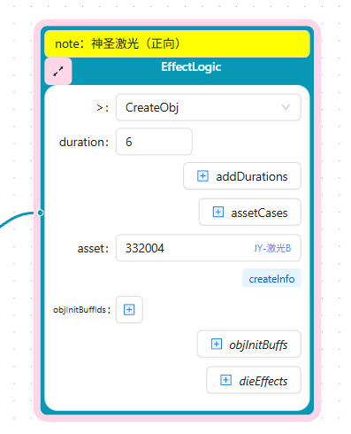
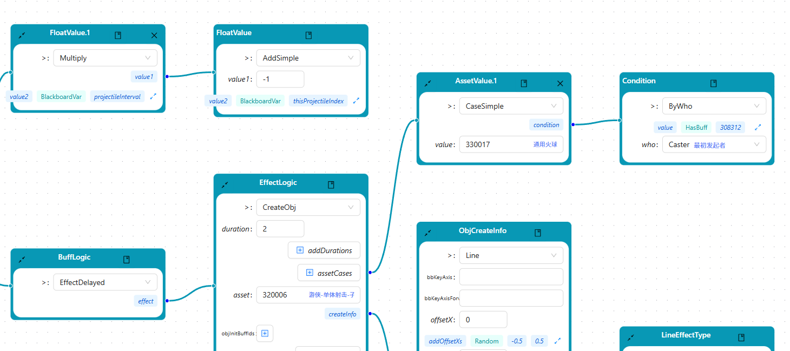
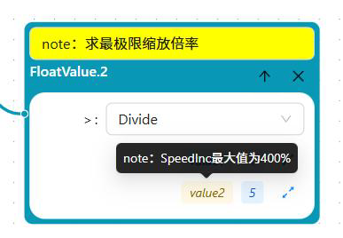

# 📁 折叠与内嵌功能

编辑器提供了强大的折叠与内嵌功能，帮助用户在有限的屏幕空间内高效浏览和编辑复杂的配置数据。

## 🎯 功能概述

### 折叠功能
- 任意**非叶子节点**都可以折叠（收起其所有叶子节点）
- 通过折叠可以快速聚焦于特定数据分支
- 支持手动折叠/展开，状态会自动保存

### 内嵌功能
- 某些**叶子节点**可以内嵌到其父节点中显示
- 内嵌后字段直接在父节点卡片中展示，不单独创建节点
- 根据**字段类型和数量**智能判断是否可以内嵌

---

## 🔽 折叠功能 (Fold)

折叠功能允许用户收起不需要查看的节点分支，让界面更加清晰简洁。

### 操作方式

#### 通过节点卡片操作
1. 点击卡片左上角的折叠按钮
2. 节点将被折叠，其所有子节点不再显示


### 折叠效果



**图中说明**：
- 折叠后的节点只显示核心信息
- 子节点完全隐藏，但不影响数据
- 再次点击可展开恢复显示

### 折叠状态保存

- 折叠状态会自动保存到配置中
- 下次打开相同记录时，折叠状态会自动恢复
- 支持通过 `$fold` 字段在数据层面控制默认折叠状态

---

## 📌 内嵌功能 (Embed)

内嵌功能可以将满足特定条件的字段直接显示在父节点中，避免创建过多的节点，提升信息密度。

### 基本概念

**内嵌前**：每个字段都创建独立节点，树形结构庞大
```
父节点
├── 子节点1
├── 子节点2
└── 子节点3
```

**内嵌后**：字段直接在父节点卡片中显示
```
父节点 (包含子节点1、2、3的字段)
```

### 内嵌规则

#### 自动过滤规则

**空的 list 字段自动过滤**
- 如果某个 list 类型的字段值为空数组 `[]`
- 该字段不会在界面中显示
- 减少无意义的信息干扰

#### Struct 内嵌条件

当字段类型为 **struct** 时，满足以下任一条件即可内嵌：

| 条件 | 描述 | 示例 |
|------|------|------|
| **条件1a** | struct 没有字段 | 空结构体 `{}` |
| **条件1b** | struct 只有 1 个 primitive 字段 | `{ name: string }` |
| **条件1c** | struct 只有 ≤3 个 number 字段 | `{ x, y, z: int }` |
| **条件1d** | struct 只有 ≤4 个 bool 字段 | `{ flag1, flag2, flag3, flag4: bool }` |
| **条件1e** | struct 只有 1 个 bool 字段和 1 个 number 字段 | `{ enabled: bool, count: int }` |

**primitive 类型**包括：`bool`、`int`、`long`、`float`、`str`、`text`

#### Interface 内嵌条件

当字段类型为 **interface** 时，其 impl 需满足以下任一条件：

| 条件 | 描述 | 示例 |
|------|------|------|
| **条件2a** | interface 的 impl 没有字段 | 空实现 `{}` |
| **条件2b** | interface 的 impl 只有 1 个 primitive 字段 | `{ value: string }` |
| **条件2c** | interface 的 impl 只有 ≤2 个 number 字段 | `{ x, y: float }` |
| **条件2d** | interface 的 impl 只有 ≤3 个 bool 字段 | `{ a, b, c: bool }` |
| **条件2e** | interface 的 impl 只有 1 个 bool 字段和 1 个 number 字段 | `{ active: bool, priority: int }` |

**注意**：interface 的内嵌条件比 struct 更严格，number 字段限制为 2 个（struct 为 3 个），bool 字段限制为 3 个（struct 为 4 个）。

#### List 内嵌条件

- **父 node 中类型为 list 的 field**，如果 **list 只包含一项**
- 且该项满足上述 struct 或 interface 内嵌条件
- 也可以内嵌显示

**示例**：
```javascript
// list 只有一个元素，且该元素满足内嵌条件
tags: [{ name: "重要" }]  // 可以内嵌

// list 有多个元素，即使单个元素满足条件也不内嵌
tags: [{ name: "重要" }, { name: "紧急" }]  // 不内嵌
```

### 内嵌效果展示



**图中说明**：
- 内嵌后，字段直接在父节点中显示
- 内嵌字段以紧凑的方式展示，节省空间

---

## 💡 Note 浮动提示

当字段包含注释（note）时，编辑器提供了友好的提示功能。

### 功能说明

#### 黄色名称标识
- 如果**子节点有 note**（注释）
- 子节点的名称会以**黄色**显示
- 快速识别哪些字段有详细说明

#### 鼠标悬浮提示
- 将鼠标悬停在黄色名称上
- 会弹出浮动提示框
- 显示**完整的字段名称**和**注释内容**
- 帮助用户理解字段的含义和用途

### 效果展示



**图中说明**：
- 黄色高亮的字段名表示该字段有 note
- 鼠标悬浮后显示完整的字段说明
- 便于快速理解字段的业务含义

---

## 📊 内嵌规则详细对比

### 规则对比表

| 类型 | 无字段 | 单 primitive | ≤2 number | ≤3 number | ≤3 bool | ≤4 bool | 1 bool + 1 number |
|------|--------|--------------|-----------|-----------|---------|---------|-------------------|
| **Struct** | ✓ (1a) | ✓ (1b) | - | ✓ (1c) | - | ✓ (1d) | ✓ (1e) |
| **Interface** | ✓ (2a) | ✓ (2b) | ✓ (2c) | - | ✓ (2d) | - | ✓ (2e) |

### 使用场景建议

#### 适合内嵌的场景
- **简单配置项**：如坐标、尺寸、开关等简单数据
- **标识信息**：如 ID、名称、类型等单字段数据
- **状态标记**：如多个 bool 开关组合
- **元数据**：如创建时间、更新时间等辅助信息

#### 不适合内嵌的场景
- **复杂对象**：字段数量超过内嵌阈值
- **嵌套结构**：包含多层嵌套的复杂结构
- **需要独立编辑**：需要频繁修改的大型对象
- **可视化重点**：需要在图中突出显示的关键节点

---

## ⚙️ 技术实现细节

### 核心代码文件

内嵌功能的核心实现位于以下文件：

- **`cfgeditor/src/routes/record/embedding/embeddingConfig.ts`**
  - 内嵌配置规则定义
  - 阈值和条件集中管理
  - 便于调整内嵌规则

- **`cfgeditor/src/routes/record/embedding/embeddingChecker.ts`**
  - 字段类型分析器
  - 内嵌条件检查器
  - 空 list 字段过滤器

- **`cfgeditor/src/flow/embedded/FoldStateHelper.tsx`**
  - Fold 状态管理助手
  - 统一 fold 状态获取逻辑
  - 消除代码重复

### 配置调整

如果需要修改内嵌规则，编辑 `embeddingConfig.ts` 文件：

```typescript
export const EMBEDDING_CONFIG = {
  struct: {
    maxNumberFields: 3,      // 修改：struct 内嵌的 number 字段上限
    maxBoolFields: 4,        // 修改：struct 内嵌的 bool 字段上限
    // ...
  },
  interface: {
    maxNumberFields: 2,      // 修改：interface 内嵌的 number 字段上限
    maxBoolFields: 3,        // 修改：interface 内嵌的 bool 字段上限
    // ...
  },
}
```

修改后重新构建应用即可生效。

---

## 💻 最佳实践

### 1. 合理使用折叠
- **按需折叠**：只折叠当前不关注的分支
- **保持上下文**：不要折叠太多层级，避免迷失方向

### 3. Note 注释规范
- **业务语境**：提供业务含义，而非技术细节

