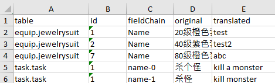

# 🌐 国际化支持方案2


---

## 🎯 方案概述

### 基础配置
在结构定义文件（`.cfg`）中，将需要国际化的字段类型从 `str` 改为 `text` 即可启用国际化支持。

### 核心原理
方案2采用更精确的键值定位方式：
- **键值构成**：原始文本所在行的主键 + 字段名称链
- **优势**：避免相同文本在不同上下文中产生歧义
- **适用场景**：需要精确上下文定位的复杂国际化需求

参考示例项目：[i18n](i18n)


## 📄 1. 生成或更新翻译文件

执行以下命令生成翻译文件：

```bat
java -jar ../../cfggen.jar -datadir ../config -langswitchdir langs -gen i18nbyid,dir=langs,backup=backup
```

### 参数说明
- `-langswitchdir langs`：指定多语言目录，工具会读取该目录下的所有子目录（子目录名即为语言代码）
- 此命令可一次性生成所有语言的翻译文件

### 生成文件说明

- **`_todo_[lang].xlsx`文件**：该文件包含两个工作表

  1. **todo 工作表**：包含待翻译文本

      

  2. **参考用 工作表**：包含已翻译文本，供翻译人员参考

      


- **`[lang]`目录**: 目录下有各模块翻译现状的excel文件

  1. **目录**：

      ```
      ├───en
      │       equip.xlsx
      │       other.xlsx
      │       task.xlsx
      ```

  2. **equip.xlsx**

      


## ✏️ 2. 人工翻译编辑

### 翻译流程选择

#### 选项A：使用 Todo 流程（推荐）
1. 生成翻译文件后，将 `_todo_[lang].xlsx` 发送给翻译人员
2. 翻译人员在 **todo 工作表** 中填写翻译内容
3. 翻译完成后，将文件放回对应的语言目录（如 `i18n/langs`）

#### 选项B：直接编辑翻译文件
- 直接在具体的翻译文件（如 `item.xlsx`）中填写翻译内容

### 翻译优先级规则

当同一翻译项在多个文件中存在时，系统按以下优先级处理：
1. **最高优先级**：`_todo_[lang].xlsx` 文件中的翻译内容
2. **次高优先级**：具体翻译文件（如 `item.xlsx`）中的翻译内容

即：Todo 文件中的翻译内容拥有最高优先级，若为空则回退使用具体翻译文件中的内容。

## 🔄 迭代流程

采用步骤1和步骤2的循环迭代模式：

1. 当 Todo 文件内容发生变化后，再次执行"生成或更新翻译文件"命令
2. 系统会将 Todo 文件中的翻译内容同步到具体的翻译文件（如 `item.xlsx`）中
3. 同时更新 Todo 文件，包含新的待翻译文本和已翻译参考内容


## 🚀 3. 生成代码和数据文件

### 多语言版本生成

```bat
java -jar ../cfggen.jar -datadir config -langswitchdir i18n/langs -gen ...
```

**参数说明**：
- `-langswitchdir i18n/langs`：指定多语言目录
- 当该目录下存在子目录时，系统识别为使用方案2
- 工具会遍历该目录下的所有子目录作为多语言版本

### 单语言版本生成

```bat
java -jar ../cfggen.jar -datadir config -i18nfile i18n/langs/en -gen ...
```

**参数说明**：
- `-i18nfile i18n/langs/en`：指定特定语言目录
- 当参数为目录而非文件时，系统识别为使用方案2

### 验证示例

在 `example` 目录下运行 `i18n_gencsharp.bat`，然后到 `cs_ls` 目录下执行 `dotnet run` 查看输出结果。红色文字即为英文版本内容。


## 🔄 方案切换

### 从方案1切换到方案2

```bat
-i18nfile i18n/en.csv -gen i18nbyid,dir=i18n/langs/en,backup=backup
```

### 从方案2切换到方案1

```bat
-i18nfile i18n/langs/en -gen i18n,file=i18n/en.csv
```


## [ai翻译](../aigen/translate)